# ONNX演算子 - 算術演算 (Arithmetic Operations)

算術演算はニューラルネットワークの最も基本的な構成要素です。これらの演算子は要素ごと（element-wise）に動作し、テンソル間の基本的な数学的操作を提供します。

## 概要図

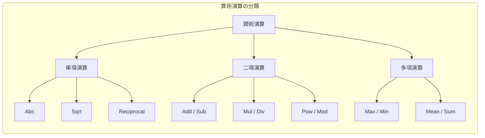

---

## Abs（絶対値）

### 説明
入力テンソルの各要素の絶対値を計算します。負の値は正の値に変換され、正の値と0はそのまま保持されます。信号処理や距離計算において重要な役割を果たします。

### 数式
$$y = |x|$$

### 処理フロー

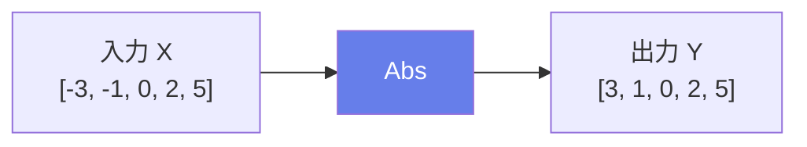

### 入出力仕様

| 項目 | 名前 | 型 | 説明 |
|------|------|-----|------|
| 入力 | X | T | 数値型テンソル |
| 出力 | Y | T | 絶対値テンソル（同形状） |

### 使用例

```python
# 入力
X = [-3, -1, 0, 2, 5]

# 出力
Y = [3, 1, 0, 2, 5]
```

### 主な用途
- **距離計算**: マンハッタン距離（L1距離）の計算
- **誤差計算**: 絶対誤差（MAE）の算出
- **信号処理**: 振幅の取得、整流処理

---

## Add（加算）

### 説明
2つのテンソルの要素ごとの加算を行います。NumPyスタイルのブロードキャストをサポートしており、異なる形状のテンソル間でも演算が可能です。ResNetの残差接続やバイアス項の追加など、ディープラーニングの至る所で使用されます。

### 数式
$$Y = A + B$$

### 処理フロー

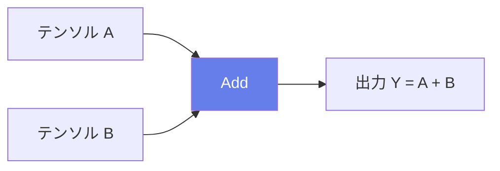

### ブロードキャストの例

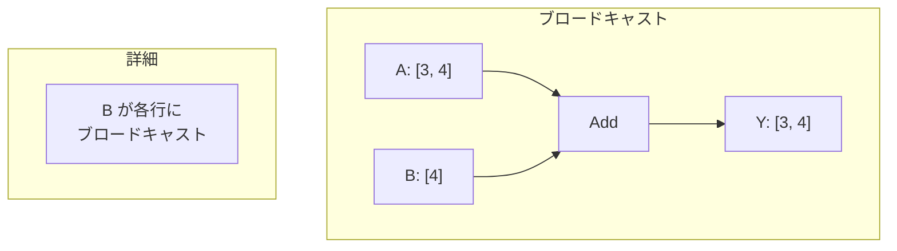

### 入出力仕様

| 項目 | 名前 | 型 | 説明 |
|------|------|-----|------|
| 入力 | A | T | 第1テンソル |
| 入力 | B | T | 第2テンソル |
| 出力 | Y | T | 要素ごとの和 |

### 使用例

```python
# 基本的な加算
A = [[1, 2], [3, 4]]
B = [[5, 6], [7, 8]]
Y = [[6, 8], [10, 12]]

# ブロードキャスト（バイアス加算）
X = [[1, 2, 3], [4, 5, 6]]  # shape: [2, 3]
b = [10, 20, 30]             # shape: [3]
Y = [[11, 22, 33], [14, 25, 36]]
```

### 主な用途
- **残差接続（Skip Connection）**: ResNetなどで入力を出力に加算
- **バイアス項の追加**: 全結合層や畳み込み層の後
- **Attention**: Value と残差の結合

---

## Sub（減算）

### 説明
2つのテンソルの要素ごとの減算を行います。正規化処理での平均減算や、差分計算に使用されます。

### 数式
$$Y = A - B$$

### 処理フロー

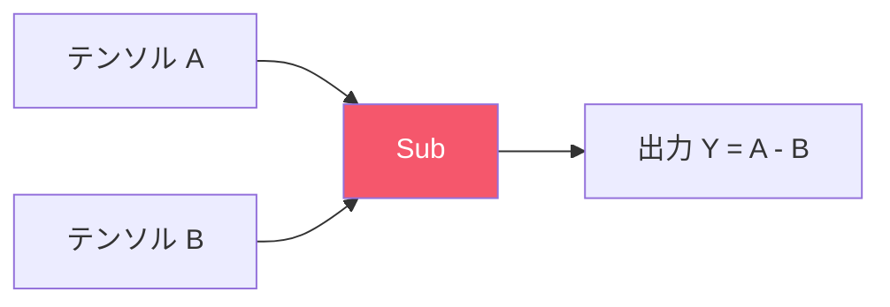

### 入出力仕様

| 項目 | 名前 | 型 | 説明 |
|------|------|-----|------|
| 入力 | A | T | 被減数テンソル |
| 入力 | B | T | 減数テンソル |
| 出力 | Y | T | 要素ごとの差 |

### 主な用途
- **正規化**: 平均値の減算（ゼロセンタリング）
- **差分計算**: 勾配、変化量の算出
- **損失計算**: 予測値と正解値の差

---

## Mul（乗算）

### 説明
2つのテンソルの要素ごとの乗算（アダマール積）を行います。行列乗算（MatMul）とは異なり、対応する要素同士を掛け合わせます。ゲート機構やマスク適用の核となる演算です。

### 数式
$$Y = A \odot B$$

### 処理フロー

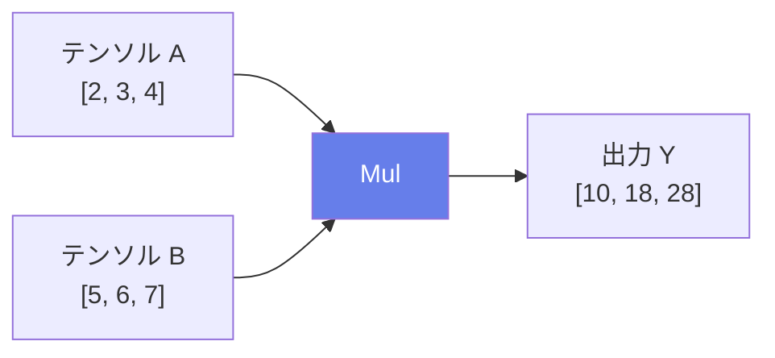

### ゲート機構での使用

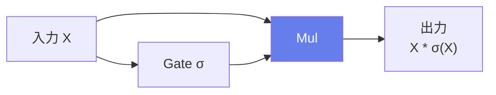

### 入出力仕様

| 項目 | 名前 | 型 | 説明 |
|------|------|-----|------|
| 入力 | A | T | 第1テンソル |
| 入力 | B | T | 第2テンソル |
| 出力 | Y | T | 要素ごとの積 |

### 主な用途
- **ゲート機構**: LSTM, GRU の忘却・入力・出力ゲート
- **Attention**: 重みとValueの乗算
- **マスク適用**: パディングマスク、ドロップアウトマスク
- **スケーリング**: 学習率の適用、正規化係数

---

## Div（除算）

### 説明
2つのテンソルの要素ごとの除算を行います。正規化や比率計算で使用されます。

### 数式
$$Y = A / B$$

### 処理フロー

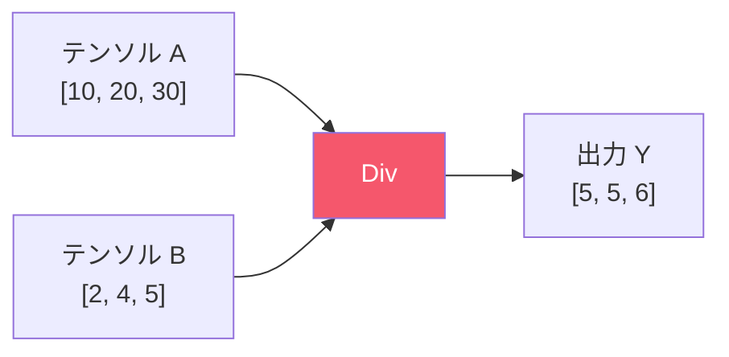

### 入出力仕様

| 項目 | 名前 | 型 | 説明 |
|------|------|-----|------|
| 入力 | A | T | 被除数テンソル |
| 入力 | B | T | 除数テンソル |
| 出力 | Y | T | 要素ごとの商 |

### 注意点
- ゼロ除算に注意（結果がinf, NaNになる可能性）
- 整数除算と浮動小数点除算で挙動が異なる

### 主な用途
- **正規化**: 標準偏差での除算
- **Softmax**: 指数の和での除算
- **比率計算**: パーセンテージ、スケール係数

---

## Pow（べき乗）

### 説明
基数テンソルを指数テンソルでべき乗します。要素ごとに計算され、二乗誤差やLpノルムの計算に使用されます。

### 数式
$$Y = X^{exponent}$$

### 処理フロー

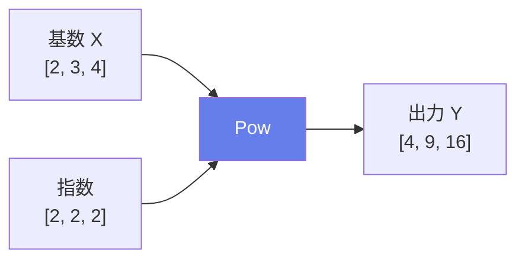

### 入出力仕様

| 項目 | 名前 | 型 | 説明 |
|------|------|-----|------|
| 入力 | X | T | 基数テンソル |
| 入力 | Y | T | 指数テンソル |
| 出力 | Z | T | べき乗結果 |

### 主な用途
- **二乗誤差**: MSE損失の計算
- **Lpノルム**: L2ノルム等の計算
- **多項式計算**: 特徴変換

---

## Sqrt（平方根）

### 説明
入力テンソルの各要素の平方根を計算します。入力は非負である必要があります。

### 数式
$$Y = \sqrt{X}$$

### 処理フロー

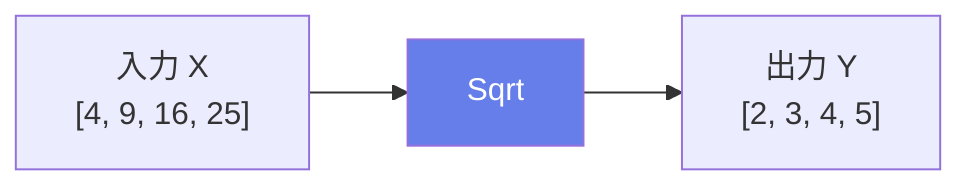

### 主な用途
- **標準偏差計算**: 分散の平方根
- **L2ノルム**: 二乗和の平方根
- **最適化**: Adam, RMSPropでの使用

---

## Reciprocal（逆数）

### 説明
入力テンソルの各要素の逆数（1/x）を計算します。

### 数式
$$Y = \frac{1}{X}$$

### 主な用途
- **除算の代替**: 乗算として実行（計算効率）
- **正規化係数**: 1/σ の計算

---

## Max / Min（最大値 / 最小値）

### 説明
複数のテンソルから要素ごとの最大値/最小値を取得します。2つ以上のテンソルを入力として受け取ることができます。

### 数式
$$Y = \max(X_1, X_2, ..., X_n)$$
$$Y = \min(X_1, X_2, ..., X_n)$$

### 処理フロー

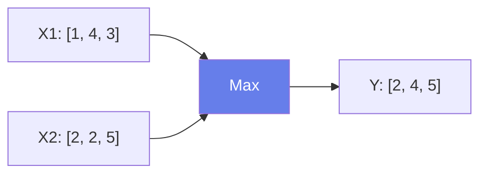

### 主な用途
- **ReLU活性化**: max(0, x)
- **クリッピング**: 値の範囲制限
- **条件付き選択**: 複数候補からの選択

---

## Mean（平均値）

### 説明
複数のテンソルの要素ごとの平均を計算します。全ての入力テンソルは同じ形状である必要があります。

### 数式
$$Y = \frac{X_1 + X_2 + ... + X_n}{n}$$

### 主な用途
- **アンサンブル**: 複数モデルの出力平均
- **移動平均**: 時系列処理

---

## Sum（合計）

### 説明
複数のテンソルの要素ごとの合計を計算します。

### 数式
$$Y = X_1 + X_2 + ... + X_n$$

### 主な用途
- **残差接続**: 複数パスの統合
- **損失関数**: 複数項の合計

---

## Mod（剰余）

### 説明
2つのテンソルの要素ごとの剰余（モジュロ）を計算します。

### 数式
$$Y = A \mod B$$

### 処理フロー

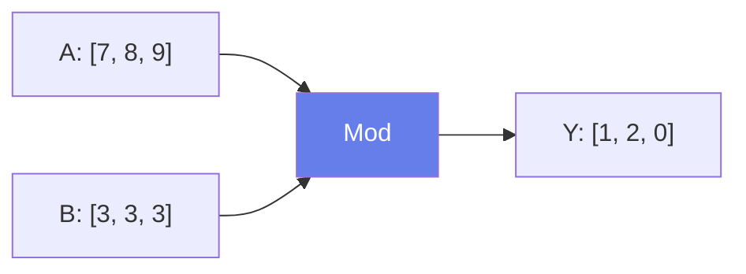

### 属性

| 属性名 | 型 | デフォルト | 説明 |
|--------|-----|----------|------|
| fmod | int | 0 | 0=Python式, 1=C言語式 |

### 主な用途
- **周期的インデックス**: 循環バッファ
- **位置エンコーディング**: Transformerの位置計算

---

## 演算子の使用場面まとめ


## ブロードキャストのルール

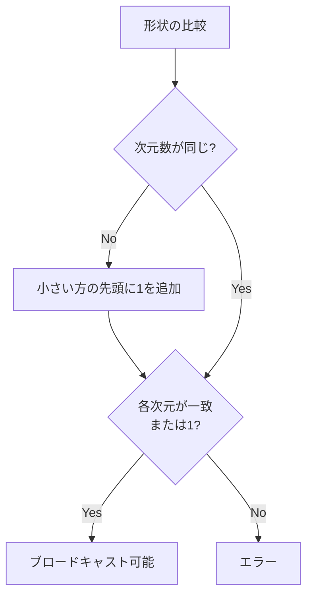

### ブロードキャストの例

| A の形状 | B の形状 | 結果の形状 |
|---------|---------|-----------|
| (3, 4) | (4,) | (3, 4) |
| (3, 4) | (1, 4) | (3, 4) |
| (3, 1) | (1, 4) | (3, 4) |
| (2, 3, 4) | (3, 4) | (2, 3, 4) |
