# ONNX演算子 - 活性化関数 (Activation Functions)

活性化関数はニューラルネットワークに非線形性を導入する重要な要素です。これにより、ネットワークは複雑なパターンを学習できるようになります。

## 概要図

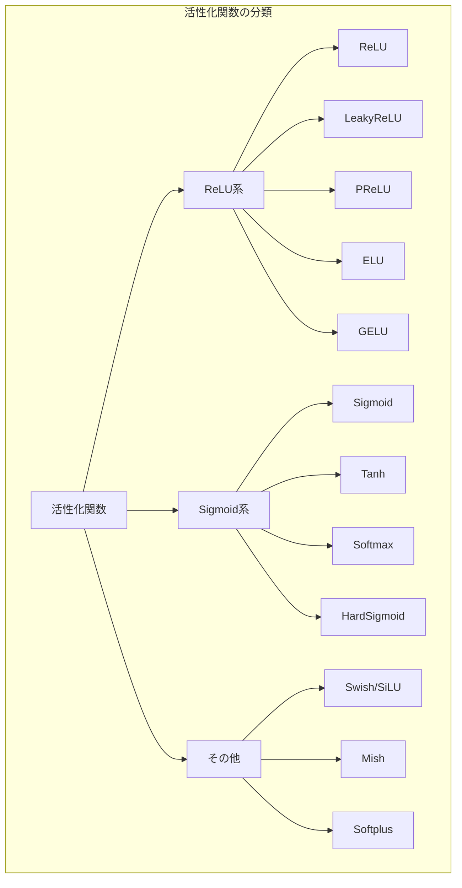

---

## ReLU（Rectified Linear Unit）

### 説明
最も基本的で広く使用される活性化関数です。負の値を0に、正の値はそのまま出力します。計算が非常に高速で、勾配消失問題を軽減します。2010年代以降のディープラーニングの成功を支えた重要な要素です。

### 数式
$$y = \max(0, x)$$

### グラフ形状

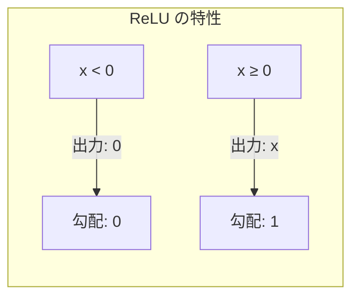

### 入出力仕様

| 項目 | 名前 | 型 | 説明 |
|------|------|-----|------|
| 入力 | X | T | 数値テンソル |
| 出力 | Y | T | 非負テンソル |

### 特性
- **出力範囲**: [0, ∞)
- **計算効率**: 非常に高い（単純な比較演算）
- **スパース性**: 負の入力で出力が0となりスパース
- **問題点**: Dead ReLU（負の入力で勾配が0になり学習が停止）

### 使用例

```python
X = [-2, -1, 0, 1, 2]
Y = [0, 0, 0, 1, 2]
```

### 主な用途
- CNNの中間層（ほぼ全てのモデル）
- 全結合層
- 最も一般的な活性化関数

---

## Sigmoid（シグモイド関数）

### 説明
入力を0から1の範囲に圧縮するS字カーブの関数です。確率として解釈できる出力を生成するため、二値分類の出力層やゲート機構でよく使用されます。

### 数式
$$\sigma(x) = \frac{1}{1 + e^{-x}}$$

### 処理フロー

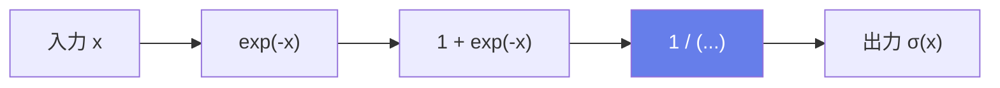

### 特性
- **出力範囲**: (0, 1)
- **微分**: σ'(x) = σ(x)(1 - σ(x))
- **問題点**: 勾配消失、出力が0中心でない

### 使用場面

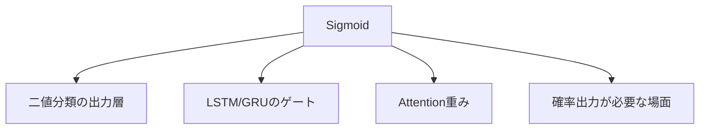

---

## Tanh（双曲線正接）

### 説明
双曲線正接関数。出力は-1から1の範囲に制限されます。Sigmoidと同様にS字カーブですが、出力が0を中心としているため、学習が安定しやすい特徴があります。

### 数式
$$\tanh(x) = \frac{e^x - e^{-x}}{e^x + e^{-x}} = 2\sigma(2x) - 1$$

### 特性
- **出力範囲**: (-1, 1)
- **0中心**: 出力の平均が0に近い
- **問題点**: 極端な値で勾配消失

### 主な用途
- RNN/LSTMの隠れ状態
- 出力を-1から1に制限したい場合

---

## Softmax（ソフトマックス）

### 説明
入力ベクトルを確率分布に変換します。全ての出力値は0から1の間で、合計が1になります。多クラス分類の出力層で標準的に使用されます。

### 数式
$$\text{softmax}(x_i) = \frac{e^{x_i}}{\sum_j e^{x_j}}$$

### 処理フロー

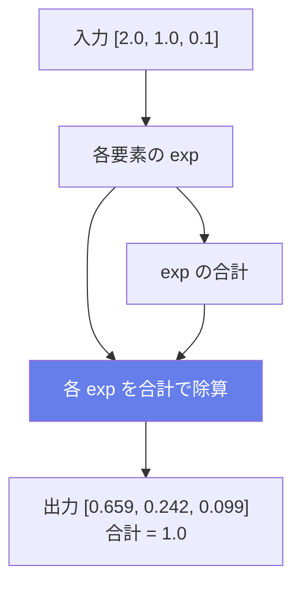

### 属性

| 属性名 | 型 | デフォルト | 説明 |
|--------|-----|----------|------|
| axis | int | -1 | softmaxを計算する軸 |

### 特性
- **出力の合計が1**: 確率分布として解釈可能
- **全ての出力が正**: 0 < softmax(x) < 1
- **最大値が強調**: 差が大きいほど極端な分布に

### 主な用途
- 多クラス分類の出力層
- Attentionスコアの正規化
- 確率的選択

---

## GELU（Gaussian Error Linear Unit）

### 説明
入力をガウス分布の累積分布関数で重み付けする活性化関数です。Transformerで広く使用され、BERT、GPTなどで採用されています。確率的な解釈が可能で、ReLUより滑らかな特性を持ちます。

### 数式
$$\text{GELU}(x) = x \cdot \Phi(x) = x \cdot \frac{1}{2}\left[1 + \text{erf}\left(\frac{x}{\sqrt{2}}\right)\right]$$

近似式（高速計算用）:
$$\text{GELU}(x) \approx 0.5x\left[1 + \tanh\left(\sqrt{\frac{2}{\pi}}(x + 0.044715x^3)\right)\right]$$

### 処理フロー

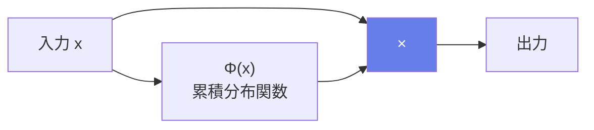

### 特性
- **滑らか**: 全点で微分可能
- **確率的解釈**: 入力が「どの程度重要か」を確率的に判定
- **非単調**: わずかに負の値を許容

### 属性

| 属性名 | 型 | デフォルト | 説明 |
|--------|-----|----------|------|
| approximate | string | "none" | "tanh"で近似計算 |

### 主な用途
- **Transformer**: BERT, GPT, ViT
- **自然言語処理**: 現在の標準的な活性化関数

---

## LeakyReLU

### 説明
ReLUの改良版で、負の領域に小さな傾きを持たせることでDead ReLU問題を軽減します。負の入力でも勾配が流れます。

### 数式
$$y = \begin{cases} x & \text{if } x \geq 0 \\ \alpha x & \text{if } x < 0 \end{cases}$$

### 処理フロー

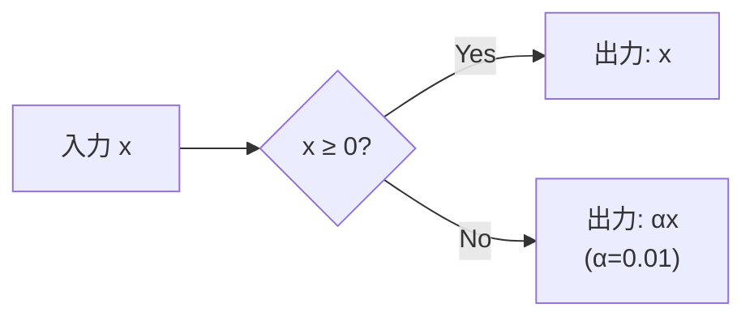

### 属性

| 属性名 | 型 | デフォルト | 説明 |
|--------|-----|----------|------|
| alpha | float | 0.01 | 負の領域の傾き |

### 主な用途
- ReLUの代替
- GANのDiscriminator

---

## PReLU（Parametric ReLU）

### 説明
LeakyReLUと同様ですが、負の領域の傾きが学習可能なパラメータです。データから最適な傾きを学習できます。

### 数式
$$y = \max(0, x) + \text{slope} \cdot \min(0, x)$$

### 処理フロー

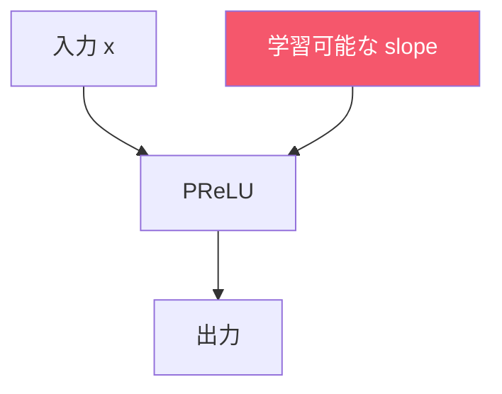

### 入出力仕様

| 項目 | 名前 | 型 | 説明 |
|------|------|-----|------|
| 入力 | X | T | 入力テンソル |
| 入力 | slope | T | 学習可能な傾き |
| 出力 | Y | T | 活性化後のテンソル |

---

## ELU（Exponential Linear Unit）

### 説明
負の領域で指数関数的なカーブを持つ活性化関数です。出力の平均が0に近く、学習を加速させる効果があります。

### 数式
$$y = \begin{cases} x & \text{if } x \geq 0 \\ \alpha(e^x - 1) & \text{if } x < 0 \end{cases}$$

### 特性
- **滑らかな曲線**: 全点で微分可能
- **負の値を許容**: -α まで
- **出力平均が0に近い**: 学習の高速化

---

## Swish / SiLU

### 説明
入力にシグモイドを掛ける自己ゲーティング活性化関数です。Googleの研究で発見され、多くのタスクでReLUより良い性能を示します。

### 数式
$$y = x \cdot \sigma(x) = \frac{x}{1 + e^{-x}}$$

### 処理フロー

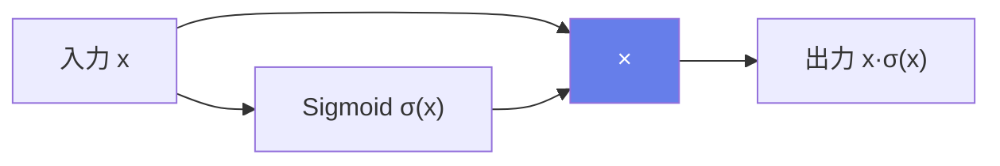

### 特性
- **自己ゲーティング**: 入力自身で重み付け
- **滑らかで非単調**: わずかに負の出力を許容
- **ReLUより良い性能**: 多くのタスクで

### 主な用途
- EfficientNet
- 画像分類
- 強化学習

---

## Mish

### 説明
自己正則化する非単調な活性化関数です。滑らかで連続な勾配を持ち、YOLOv4などで使用されています。

### 数式
$$y = x \cdot \tanh(\text{softplus}(x)) = x \cdot \tanh(\ln(1 + e^x))$$

### 処理フロー

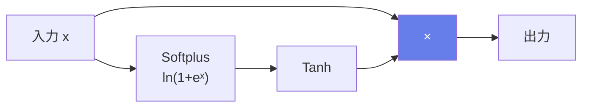

### 主な用途
- YOLOv4
- 物体検出
- 画像認識

---

## HardSigmoid / HardSwish

### 説明
Sigmoid/Swishの計算効率の良い近似です。指数計算を避けることで高速に計算できます。

### HardSigmoid
$$y = \text{clip}(\alpha x + \beta, 0, 1)$$
デフォルト: α=0.2, β=0.5

### HardSwish
$$y = x \cdot \frac{\text{clip}(x + 3, 0, 6)}{6}$$

### 主な用途
- MobileNetV3
- エッジデバイス向けモデル
- リアルタイム推論

---

## Softplus

### 説明
ReLUの滑らかな近似です。常に正の値を出力し、全ての点で微分可能です。

### 数式
$$y = \ln(1 + e^x)$$

### 主な用途
- 正の値が必要な出力（分散など）
- ベイズニューラルネットワーク

---

## 活性化関数の比較

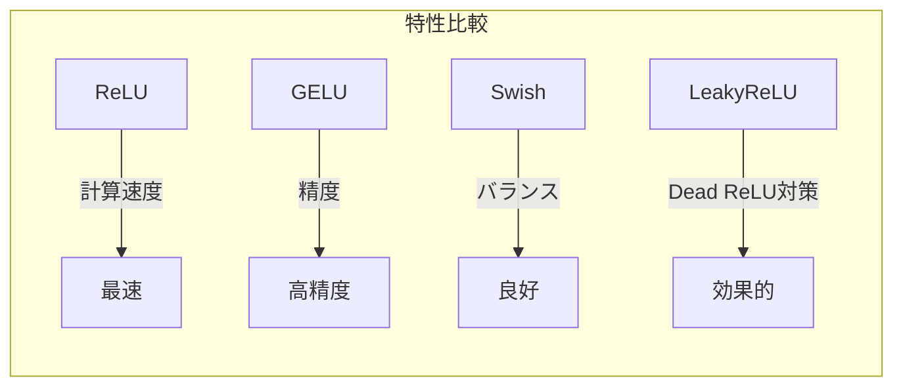

### 選択ガイド

| 用途 | 推奨活性化関数 |
|------|----------------|
| 一般的なCNN | ReLU |
| Transformer/NLP | GELU |
| GAN | LeakyReLU |
| 軽量モデル | HardSwish |
| 物体検出 | Mish, Swish |
| 二値分類出力 | Sigmoid |
| 多クラス分類出力 | Softmax |
| RNN/LSTM | Tanh |

---

## 数値安定性

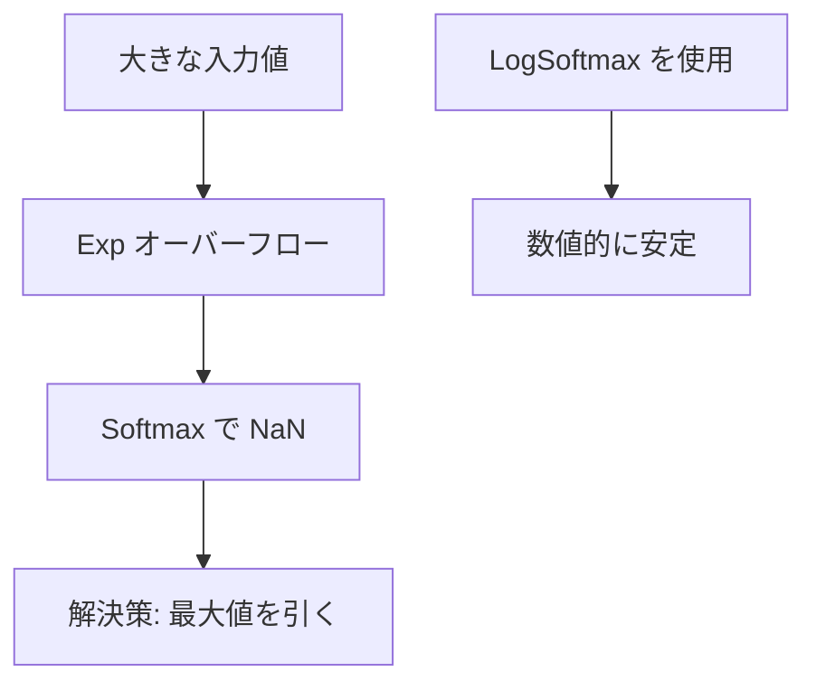

### LogSoftmax
Softmaxの対数を計算する際は、LogSoftmaxを使用することで数値的に安定した計算が可能です:

$$\text{logsoftmax}(x_i) = x_i - \log\left(\sum_j e^{x_j}\right)$$
