# ONNX演算子 - 畳み込み演算 (Convolution Operations)

畳み込み演算は画像認識やコンピュータビジョンの基盤となる演算です。局所的な特徴を抽出し、空間的な階層構造を学習することができます。

## 概要図

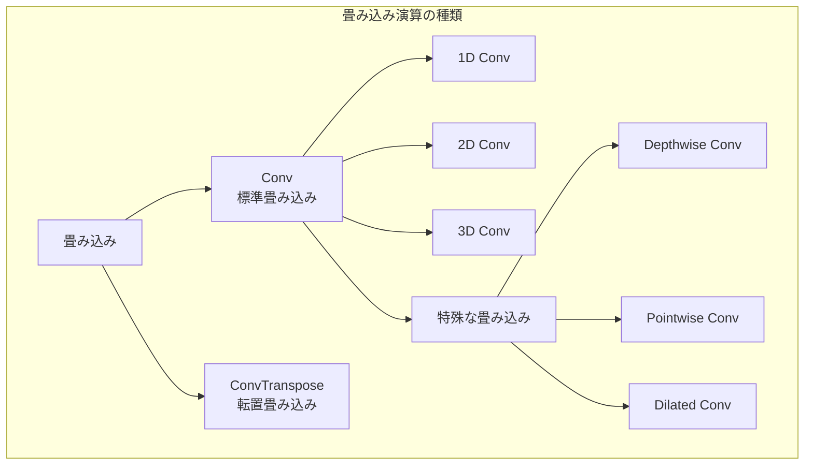

---

## Conv（畳み込み）

### 説明
畳み込み演算を行います。カーネル（フィルタ）を入力テンソル上でスライドさせながら、要素ごとの積和を計算して特徴マップを生成します。画像認識の基本となる演算で、局所的な特徴を抽出します。

1980年代のNeocognitronに起源を持ち、1998年のLeNet、2012年のAlexNetを経て、現代のディープラーニングの中核技術となりました。

### 畳み込みの動作原理

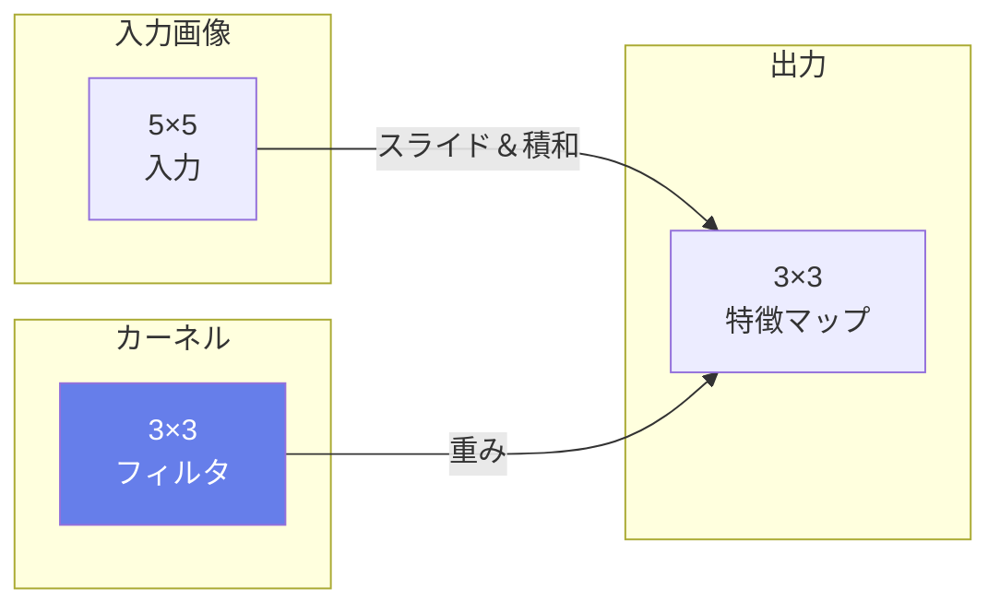

### 2D畳み込みの計算

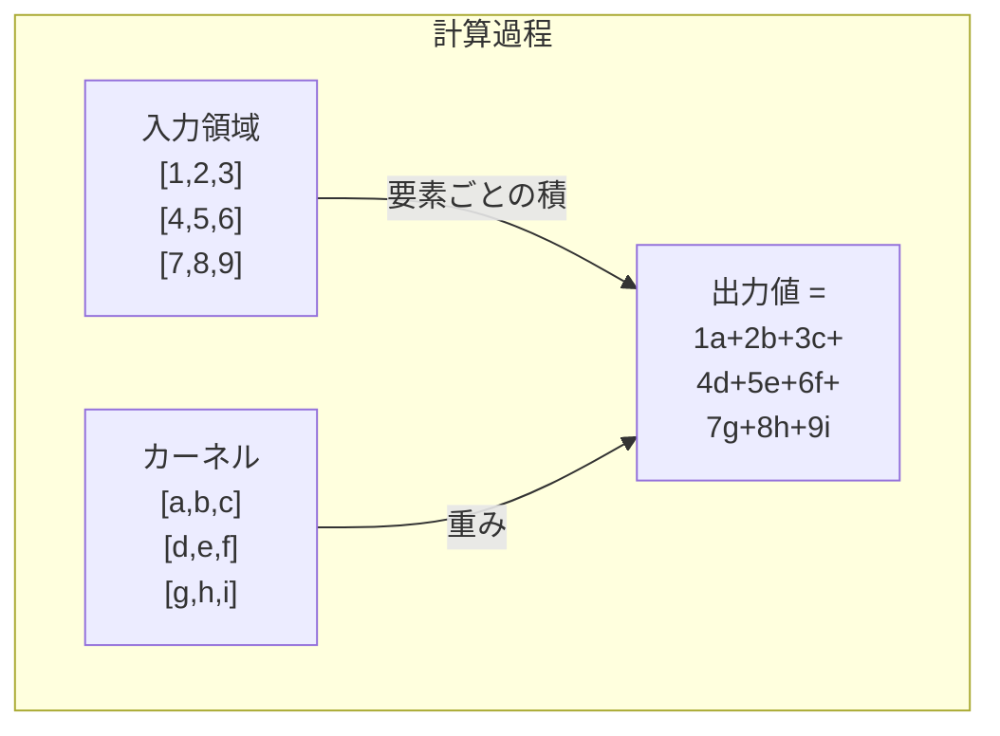

### 数式
$$Y[n,c_{out},h,w] = \sum_{c_{in}} \sum_{k_h} \sum_{k_w} X[n,c_{in},h+k_h,w+k_w] \times W[c_{out},c_{in},k_h,k_w] + B[c_{out}]$$

### 入出力仕様

| 項目 | 名前 | 形状 | 説明 |
|------|------|------|------|
| 入力 | X | [N, C, H, W] | 入力テンソル (NCHW形式) |
| 入力 | W | [M, C/g, kH, kW] | 重みテンソル |
| 入力 | B | [M] | バイアス（オプション） |
| 出力 | Y | [N, M, oH, oW] | 出力テンソル |

### 属性

| 属性名 | 型 | デフォルト | 説明 |
|--------|-----|----------|------|
| auto_pad | string | "NOTSET" | パディング方式 |
| dilations | ints | [1, 1] | 膨張率 |
| group | int | 1 | グループ畳み込みのグループ数 |
| kernel_shape | ints | - | カーネルサイズ |
| pads | ints | [0,0,0,0] | パディング [top, left, bottom, right] |
| strides | ints | [1, 1] | ストライド |

### 出力サイズの計算

```
output_height = (input_height + pad_top + pad_bottom - kernel_height) / stride_h + 1
output_width  = (input_width + pad_left + pad_right - kernel_width) / stride_w + 1
```

### パディングモード

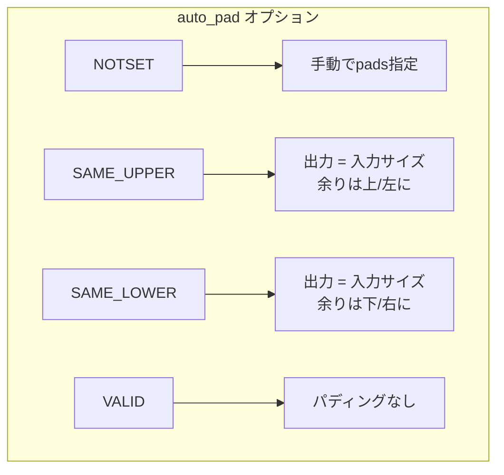

### ストライドとパディングの効果

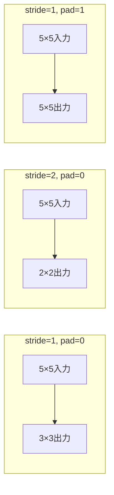

### Dilated Convolution（膨張畳み込み）

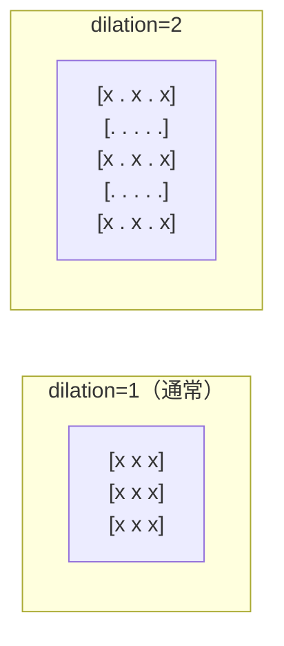

膨張畳み込みは、カーネルの要素間に間隔を設けることで、パラメータを増やさずに受容野を拡大します。セマンティックセグメンテーションで有効です。

### グループ畳み込み

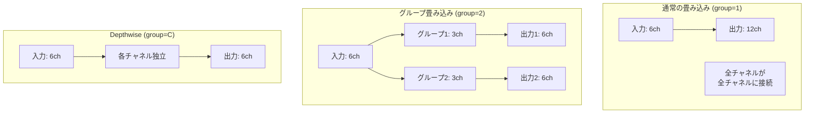

### 使用例

```python
# 典型的なCNN層
入力: [1, 3, 224, 224]    # 1枚のRGB画像
カーネル: [64, 3, 7, 7]   # 64個の7×7フィルタ
ストライド: [2, 2]
パディング: [3, 3, 3, 3]
出力: [1, 64, 112, 112]   # 64チャネルの特徴マップ
```

### 畳み込みの種類

| 種類 | 説明 | 用途 |
|------|------|------|
| 1D Conv | 時系列データ | 音声、テキスト |
| 2D Conv | 画像データ | 画像認識（最も一般的） |
| 3D Conv | 動画、ボリューム | 動画分類、医療画像 |
| Depthwise | チャネルごとに独立 | MobileNet（軽量化） |
| Pointwise | 1×1カーネル | チャネル数変換 |

---

## ConvTranspose（転置畳み込み）

### 説明
畳み込みの転置演算で、主にアップサンプリングに使用されます。「逆畳み込み」や「デコンボリューション」とも呼ばれますが、厳密には畳み込みの逆演算ではなく、畳み込みの勾配計算に相当します。

入力より大きい出力を生成でき、エンコーダ-デコーダ構造のデコーダ部分や生成モデルで広く使用されます。

### 動作原理

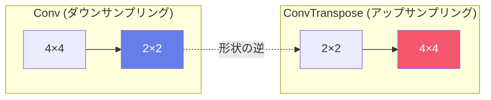

### 処理の詳細

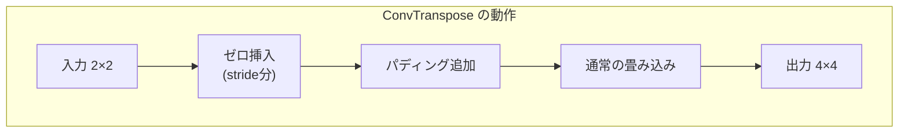

### 出力サイズの計算

```
output_size = (input_size - 1) × stride - 2 × padding + kernel_size + output_padding
```

### 入出力仕様

| 項目 | 名前 | 形状 | 説明 |
|------|------|------|------|
| 入力 | X | [N, C, H, W] | 入力テンソル |
| 入力 | W | [C, M/g, kH, kW] | 重みテンソル |
| 入力 | B | [M] | バイアス（オプション） |
| 出力 | Y | [N, M, oH, oW] | 出力テンソル |

### 属性

| 属性名 | 型 | デフォルト | 説明 |
|--------|-----|----------|------|
| auto_pad | string | "NOTSET" | パディング方式 |
| dilations | ints | [1, 1] | 膨張率 |
| group | int | 1 | グループ数 |
| kernel_shape | ints | - | カーネルサイズ |
| output_padding | ints | [0, 0] | 出力パディング |
| output_shape | ints | - | 出力形状（直接指定） |
| pads | ints | [0,0,0,0] | パディング |
| strides | ints | [1, 1] | ストライド |

### チェッカーボードアーティファクト

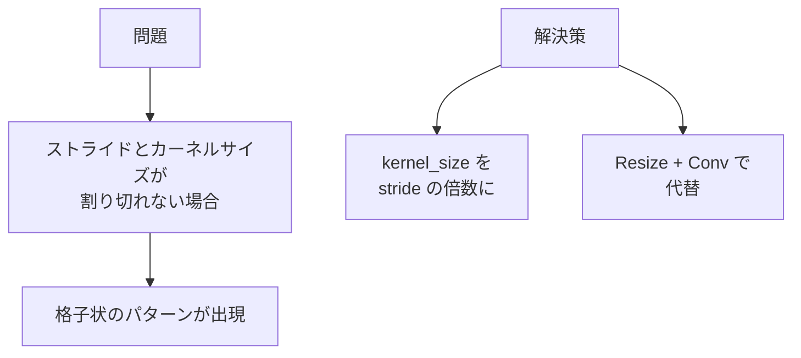

### 使用例

```python
# セマンティックセグメンテーション（2倍アップサンプリング）
入力: [1, 64, 14, 14]
カーネル: [64, 32, 4, 4]
ストライド: [2, 2]
出力: [1, 32, 28, 28]
```

### 主な用途

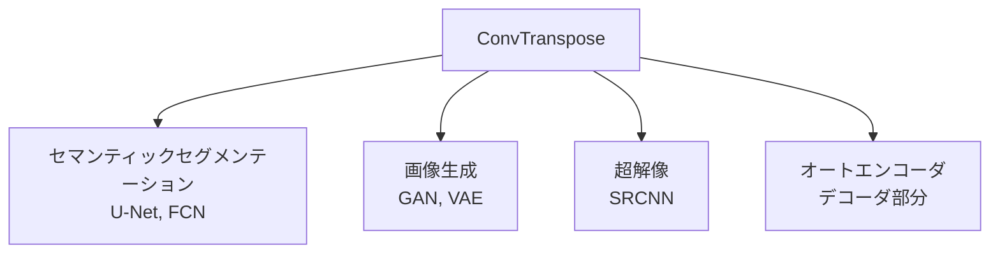

---

## CNNアーキテクチャでの使用

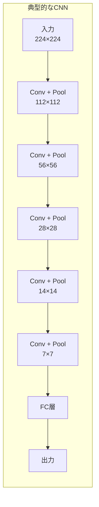

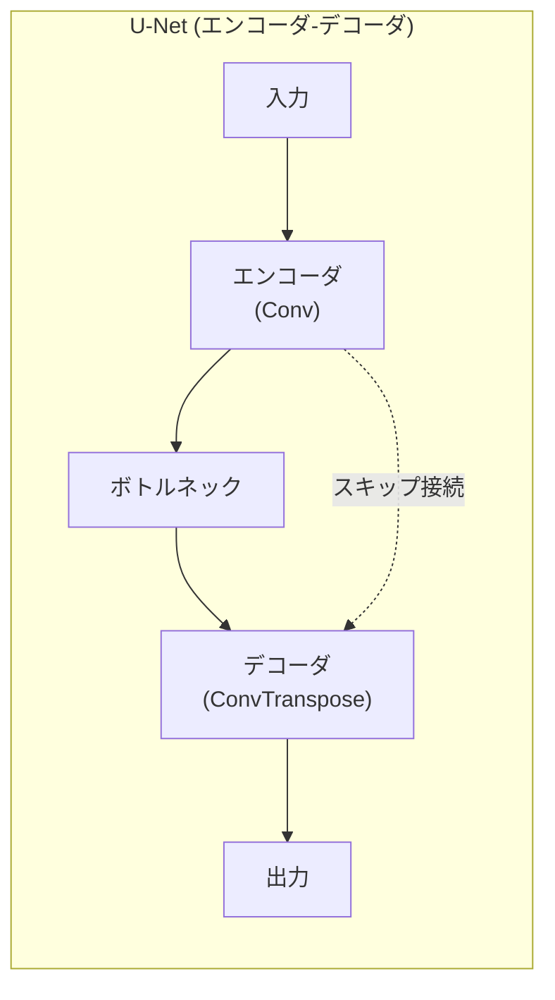

---

## パフォーマンス考慮事項

| 要素 | 影響 | 最適化 |
|------|------|--------|
| カーネルサイズ | 大きいほど計算量増 | 3×3を多用 |
| チャネル数 | 計算量に二次的に影響 | ボトルネック構造 |
| ストライド | 大きいほど出力小 | ダウンサンプリングに活用 |
| グループ | パラメータ削減 | Depthwise Separable |
| Dilation | 受容野拡大 | セグメンテーション |
