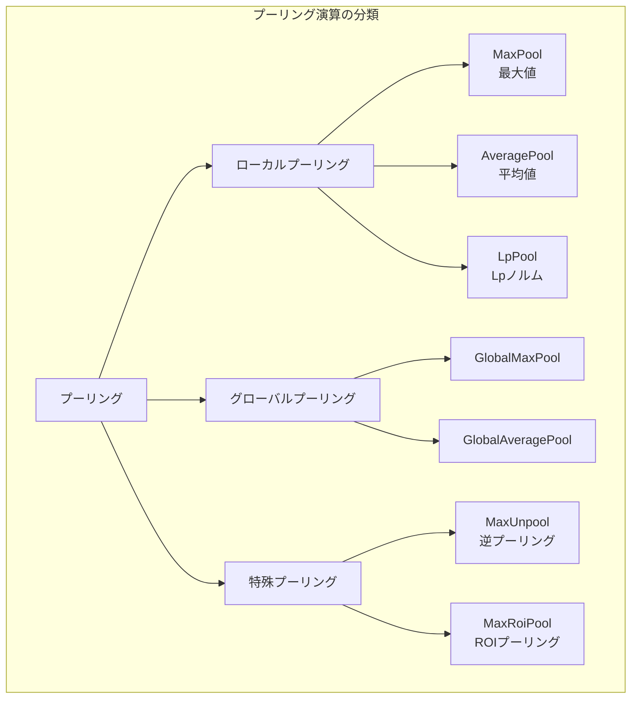
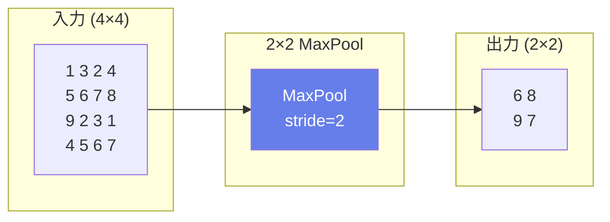
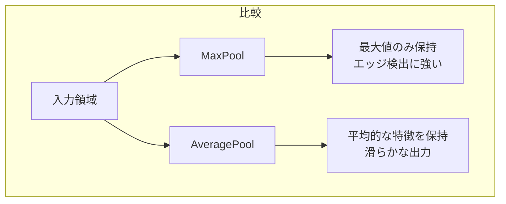
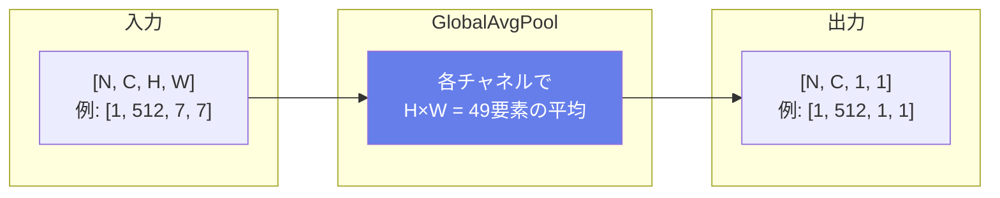
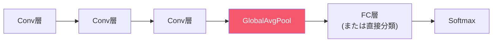
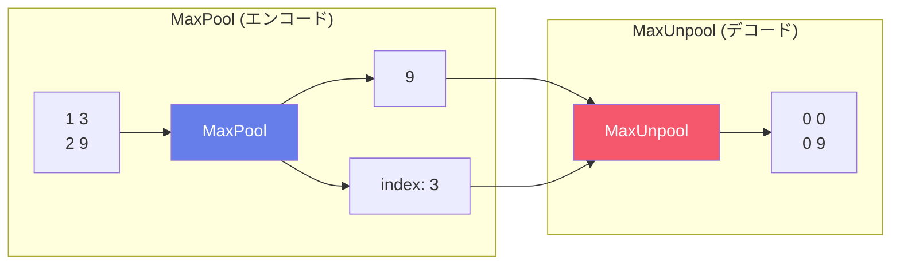
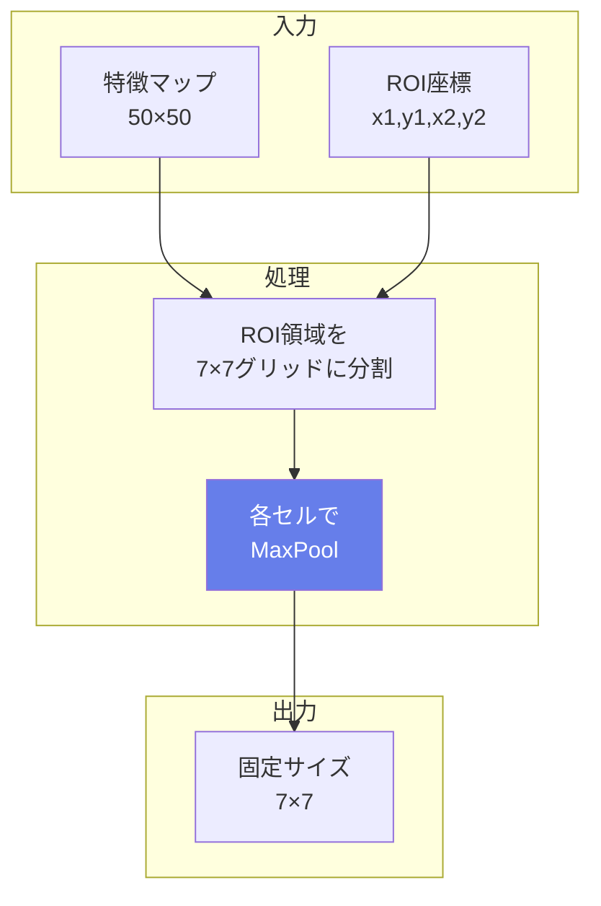
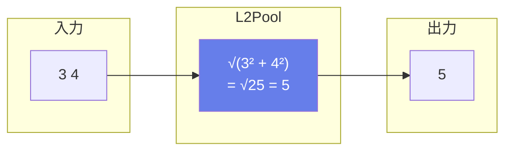
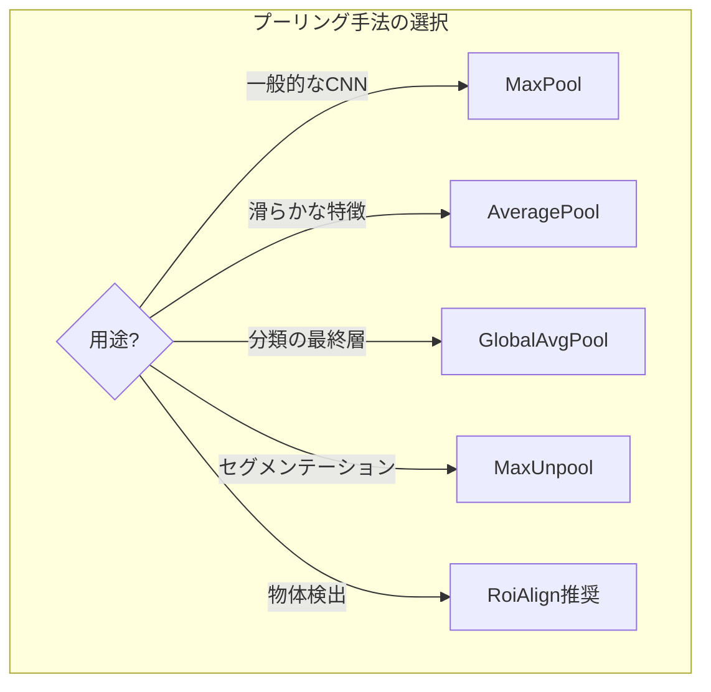

# ONNX演算子 - プーリング演算 (Pooling Operations)

プーリング演算は特徴マップの空間的なダウンサンプリングを行い、位置に対するロバスト性を向上させながら計算量を削減します。CNNの重要な構成要素です。

## 概要図



---

## MaxPool（最大プーリング）

### 説明
指定したウィンドウ内の最大値を取得します。最も強い活性化（特徴）を保持するため、エッジや顕著な特徴の検出に効果的です。CNNで最も一般的に使用されるプーリング演算です。

### 動作原理



### 数式
$$Y[i,j] = \max_{m,n \in W} X[i \cdot s + m, j \cdot s + n]$$

（W = ウィンドウ、s = ストライド）

### 入出力仕様

| 項目 | 名前 | 形状 | 説明 |
|------|------|------|------|
| 入力 | X | [N, C, H, W] | 入力テンソル |
| 出力 | Y | [N, C, oH, oW] | プーリング後のテンソル |
| 出力 | Indices | [N, C, oH, oW] | 最大値の位置（オプション） |

### 属性

| 属性名 | 型 | デフォルト | 説明 |
|--------|-----|----------|------|
| kernel_shape | ints | - | プーリングウィンドウサイズ |
| strides | ints | [1, 1] | ストライド |
| pads | ints | [0,0,0,0] | パディング |
| dilations | ints | [1, 1] | 膨張率 |
| ceil_mode | int | 0 | 出力サイズの切り上げ |
| auto_pad | string | "NOTSET" | パディング方式 |

### 使用例

```python
# 典型的なCNN層でのMaxPool
入力: [1, 64, 28, 28]
kernel_shape: [2, 2]
strides: [2, 2]
出力: [1, 64, 14, 14]  # サイズが半分に
```

### 主な用途
- **CNNのダウンサンプリング**: VGG, AlexNet等
- **位置不変性の獲得**: 小さな位置ずれに対してロバスト
- **計算量削減**: 特徴マップのサイズを削減

---

## AveragePool（平均プーリング）

### 説明
指定したウィンドウ内の要素の平均値を計算します。空間次元を縮小しながら、領域内の平均的な特徴を保持します。MaxPoolより滑らかな出力を生成します。

### 動作原理

```mermaid
graph LR
    subgraph "入力領域"
        I["2 4<br/>6 8"]
    end

    subgraph "AveragePool"
        A[平均値計算<br/>(2+4+6+8)/4]
    end

    subgraph "出力"
        O["5"]
    end

    I --> A --> O

    style A fill:#667eea,color:#fff
```

### 数式
$$Y[i,j] = \frac{1}{|W|} \sum_{m,n \in W} X[i \cdot s + m, j \cdot s + n]$$

### MaxPool vs AveragePool



### 属性

| 属性名 | 型 | デフォルト | 説明 |
|--------|-----|----------|------|
| kernel_shape | ints | - | プーリングウィンドウサイズ |
| strides | ints | [1, 1] | ストライド |
| pads | ints | [0,0,0,0] | パディング |
| count_include_pad | int | 0 | パディングを平均計算に含めるか |
| ceil_mode | int | 0 | 出力サイズの切り上げ |

### 主な用途
- **特徴マップのダウンサンプリング**
- **ノイズ低減**（平滑化効果）
- **ResNetなどのダウンサンプリング層**

---

## GlobalAveragePool（グローバル平均プーリング）

### 説明
各チャネルの空間全体（H×W）の平均を計算し、1つの値に縮約します。全結合層の代替として使用され、パラメータ数を大幅に削減できます。

### 動作原理



### 数式
$$Y[n,c] = \frac{1}{H \times W} \sum_{h=1}^{H} \sum_{w=1}^{W} X[n,c,h,w]$$

### CNNでの使用位置



### 入出力仕様

| 項目 | 名前 | 形状 | 説明 |
|------|------|------|------|
| 入力 | X | [N, C, H, W] | 入力テンソル |
| 出力 | Y | [N, C, 1, 1] | 各チャネル1値 |

### 利点
- **入力サイズに依存しない**: 任意サイズの入力に対応
- **過学習を抑制**: パラメータが不要
- **パラメータ削減**: FC層より大幅に少ない

### 主な用途
- **分類ネットワークの最終層**: ResNet, GoogLeNet, EfficientNet
- **全結合層の代替**

---

## GlobalMaxPool（グローバル最大プーリング）

### 説明
各チャネルの空間全体（H×W）の最大値を取得します。各チャネルで最も強い活性化のみを保持します。

### 数式
$$Y[n,c] = \max_{h,w} X[n,c,h,w]$$

### 入出力仕様

| 項目 | 名前 | 形状 | 説明 |
|------|------|------|------|
| 入力 | X | [N, C, H, W] | 入力テンソル |
| 出力 | Y | [N, C, 1, 1] | 各チャネルの最大値 |

### 主な用途
- **特徴の存在検出**
- **分類タスク**
- **最も顕著な特徴の抽出**

---

## MaxUnpool（最大プーリング逆演算）

### 説明
MaxPoolの逆演算です。MaxPoolで記録されたインデックスを使用して、最大値を元の位置に配置し、他の位置は0で埋めます。

### 動作原理



### 入出力仕様

| 項目 | 名前 | 形状 | 説明 |
|------|------|------|------|
| 入力 | X | プーリング後の形状 | プーリング後のテンソル |
| 入力 | I | 同上 | MaxPoolからのインデックス |
| 入力 | output_shape | - | 出力形状（オプション） |
| 出力 | Y | 元の形状 | アンプーリング後のテンソル |

### 主な用途
- **SegNet**: セマンティックセグメンテーション
- **エンコーダ-デコーダ構造**
- **詳細な位置情報の復元**

---

## MaxRoiPool（ROI最大プーリング）

### 説明
Region of Interest (ROI) 内で最大プーリングを行います。物体検出で、提案された領域から固定サイズの特徴を抽出するために使用されます。

### 動作原理



### 入出力仕様

| 項目 | 名前 | 形状 | 説明 |
|------|------|------|------|
| 入力 | X | [N, C, H, W] | 入力特徴マップ |
| 入力 | rois | [num_rois, 5] | ROI座標 (batch_id, x1, y1, x2, y2) |
| 出力 | Y | [num_rois, C, pH, pW] | プーリング結果 |

### 属性

| 属性名 | 型 | 説明 |
|--------|-----|------|
| pooled_shape | ints | 出力サイズ [pooled_h, pooled_w] |
| spatial_scale | float | 入力座標のスケール係数 |

### 主な用途
- **Fast R-CNN**
- **Faster R-CNN**
- **物体検出の特徴抽出**

### 注意
量子化誤差の問題があり、**RoiAlign**の使用が推奨される場合が多い

---

## LpPool（Lpプーリング）

### 説明
ウィンドウ内の要素のLpノルムを計算します。p=1でL1ノルム（絶対値の和）、p=2でL2ノルム（ユークリッドノルム）になります。

### 数式
$$Y = \left(\sum_{i \in W} |X_i|^p\right)^{1/p}$$

### L2プーリングの例



### 属性

| 属性名 | 型 | デフォルト | 説明 |
|--------|-----|----------|------|
| kernel_shape | ints | - | プーリングウィンドウサイズ |
| p | int | 2 | ノルムの次数 |
| strides | ints | [1, 1] | ストライド |
| pads | ints | [0,0,0,0] | パディング |

### 主な用途
- **テクスチャ解析**
- **特徴の大きさ（magnitude）の保持**
- **正規化効果**

---

## プーリング演算の比較



### 特性比較表

| プーリング | 特徴 | 使用場面 |
|-----------|------|----------|
| MaxPool | 最も強い特徴を保持 | 一般的なCNN |
| AveragePool | 平均的な特徴を保持 | 滑らかさが必要な場合 |
| GlobalAvgPool | パラメータなし | 分類の最終層 |
| GlobalMaxPool | 存在検出に強い | 特徴の有無判定 |
| LpPool | ノルムベース | テクスチャ解析 |

---

## 出力サイズの計算

```
output_size = floor((input_size + pad_begin + pad_end - kernel_size) / stride) + 1
```

ceil_mode=1の場合は ceil() を使用
