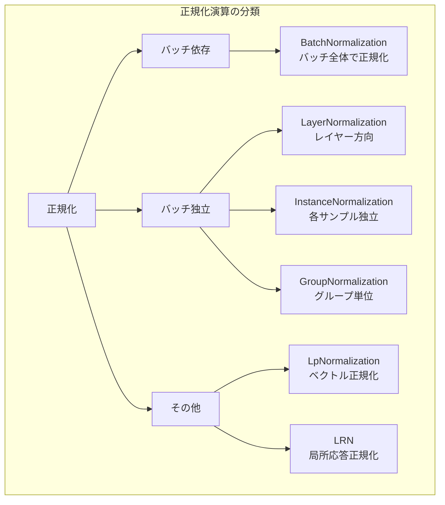
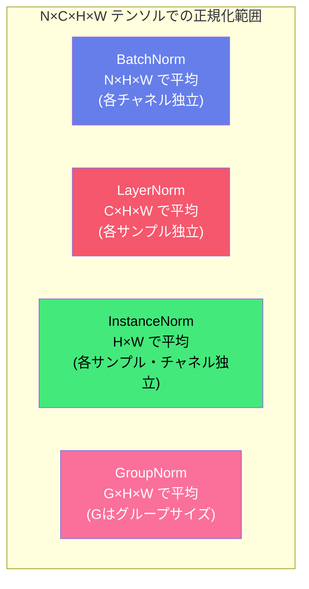
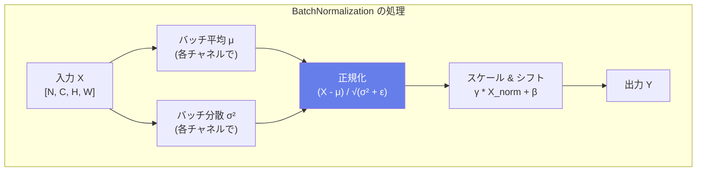
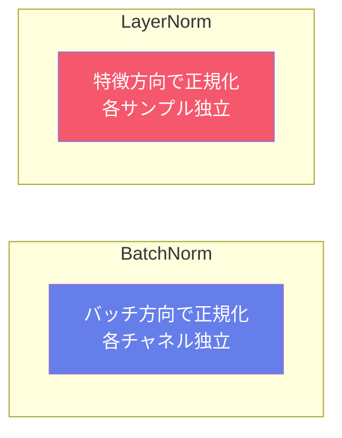
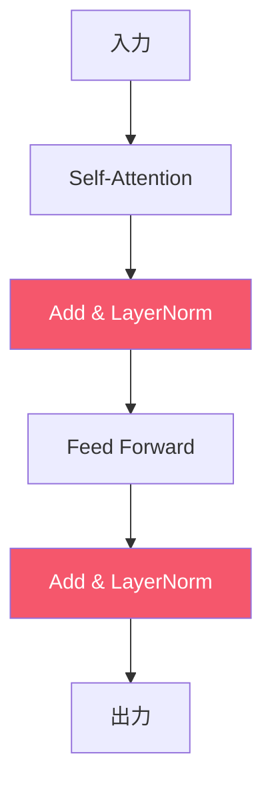
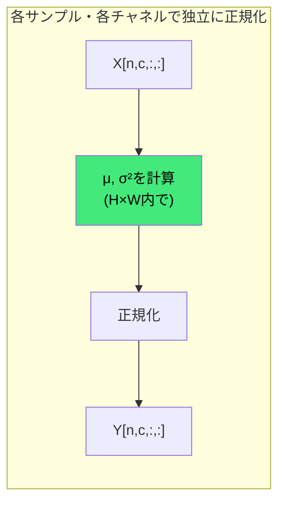
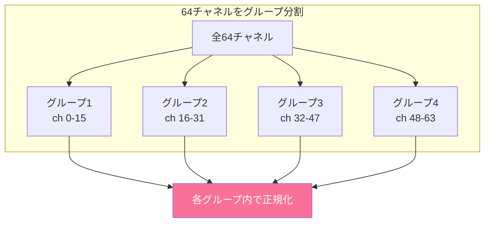
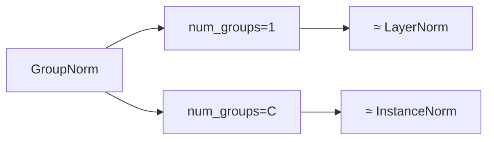
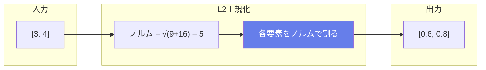
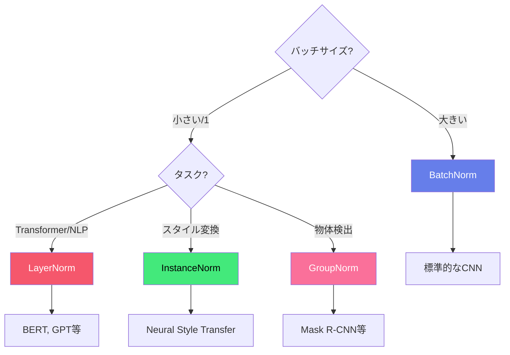

# ONNX演算子 - 正規化演算 (Normalization Operations)

正規化演算はニューラルネットワークの学習を安定させ、収束を高速化する重要な技術です。内部共変量シフトを軽減し、より深いネットワークの訓練を可能にします。

## 概要図

---

## 正規化の計算範囲の比較

---

## BatchNormalization（バッチ正規化）

### 説明
ミニバッチ全体で各チャネルの平均と分散を計算し、正規化を行います。2015年にGoogleが提案し、深層学習の標準技術となりました。学習を安定化させ、収束を大幅に高速化する効果があります。

### 処理フロー

### 数式
$$\mu_c = \frac{1}{N \cdot H \cdot W} \sum_{n,h,w} X_{n,c,h,w}$$

$$\sigma_c^2 = \frac{1}{N \cdot H \cdot W} \sum_{n,h,w} (X_{n,c,h,w} - \mu_c)^2$$

$$\hat{X} = \frac{X - \mu}{\sqrt{\sigma^2 + \epsilon}}$$

$$Y = \gamma \cdot \hat{X} + \beta$$

### 入出力仕様

| 項目 | 名前 | 形状 | 説明 |
|------|------|------|------|
| 入力 | X | [N, C, H, W] | 入力テンソル |
| 入力 | scale (γ) | [C] | スケールパラメータ（学習可能） |
| 入力 | B (β) | [C] | シフトパラメータ（学習可能） |
| 入力 | input_mean | [C] | 推論時の移動平均 |
| 入力 | input_var | [C] | 推論時の移動分散 |
| 出力 | Y | [N, C, H, W] | 正規化されたテンソル |

### 属性

| 属性名 | 型 | デフォルト | 説明 |
|--------|-----|----------|------|
| epsilon | float | 1e-5 | 数値安定性のための小さな値 |
| momentum | float | 0.9 | 移動平均の更新率 |
| training_mode | int | 0 | 訓練モードか推論モードか |

### 訓練時 vs 推論時

### 主な用途
- **ほぼ全てのCNN**: ResNet, VGG, EfficientNet等
- **学習率を大きくできる**
- **正則化効果**: Dropoutの代替にもなりうる

### 注意点
- バッチサイズが小さいと統計が不安定
- 推論時は固定された統計量を使用

---

## LayerNormalization（レイヤー正規化）

### 説明
各サンプルの全ての特徴（チャネル×空間）にわたって正規化を行います。バッチサイズに依存せず、Transformerで標準的に使用されます。

### BatchNorm vs LayerNorm

### 数式
$$\mu = \frac{1}{D} \sum_{i=1}^{D} x_i$$

$$\sigma^2 = \frac{1}{D} \sum_{i=1}^{D} (x_i - \mu)^2$$

$$Y = \gamma \cdot \frac{X - \mu}{\sqrt{\sigma^2 + \epsilon}} + \beta$$

（D = 正規化する特徴の次元数）

### 入出力仕様

| 項目 | 名前 | 形状 | 説明 |
|------|------|------|------|
| 入力 | X | [*, normalized_shape] | 入力テンソル |
| 入力 | Scale | [normalized_shape] | スケールパラメータ |
| 入力 | B | [normalized_shape] | バイアスパラメータ |
| 出力 | Y | 入力と同じ | 正規化されたテンソル |

### 属性

| 属性名 | 型 | デフォルト | 説明 |
|--------|-----|----------|------|
| axis | int | -1 | 正規化を開始する軸 |
| epsilon | float | 1e-5 | 数値安定性のための値 |

### Transformerでの使用

### 主な用途
- **Transformer**: BERT, GPT, ViT等
- **RNN/LSTM**
- **自然言語処理**
- **バッチサイズ1での推論**

---

## InstanceNormalization（インスタンス正規化）

### 説明
各サンプルの各チャネルを独立に正規化します。バッチ内の他のサンプルに依存しないため、バッチサイズが1でも動作します。スタイル変換タスクで特に効果的です。

### 処理フロー

### 数式
$$\mu_{n,c} = \frac{1}{H \cdot W} \sum_{h,w} X_{n,c,h,w}$$

$$Y_{n,c} = \gamma_c \cdot \frac{X_{n,c} - \mu_{n,c}}{\sqrt{\sigma_{n,c}^2 + \epsilon}} + \beta_c$$

### 入出力仕様

| 項目 | 名前 | 形状 | 説明 |
|------|------|------|------|
| 入力 | input | [N, C, H, W] | 入力テンソル |
| 入力 | scale | [C] | スケールパラメータ |
| 入力 | B | [C] | バイアスパラメータ |
| 出力 | output | [N, C, H, W] | 正規化されたテンソル |

### 主な用途
- **スタイル変換**: Neural Style Transfer
- **画像生成**: GAN
- **バッチサイズ1での推論**
- **リアルタイム処理**

---

## GroupNormalization（グループ正規化）

### 説明
チャネルを複数のグループに分け、各グループ内で正規化を行います。BatchNormとLayerNormの中間的な手法で、小さいバッチサイズでも安定動作します。

### グループ分割の概念

### 特殊ケース

### 入出力仕様

| 項目 | 名前 | 形状 | 説明 |
|------|------|------|------|
| 入力 | X | [N, C, H, W] | 入力テンソル |
| 入力 | scale | [C] | スケールパラメータ |
| 入力 | bias | [C] | バイアスパラメータ |
| 出力 | Y | [N, C, H, W] | 正規化されたテンソル |

### 属性

| 属性名 | 型 | 説明 |
|--------|-----|------|
| num_groups | int | グループ数（Cの約数） |
| epsilon | float | 数値安定性のための値 |

### 主な用途
- **物体検出**: 特に小バッチサイズ
- **セグメンテーション**
- **Mask R-CNN**

---

## LpNormalization（Lp正規化）

### 説明
指定した軸に沿ってLpノルムで正規化します。正規化後のベクトルのLpノルムは1になります。

### L2正規化の例

### 数式
$$Y = \frac{X}{\|X\|_p}$$

$$\|X\|_p = \left(\sum_i |x_i|^p\right)^{1/p}$$

### 属性

| 属性名 | 型 | デフォルト | 説明 |
|--------|-----|----------|------|
| axis | int | -1 | 正規化する軸 |
| p | int | 2 | ノルムの次数（1または2） |

### 主な用途
- **埋め込みベクトルの正規化**
- **コサイン類似度計算の前処理**
- **特徴ベクトルの正規化**

---

## LRN（Local Response Normalization）

### 説明
局所応答正規化。近傍のチャネルの活性化で正規化を行います。生物学的な側抑制（lateral inhibition）にヒントを得た手法で、AlexNetで使用されました。

### 処理概念

### 数式
$$Y_{n,c,h,w} = \frac{X_{n,c,h,w}}{\left(bias + \frac{\alpha}{size} \sum_{c'=\max(0,c-\lfloor size/2 \rfloor)}^{\min(C-1,c+\lfloor size/2 \rfloor)} X_{n,c',h,w}^2\right)^\beta}$$

### 属性

| 属性名 | 型 | デフォルト | 説明 |
|--------|-----|----------|------|
| alpha | float | 0.0001 | スケーリングパラメータ |
| beta | float | 0.75 | 指数 |
| bias | float | 1.0 | バイアス項 |
| size | int | - | 正規化する近傍チャネル数 |

### 主な用途
- **AlexNet**（歴史的）
- **競合抑制効果**
- **顕著な特徴の強調**

### 注意
現在はBatchNormの使用が一般的で、LRNはあまり使用されません。

---

## MeanVarianceNormalization（平均分散正規化）

### 説明
指定した軸に沿って平均と分散で正規化します。出力の平均が0、分散が1になります。

### 数式
$$Y = \frac{X - \mu}{\sqrt{\sigma^2 + \epsilon}}$$

### 属性

| 属性名 | 型 | デフォルト | 説明 |
|--------|-----|----------|------|
| axes | ints | [0, 2, 3] | 正規化する軸のリスト |

### 主な用途
- **特徴の標準化**
- **前処理**
- **カスタム正規化**

---

## 正規化手法の選択ガイド

### 比較表

| 正規化 | バッチ依存 | 適用場面 | 特徴 |
|--------|----------|----------|------|
| BatchNorm | あり | CNN全般 | 最も一般的、学習が安定 |
| LayerNorm | なし | Transformer | バッチサイズに依存しない |
| InstanceNorm | なし | スタイル変換 | 各サンプル完全独立 |
| GroupNorm | なし | 物体検出 | 小バッチで安定 |
| LpNorm | なし | 埋め込み | ベクトル正規化 |
