# ONNX演算子 - 形状変換演算 (Shape Operations)

形状変換演算はテンソルの形状を変更したり、複数のテンソルを結合・分割したりする演算です。データの流れを制御し、層間の接続を可能にする重要な役割を果たします。

## 概要図

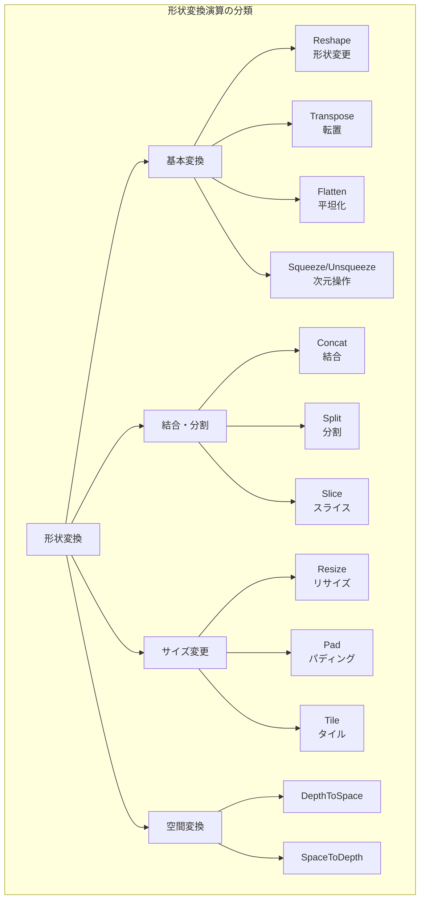

---

## Reshape（形状変更）

### 説明
テンソルの形状を変更します。要素の総数は変わらず、メモリ配置を再解釈するだけなので、非常に効率的な演算です。

### 動作原理

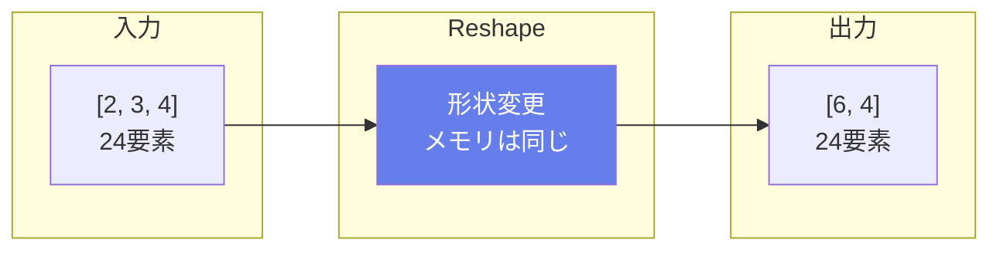

### 特殊な値

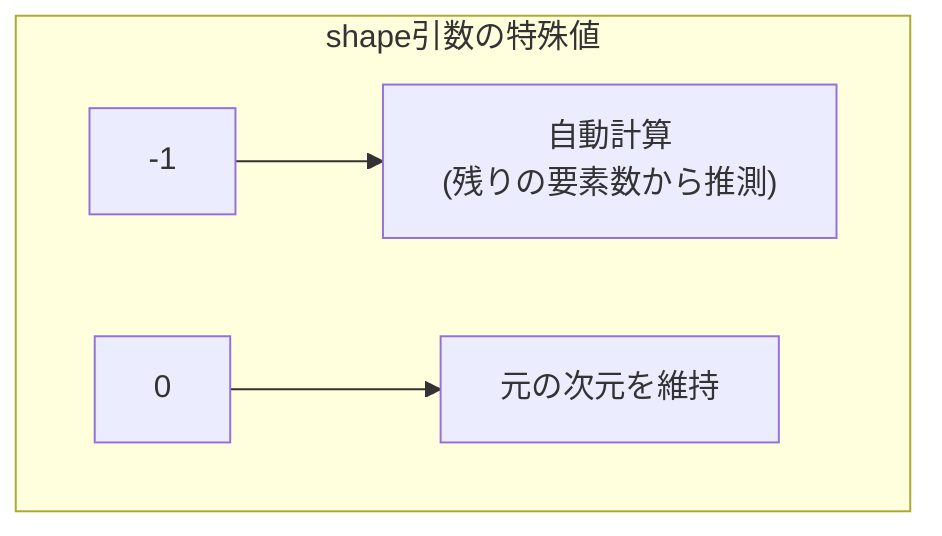

### 入出力仕様

| 項目 | 名前 | 形状 | 説明 |
|------|------|------|------|
| 入力 | data | 任意 | 入力テンソル |
| 入力 | shape | [n] | 新しい形状（int64） |
| 出力 | reshaped | shape指定 | 形状変更後のテンソル |

### 使用例

```python
# 基本的なReshape
入力: [2, 3, 4] (24要素)
shape: [6, 4]
出力: [6, 4] (24要素)

# -1を使用（自動計算）
入力: [2, 3, 4]
shape: [-1, 4]
出力: [6, 4]  # -1は6と計算される

# 0を使用（元の次元維持）
入力: [2, 3, 4]
shape: [0, -1]
出力: [2, 12]  # 0は2を維持、-1は12と計算される
```

### 主な用途
- **全結合層への入力準備**
- **バッチ次元の操作**
- **Attention計算の準備**

---

## Transpose（転置）

### 説明
テンソルの軸の順序を入れ替えます。2次元テンソルでは行列の転置に相当します。メモリのコピーが発生するため、Reshapeより計算コストが高いです。

### 動作原理

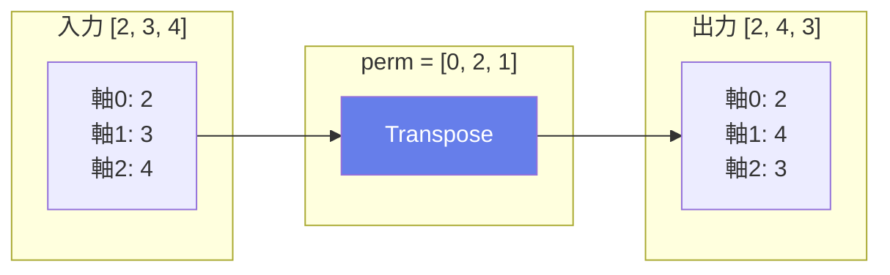

### 2D行列の転置

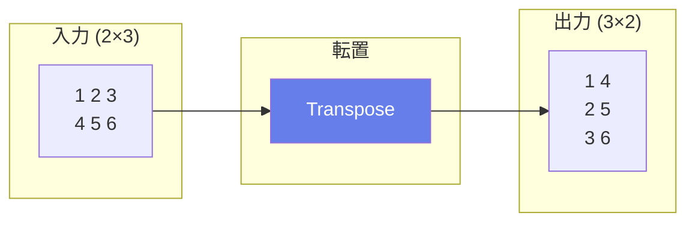

### 入出力仕様

| 項目 | 名前 | 形状 | 説明 |
|------|------|------|------|
| 入力 | data | 任意 | 入力テンソル |
| 出力 | transposed | 変換後 | 転置後のテンソル |

### 属性

| 属性名 | 型 | デフォルト | 説明 |
|--------|-----|----------|------|
| perm | ints | 逆順 | 軸の新しい順序 |

### 主な用途
- **行列転置**
- **チャネル順序の変更**: NCHW ↔ NHWC
- **Attention計算**: Q, K, Vの変換

---

## Flatten（平坦化）

### 説明
多次元テンソルを2次元に平坦化します。axis以前の次元が最初の次元に、axis以降の次元が2番目の次元に結合されます。

### 動作原理

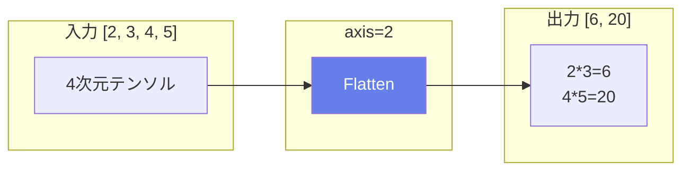

### 数式
$$\text{output\_shape} = [\prod_{i=0}^{axis-1} \text{input\_shape}[i], \prod_{i=axis}^{n-1} \text{input\_shape}[i]]$$

### 属性

| 属性名 | 型 | デフォルト | 説明 |
|--------|-----|----------|------|
| axis | int | 1 | 平坦化の分割点 |

### 使用例

```python
# CNNから全結合層への接続
入力: [32, 512, 7, 7]  # バッチ32、512チャネル、7×7
axis: 1 (デフォルト)
出力: [32, 25088]  # バッチ維持、512*7*7=25088
```

### 主な用途
- **CNNから全結合層への接続**
- **特徴ベクトルの生成**
- **分類器への入力準備**

---

## Squeeze（次元削除）

### 説明
サイズが1の次元を削除します。特定の軸を指定するか、全てのサイズ1の次元を削除できます。

### 動作原理

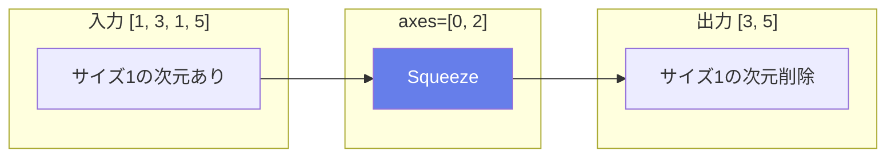

### 入出力仕様

| 項目 | 名前 | 形状 | 説明 |
|------|------|------|------|
| 入力 | data | 任意 | 入力テンソル |
| 入力 | axes | [n] | 削除する軸（オプション） |
| 出力 | squeezed | 削減後 | 次元削除後のテンソル |

### 主な用途
- **不要な次元の除去**
- **ブロードキャスト後の形状調整**
- **バッチサイズ1の次元除去**

---

## Unsqueeze（次元追加）

### 説明
指定した位置にサイズ1の新しい次元を挿入します。Squeezeの逆操作です。

### 動作原理

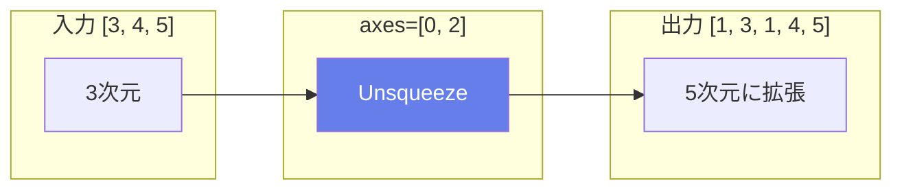

### 入出力仕様

| 項目 | 名前 | 形状 | 説明 |
|------|------|------|------|
| 入力 | data | 任意 | 入力テンソル |
| 入力 | axes | [n] | 挿入する位置 |
| 出力 | expanded | 拡張後 | 次元追加後のテンソル |

### 主な用途
- **ブロードキャスト用の次元追加**
- **バッチ次元の追加**
- **チャネル次元の追加**

---

## Concat（結合）

### 説明
複数のテンソルを指定した軸に沿って結合します。結合する軸以外の次元は全て同じである必要があります。

### 動作原理

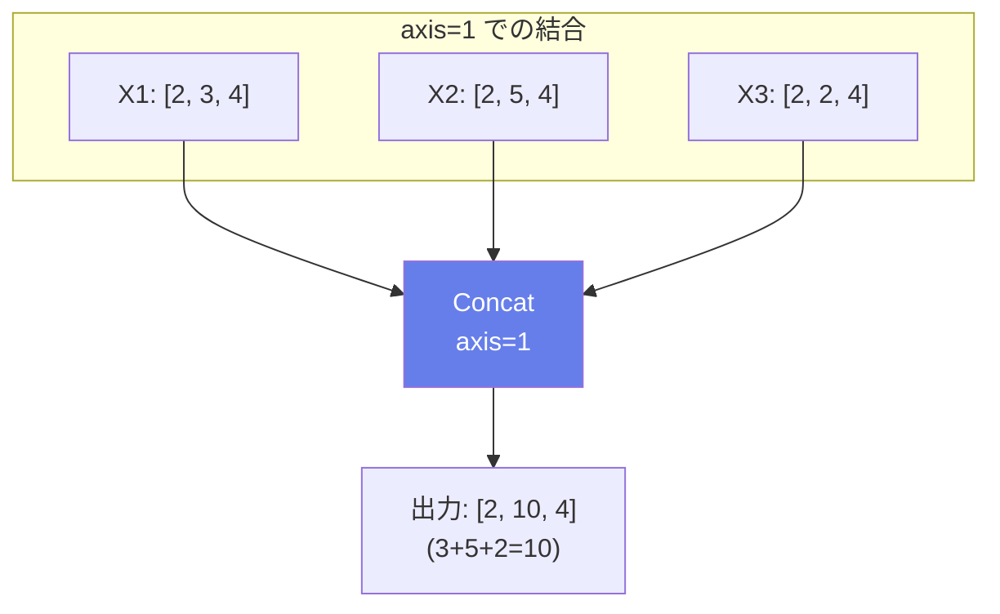

### 属性

| 属性名 | 型 | 説明 |
|--------|-----|------|
| axis | int | 結合する軸 |

### 主な用途
- **特徴の結合**: DenseNet
- **スキップ接続**: U-Net
- **マルチスケール特徴の統合**

---

## Split（分割）

### 説明
テンソルを指定した軸に沿って複数の部分に分割します。均等分割または指定したサイズでの分割が可能です。

### 動作原理

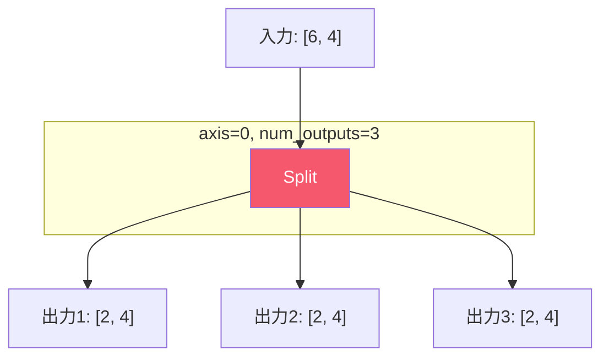

### 属性

| 属性名 | 型 | デフォルト | 説明 |
|--------|-----|----------|------|
| axis | int | 0 | 分割する軸 |
| num_outputs | int | - | 出力数（均等分割時） |

### 入力

| 名前 | 説明 |
|------|------|
| split | 各出力のサイズ（オプション） |

### 主な用途
- **マルチヘッドAttentionの分割**
- **グループ畳み込み**
- **並列処理**

---

## Slice（スライス）

### 説明
テンソルの一部を切り出します。Pythonのスライス記法と同様に、開始・終了インデックスとステップを指定できます。

### 動作原理

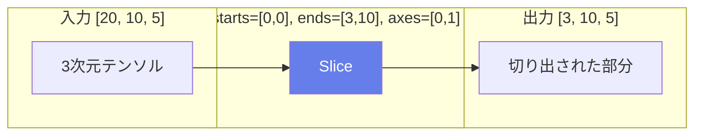

### 入出力仕様

| 項目 | 名前 | 説明 |
|------|------|------|
| 入力 | data | 入力テンソル |
| 入力 | starts | 各軸の開始インデックス |
| 入力 | ends | 各軸の終了インデックス |
| 入力 | axes | スライスする軸（オプション） |
| 入力 | steps | 各軸のステップ（オプション） |
| 出力 | output | スライスされたテンソル |

### 使用例

```python
# 負のインデックス
入力: [10, 20, 30]
starts: [0]
ends: [-1]  # 最後の要素を除く
axes: [0]
出力: [9, 20, 30]
```

### 主な用途
- **データの部分抽出**
- **パディングの除去**
- **ウィンドウ処理**

---

## Pad（パディング）

### 説明
テンソルの周囲にパディング（余白）を追加します。画像処理で畳み込みの出力サイズを維持したり、シーケンスの長さを揃えたりするために使用されます。

### パディングモード

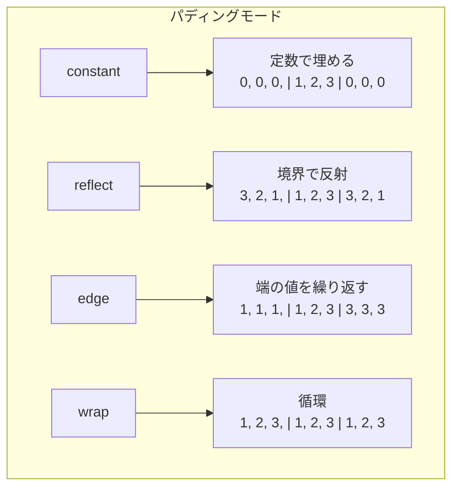

### 入出力仕様

| 項目 | 名前 | 説明 |
|------|------|------|
| 入力 | data | 入力テンソル |
| 入力 | pads | 各軸の[前, 後]のパディング量 |
| 入力 | constant_value | 定数パディングの値（オプション） |
| 出力 | output | パディング後のテンソル |

### 属性

| 属性名 | 型 | デフォルト | 説明 |
|--------|-----|----------|------|
| mode | string | "constant" | パディングモード |

### 主な用途
- **畳み込みの出力サイズ維持**
- **シーケンスの長さ統一**
- **画像のボーダー処理**

---

## Resize（リサイズ）

### 説明
テンソル（主に画像）のサイズを変更します。補間方法を選択でき、アップサンプリングとダウンサンプリングの両方に対応します。

### 補間モード

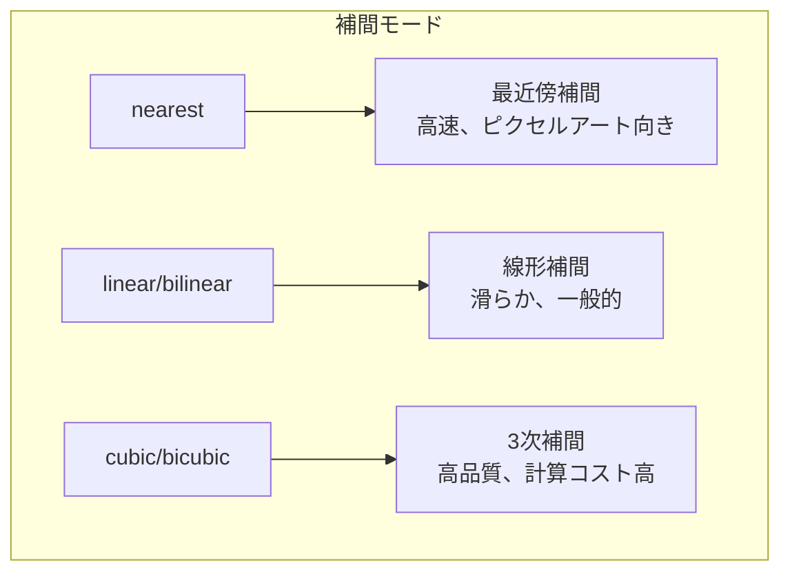

### 入出力仕様

| 項目 | 名前 | 説明 |
|------|------|------|
| 入力 | X | 入力テンソル |
| 入力 | roi | 関心領域（オプション） |
| 入力 | scales | スケール係数（オプション） |
| 入力 | sizes | 出力サイズ（オプション） |
| 出力 | Y | リサイズされたテンソル |

### 属性

| 属性名 | 型 | 説明 |
|--------|-----|------|
| mode | string | 補間モード |
| coordinate_transformation_mode | string | 座標変換モード |

### 使用例

```python
# 2倍にアップサンプリング
入力: [1, 3, 224, 224]
scales: [1, 1, 2, 2]
出力: [1, 3, 448, 448]
```

### 主な用途
- **画像のアップサンプリング**
- **特徴マップのサイズ調整**
- **マルチスケール処理**

---

## DepthToSpace / SpaceToDepth

### DepthToSpace（深さから空間へ）

チャネル次元のデータを空間次元に再配置します（ピクセルシャッフル）。

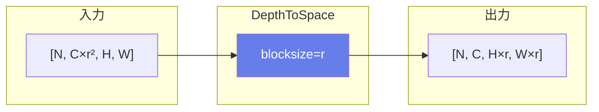

### SpaceToDepth（空間から深さへ）

空間次元のデータをチャネル次元に再配置します（DepthToSpaceの逆）。

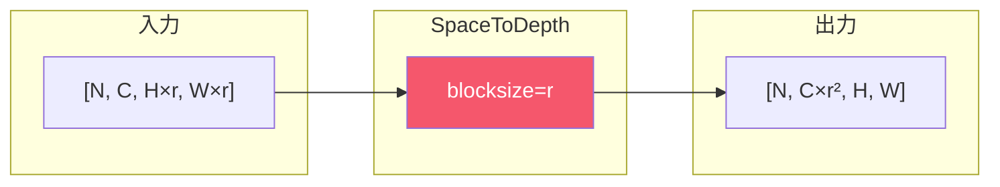

### 主な用途

| 演算子 | 用途 |
|--------|------|
| DepthToSpace | 超解像（Sub-Pixel Convolution）、アップサンプリング |
| SpaceToDepth | 情報を失わないダウンサンプリング、YOLOv5のFocus層 |

---

## Tile / Expand

### Tile（タイル）
テンソルを指定した回数だけ繰り返してタイル状に配置します。

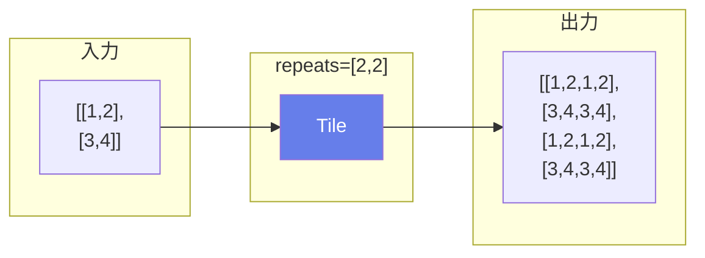

### Expand（拡張）
テンソルをブロードキャストして指定した形状に拡張します。

```python
# Expandの例
入力: [1, 4] (shape)
shape: [3, 4]
出力: [3, 4] (最初の次元を3に拡張)
```

### 違い

| 演算子 | 特徴 |
|--------|------|
| Tile | 実際にデータをコピー |
| Expand | ブロードキャスト（メモリ効率的な場合あり） |
