# ONNX演算子 - インデックス演算 (Index Operations)

インデックス演算はテンソルの特定の要素を選択したり、指定した位置に値を書き込んだりする演算です。埋め込みルックアップやスパーステンソルの操作に不可欠です。

## 概要図

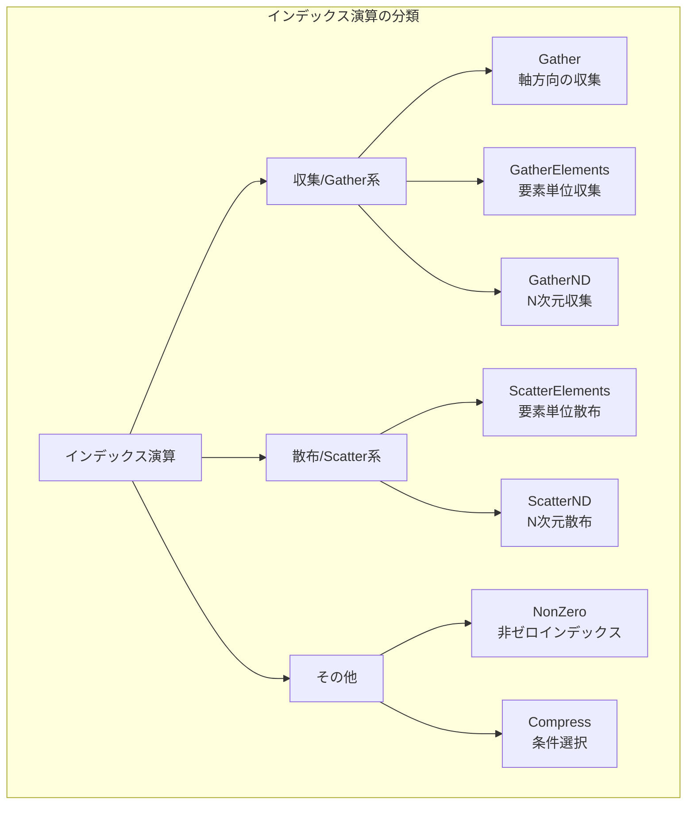

---

## Gather（収集）

### 説明
指定したインデックスに基づいてテンソルから要素を収集します。埋め込み層のルックアップ操作として広く使用されます。

### 動作原理

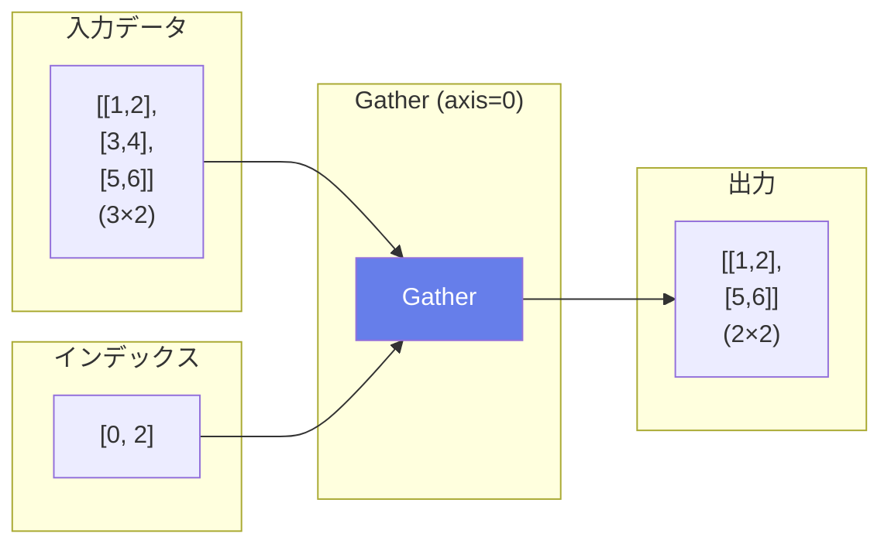

### 埋め込みルックアップ

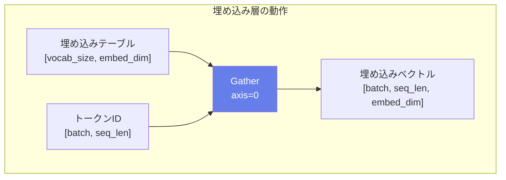

### 入出力仕様

| 項目 | 名前 | 形状 | 説明 |
|------|------|------|------|
| 入力 | data | 任意 | 入力テンソル |
| 入力 | indices | 整数テンソル | 収集するインデックス |
| 出力 | output | 計算される | 収集されたテンソル |

### 属性

| 属性名 | 型 | デフォルト | 説明 |
|--------|-----|----------|------|
| axis | int | 0 | 収集する軸 |

### 使用例

```python
# 埋め込みルックアップ
embedding = [[0.1, 0.2], [0.3, 0.4], [0.5, 0.6], [0.7, 0.8]]  # [4, 2]
indices = [1, 3, 0]
output = [[0.3, 0.4], [0.7, 0.8], [0.1, 0.2]]  # [3, 2]
```

### 主な用途
- **単語埋め込みのルックアップ**
- **インデックスによる選択**
- **バッチ内の要素選択**

---

## GatherElements（要素収集）

### 説明
インデックステンソルと同じ形状の出力を生成し、各位置で指定されたインデックスの要素を収集します。Gatherより柔軟な収集が可能です。

### 動作原理

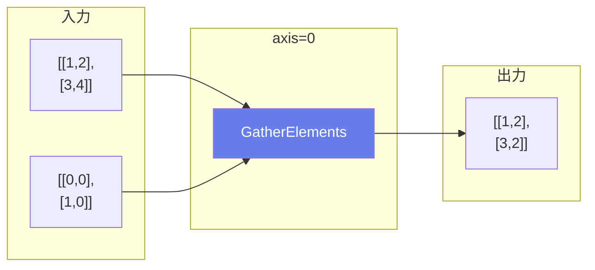

### 数式
```
axis=0の場合:
output[i][j][k] = input[indices[i][j][k]][j][k]
```

### 入出力仕様

| 項目 | 名前 | 形状 | 説明 |
|------|------|------|------|
| 入力 | data | 任意 | 入力テンソル |
| 入力 | indices | dataと同ランク | インデックステンソル |
| 出力 | output | indicesと同形状 | 収集されたテンソル |

### 主な用途
- **複雑なインデックス操作**
- **Top-K選択後の値取得**
- **Attentionの値選択**

---

## GatherND（N次元収集）

### 説明
N次元インデックスを使用して要素またはスライスを収集します。複数の軸にまたがるインデックス指定が可能で、より複雑な収集パターンを実現できます。

### 動作原理

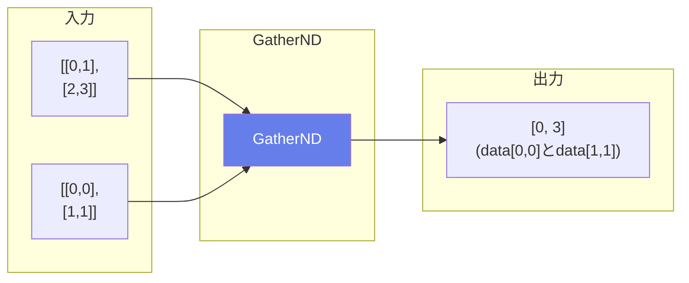

### 入出力仕様

| 項目 | 名前 | 形状 | 説明 |
|------|------|------|------|
| 入力 | data | 任意 | 入力テンソル |
| 入力 | indices | [..., index_depth] | N次元インデックス |
| 出力 | output | 計算される | 収集されたテンソル |

### 属性

| 属性名 | 型 | デフォルト | 説明 |
|--------|-----|----------|------|
| batch_dims | int | 0 | バッチ次元の数 |

### 使用例

```python
# 点群からの特徴抽出
data = [batch, H, W, C]
indices = [batch, num_points, 2]  # 各点のH,W座標
output = [batch, num_points, C]
```

### 主な用途
- **点群からの特徴抽出**
- **複雑なインデックスパターン**
- **グラフニューラルネットワーク**

---

## ScatterElements（要素散布）

### 説明
GatherElementsの逆操作。インデックスで指定した位置に値を書き込みます。更新値を指定した位置に散布します。

### 動作原理

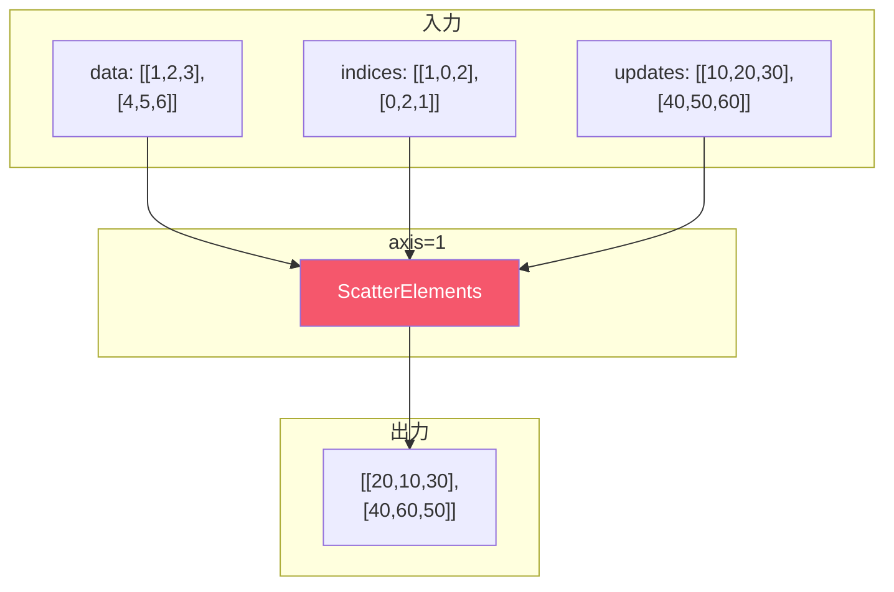

### 入出力仕様

| 項目 | 名前 | 形状 | 説明 |
|------|------|------|------|
| 入力 | data | 任意 | ベースとなるテンソル |
| 入力 | indices | 任意 | 書き込み位置のインデックス |
| 入力 | updates | indicesと同形状 | 書き込む値 |
| 出力 | output | dataと同形状 | 更新されたテンソル |

### 属性

| 属性名 | 型 | デフォルト | 説明 |
|--------|-----|----------|------|
| axis | int | 0 | 散布する軸 |
| reduction | string | 'none' | 重複時の処理 |

### reduction オプション

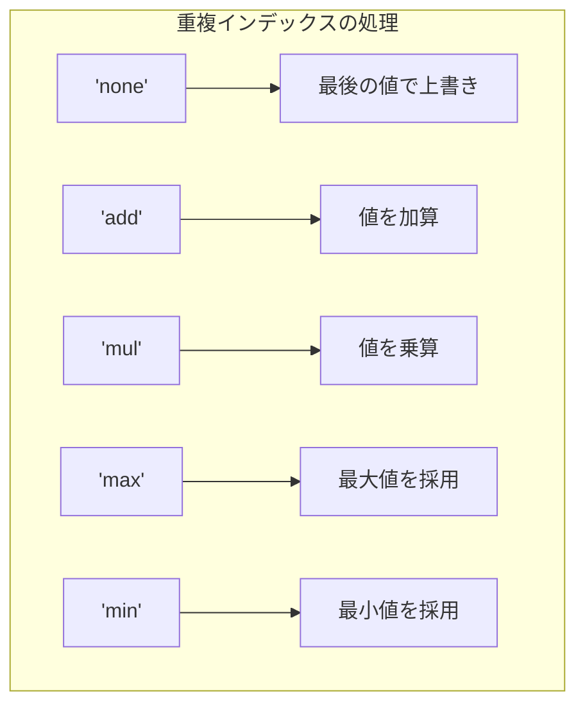

### 主な用途
- **One-hotエンコーディングの作成**
- **スパース更新**
- **勾配の散布**

---

## ScatterND（N次元散布）

### 説明
GatherNDの逆操作。N次元インデックスで指定した位置に値を書き込みます。

### 動作原理

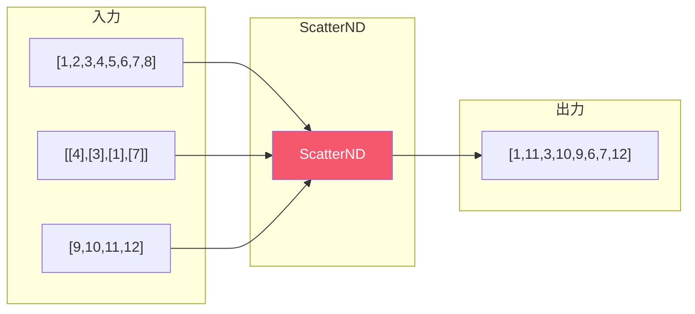

### 主な用途
- **スパーステンソルの構築**
- **点群の特徴書き込み**
- **グラフ更新**

---

## NonZero（非ゼロインデックス）

### 説明
入力テンソルで0でない要素のインデックスを返します。スパースデータの処理やマスク操作に使用されます。

### 動作原理

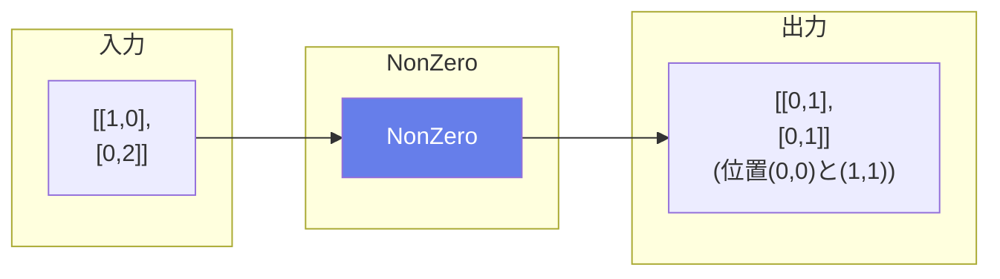

### 入出力仕様

| 項目 | 名前 | 形状 | 説明 |
|------|------|------|------|
| 入力 | X | 任意 | 入力テンソル |
| 出力 | Y | [rank, num_nonzero] | 非ゼロ要素のインデックス |

### 主な用途
- **スパースデータ処理**
- **マスクの適用**
- **条件に合う要素の検索**

---

## Compress（圧縮選択）

### 説明
ブール条件に基づいて要素を選択します。条件がTrueの要素のみを抽出して返します。

### 動作原理

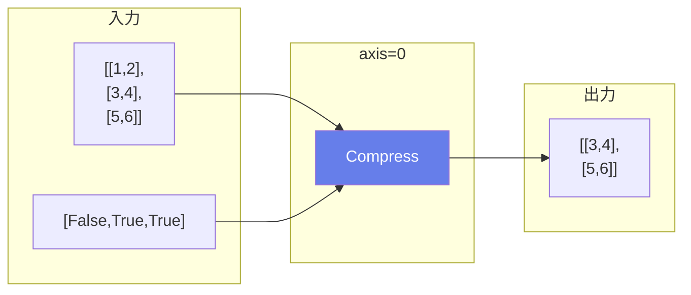

### 入出力仕様

| 項目 | 名前 | 形状 | 説明 |
|------|------|------|------|
| 入力 | input | 任意 | 入力テンソル |
| 入力 | condition | ブール | 条件テンソル |
| 出力 | output | 圧縮後 | 選択された要素 |

### 属性

| 属性名 | 型 | デフォルト | 説明 |
|--------|-----|----------|------|
| axis | int | None | 圧縮する軸（省略時は平坦化） |

### 主な用途
- **条件フィルタリング**
- **マスク適用**
- **有効なデータの抽出**

---

## Gather vs GatherElements vs GatherND

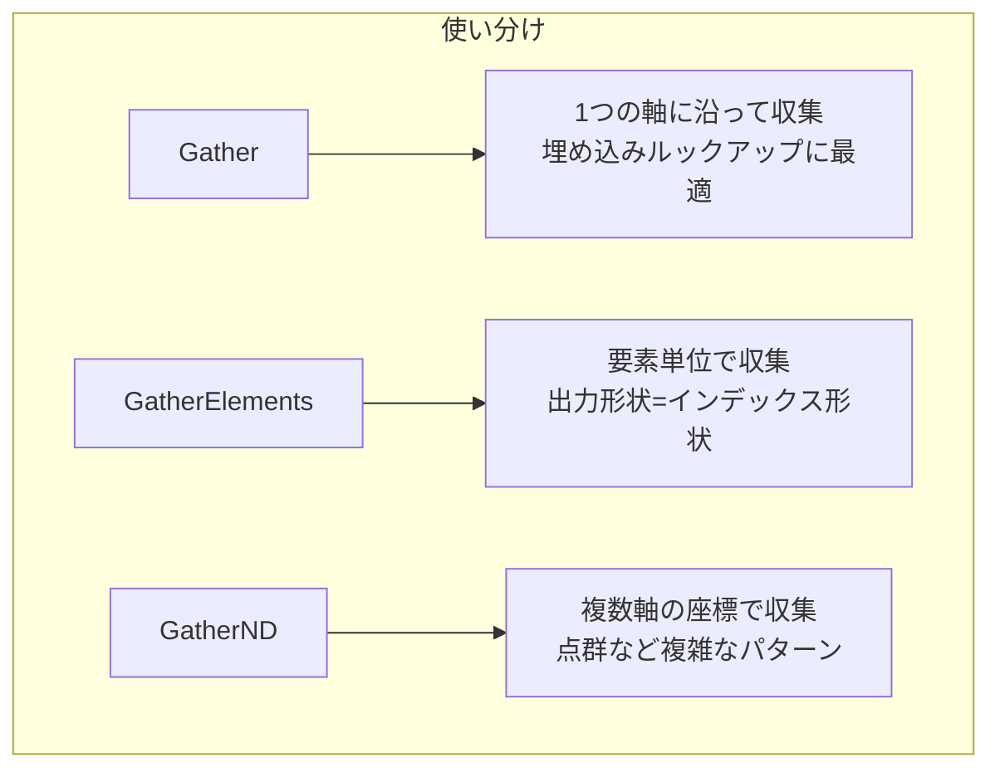

### 比較表

| 演算子 | インデックス | 出力形状 | 用途 |
|--------|------------|---------|------|
| Gather | 1軸方向 | indices形状 + data残り次元 | 埋め込み |
| GatherElements | 要素単位 | indices形状 | Top-K値取得 |
| GatherND | N次元座標 | 座標に依存 | 点群、グラフ |
