# ONNX演算子 - 比較・論理演算 (Comparison & Logic Operations)

比較・論理演算はテンソルの要素を比較したり、ブール値に対する論理操作を行います。条件分岐やマスク生成の基盤となる重要な演算です。

## 概要図

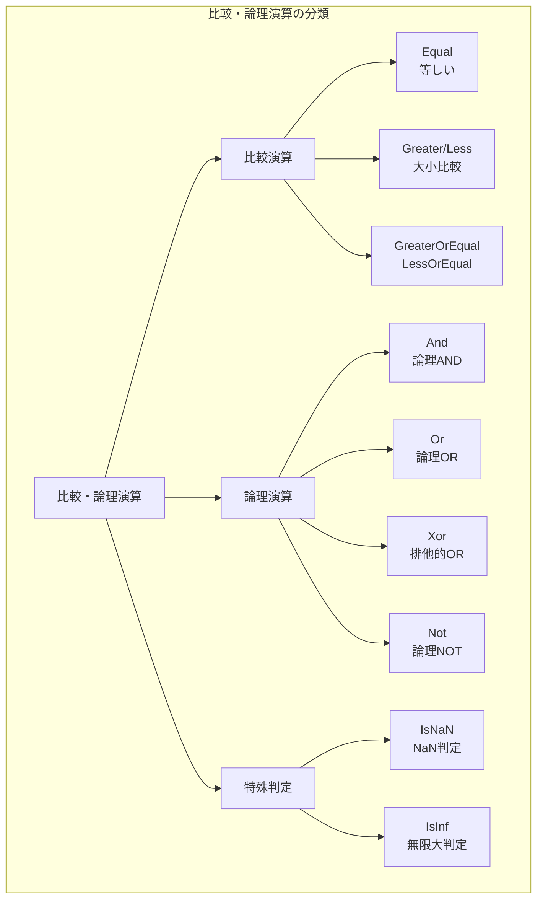

---

## 比較演算

### Equal（等しい）

2つのテンソルの要素が等しいかを判定します。

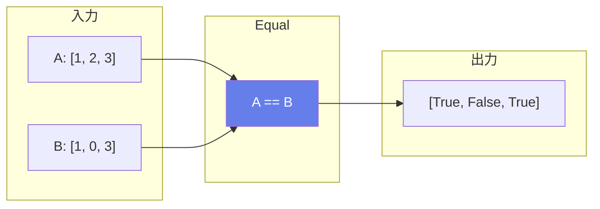

#### 数式
$$Y = (A == B)$$

#### 主な用途
- **条件判定**
- **マスク生成**
- **パディングトークンの検出**
- **ラベル比較**

---

### Greater / Less / GreaterOrEqual / LessOrEqual

大小関係を比較する演算子群です。

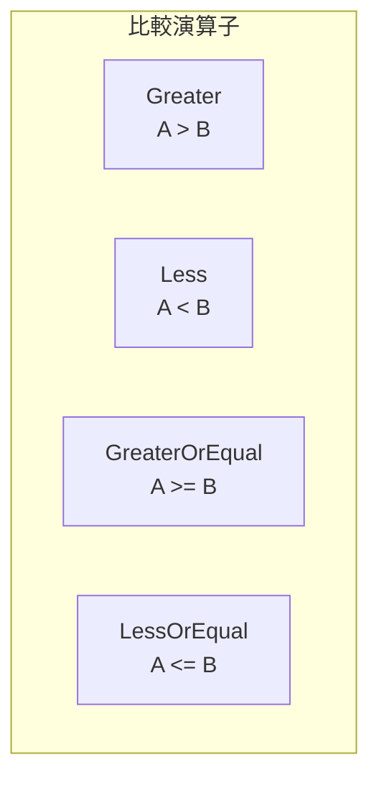

#### 使用例

```python
A = [5, 2, 3]
B = [3, 3, 3]

Greater(A, B)        # [True, False, False]
Less(A, B)           # [False, True, False]
GreaterOrEqual(A, B) # [True, False, True]
LessOrEqual(A, B)    # [False, True, True]
```

#### 主な用途
- **しきい値判定**
- **アテンションマスク生成**
- **範囲チェック**
- **ソート条件**

---

## 論理演算

### 真理値表

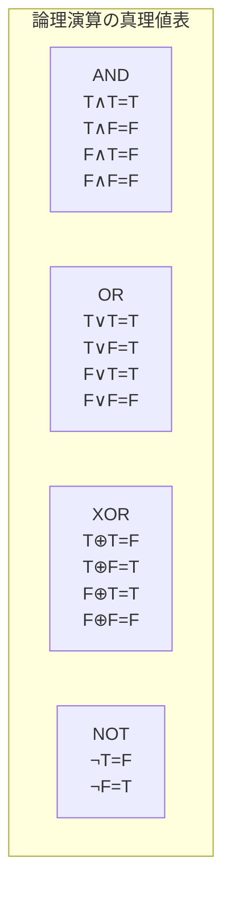

---

### And（論理AND）

両方がTrueの場合のみTrueを返します。


#### 主な用途
- **複合条件の判定**
- **マスクの組み合わせ**
- **フィルタリング条件**

---

### Or（論理OR）

どちらかがTrueならTrueを返します。


#### 主な用途
- **複合条件（いずれか）**
- **マスクの結合**
- **例外条件の追加**

---

### Xor（排他的論理和）

片方だけがTrueの場合にTrueを返します。

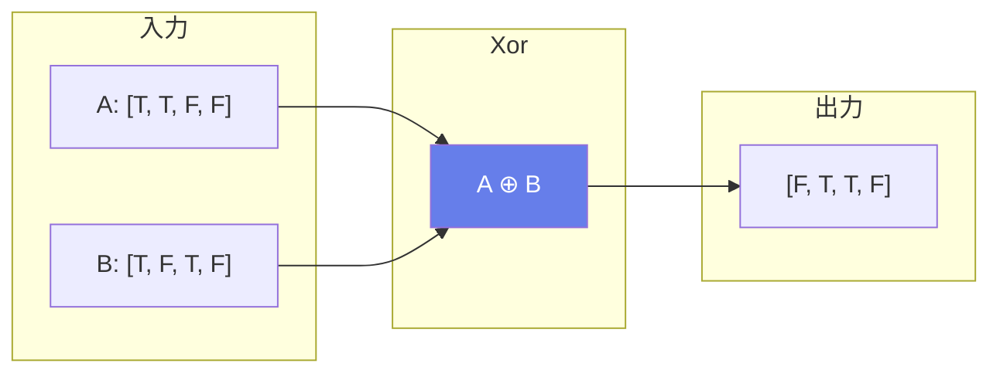

#### 主な用途
- **差分検出**
- **異なる要素の特定**
- **トグル操作**

---

### Not（論理NOT）

ブール値を反転します。

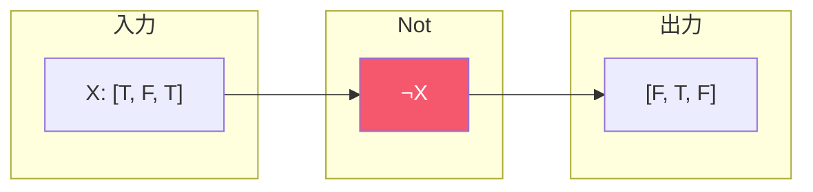

#### 主な用途
- **条件の反転**
- **マスクの反転**
- **補集合の計算**

---

## 特殊な判定演算

### IsNaN（NaN判定）

各要素がNaN（非数）かどうかを判定します。

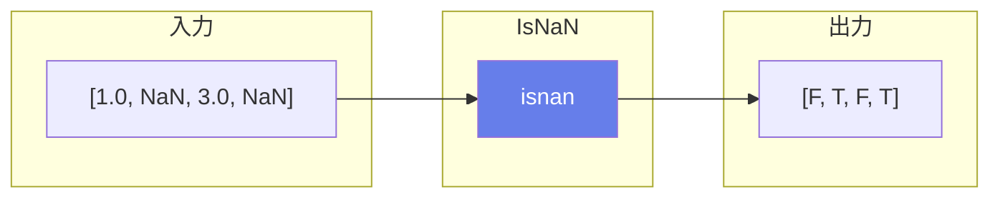

#### 主な用途
- **データ検証**
- **異常値検出**
- **数値エラーのチェック**

---

### IsInf（無限大判定）

各要素が無限大（正または負）かどうかを判定します。

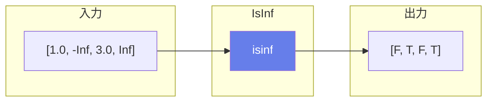

#### 属性

| 属性名 | 型 | デフォルト | 説明 |
|--------|-----|----------|------|
| detect_negative | int | 1 | 負の無限大を検出するか |
| detect_positive | int | 1 | 正の無限大を検出するか |

#### 主な用途
- **オーバーフロー検出**
- **数値安定性チェック**
- **異常値検出**

---

## Attentionマスクの生成例

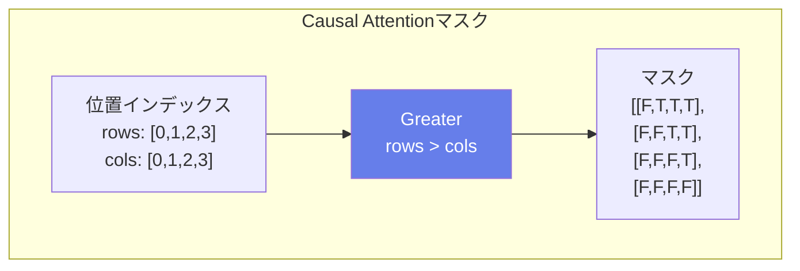

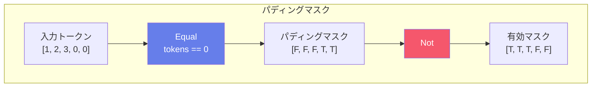

---

## 比較演算の入出力仕様

| 演算子 | 数式 | 入力型 | 出力型 |
|--------|------|--------|--------|
| Equal | A == B | 数値 | bool |
| Greater | A > B | 数値 | bool |
| Less | A < B | 数値 | bool |
| GreaterOrEqual | A >= B | 数値 | bool |
| LessOrEqual | A <= B | 数値 | bool |
| And | A ∧ B | bool | bool |
| Or | A ∨ B | bool | bool |
| Xor | A ⊕ B | bool | bool |
| Not | ¬A | bool | bool |
| IsNaN | isnan(X) | float | bool |
| IsInf | isinf(X) | float | bool |

---

## ブロードキャスト

全ての比較・論理演算はNumPyスタイルのブロードキャストをサポートします。

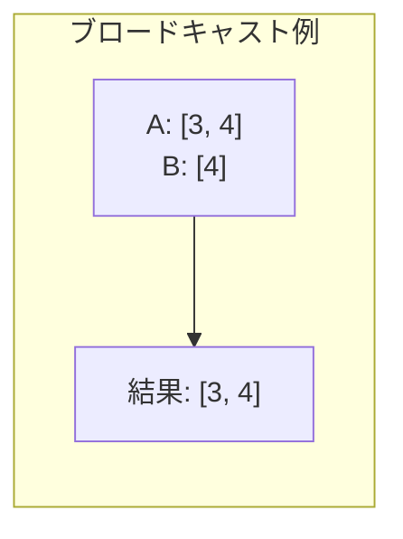
