# ONNX演算子 - 縮約演算 (Reduction Operations)

縮約演算は指定した軸に沿ってテンソルを集約し、次元を削減する演算です。統計量の計算、損失関数、正規化などで広く使用されます。

## 概要図

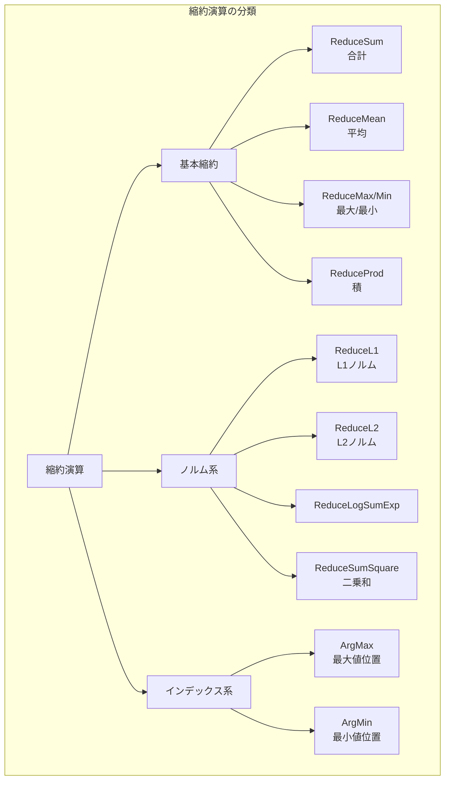

---

## 縮約演算の基本概念

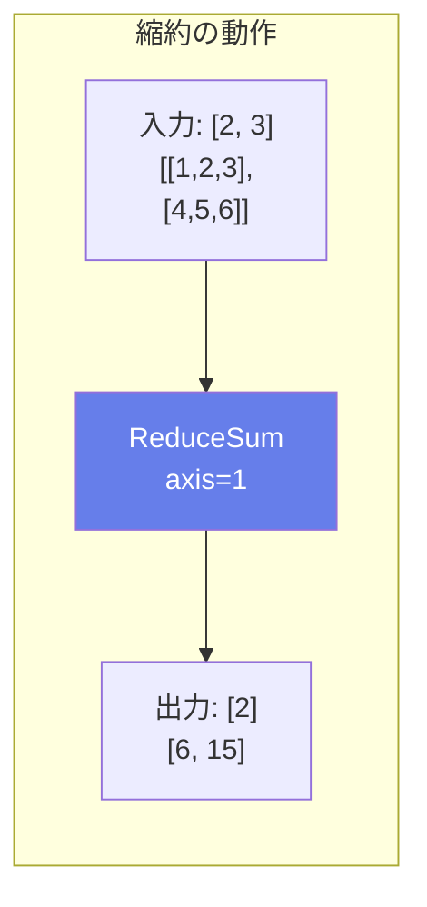

### keepdims オプション

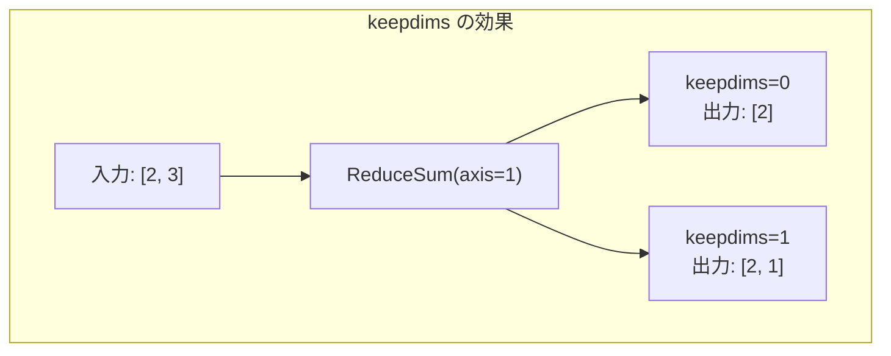

---

## ReduceSum（合計縮約）

### 説明
指定した軸に沿ってテンソルの合計を計算します。損失関数の計算やAttentionの重み付け和などで使用されます。

### 動作原理

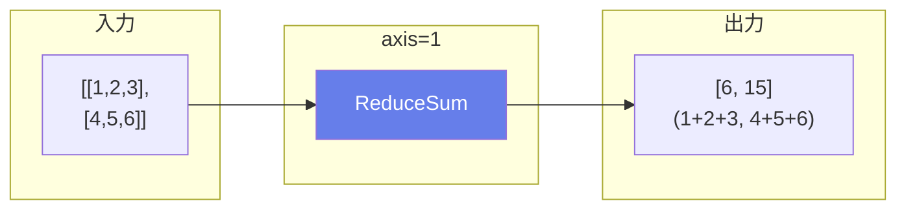

### 数式
$$Y = \sum_{i \in axis} X_i$$

### 属性

| 属性名 | 型 | デフォルト | 説明 |
|--------|-----|----------|------|
| keepdims | int | 1 | 縮約した軸を維持するか |
| noop_with_empty_axes | int | 0 | axesが空の場合の挙動 |

### 主な用途
- **損失関数の計算**
- **重み付け和**
- **バッチ統計量**

---

## ReduceMean（平均縮約）

### 説明
指定した軸に沿ってテンソルの平均を計算します。正規化や統計計算で頻繁に使用されます。

### 動作原理

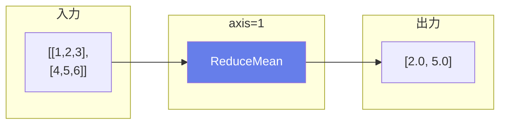

### 数式
$$Y = \frac{1}{|axis|} \sum_{i \in axis} X_i$$

### 主な用途
- **GlobalAveragePoolの実装**
- **正規化（平均の減算）**
- **統計量の計算**

---

## ReduceMax / ReduceMin

### 説明
指定した軸に沿ってテンソルの最大値/最小値を計算します。

### 動作原理

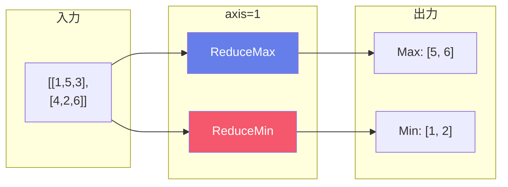

### 数式
$$Y_{max} = \max_{i \in axis} X_i$$
$$Y_{min} = \min_{i \in axis} X_i$$

### 主な用途
- **特徴の最大/最小値抽出**
- **プーリング操作の実装**
- **正規化の準備**

---

## ReduceProd（積縮約）

### 説明
指定した軸に沿ってテンソルの積を計算します。

### 数式
$$Y = \prod_{i \in axis} X_i$$

### 使用例

```python
data = [[1, 2, 3], [4, 5, 6]]
axes = [1]
output = [6, 120]  # (1*2*3, 4*5*6)
```

### 主な用途
- **形状の要素数計算**
- **確率の積**
- **行列式関連**

---

## ReduceL1 / ReduceL2（ノルム縮約）

### ReduceL1
絶対値の和（L1ノルム、マンハッタン距離）を計算します。

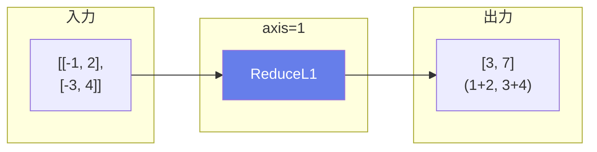

### ReduceL2
ユークリッドノルム（L2ノルム）を計算します。

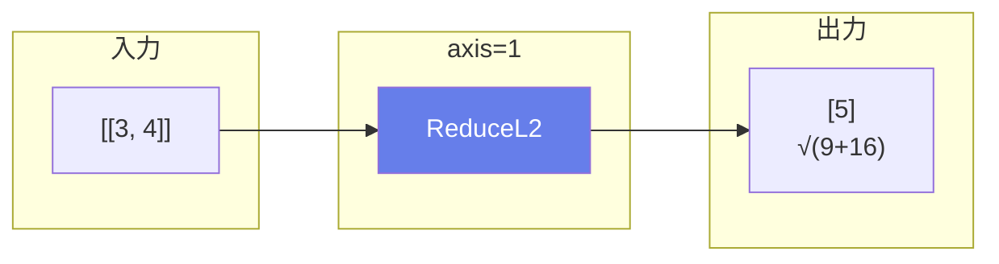

### 数式
$$L_1 = \sum_i |x_i|$$
$$L_2 = \sqrt{\sum_i x_i^2}$$

### 主な用途
- **正則化項の計算**
- **ベクトルの大きさ計算**
- **コサイン類似度の分母**

---

## ReduceLogSumExp

### 説明
log(sum(exp(X)))を数値的に安定な方法で計算します。Softmaxの分母計算などに使用されます。

### 動作原理

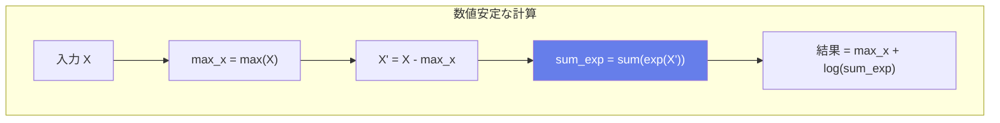

### 数式
$$Y = \log\left(\sum_i e^{x_i}\right)$$

実装（数値安定）:
$$Y = \max(X) + \log\left(\sum_i e^{x_i - \max(X)}\right)$$

### 主な用途
- **Softmaxの計算**
- **対数確率の合成**
- **数値安定な計算**

---

## ReduceSumSquare（二乗和縮約）

### 説明
要素の二乗の和を計算します。

### 数式
$$Y = \sum_i x_i^2$$

### 使用例

```python
data = [[1, 2], [3, 4]]
axes = [1]
output = [5, 25]  # (1+4, 9+16)
```

### 主な用途
- **分散計算の一部**
- **MSE損失**
- **L2ノルムの二乗**

---

## ArgMax / ArgMin

### 説明
指定した軸に沿って最大値/最小値のインデックスを返します。

### 動作原理

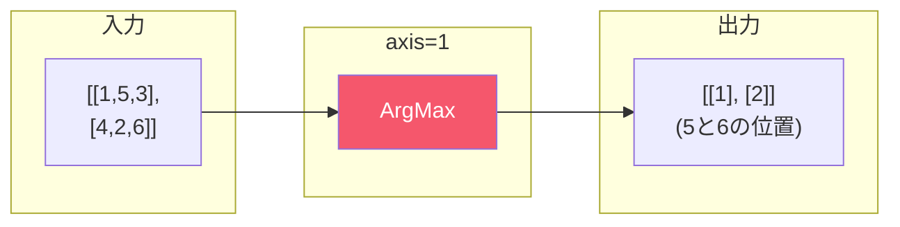

### 属性

| 属性名 | 型 | デフォルト | 説明 |
|--------|-----|----------|------|
| axis | int | 0 | 検索する軸 |
| keepdims | int | 1 | 次元を維持するか |
| select_last_index | int | 0 | 同値の場合に最後のインデックスを選ぶか |

### 主な用途
- **分類の予測**: クラス確率から予測クラスを取得
- **最大値の位置特定**
- **Top-1選択**

---

## 分類での使用例

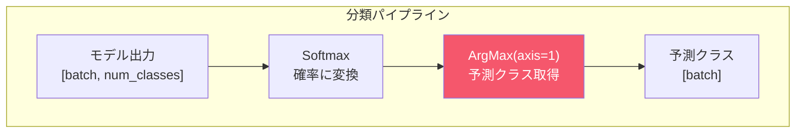

---

## 縮約演算の比較表

| 演算子 | 数式 | 出力型 | 主な用途 |
|--------|------|--------|----------|
| ReduceSum | Σx | 数値 | 損失計算 |
| ReduceMean | Σx/n | 数値 | 正規化 |
| ReduceMax | max(x) | 数値 | プーリング |
| ReduceMin | min(x) | 数値 | 下限計算 |
| ReduceProd | Πx | 数値 | 形状計算 |
| ReduceL1 | Σ|x| | 数値 | L1正則化 |
| ReduceL2 | √Σx² | 数値 | L2正則化 |
| ReduceLogSumExp | log(Σexp(x)) | 数値 | Softmax |
| ReduceSumSquare | Σx² | 数値 | 分散、MSE |
| ArgMax | argmax(x) | int64 | 分類予測 |
| ArgMin | argmin(x) | int64 | 最近傍 |

---

## 全軸の縮約

```python
# 全要素の合計
data = [[1, 2, 3], [4, 5, 6]]
axes = [0, 1]  # または axes=None
output = 21  # 1+2+3+4+5+6
```
