# ONNX演算子 - 数学関数 (Math Functions)

数学関数は要素ごとの数学的変換を提供します。指数・対数関数、三角関数、丸め関数など、科学計算や確率計算の基盤となる演算です。

## 概要図

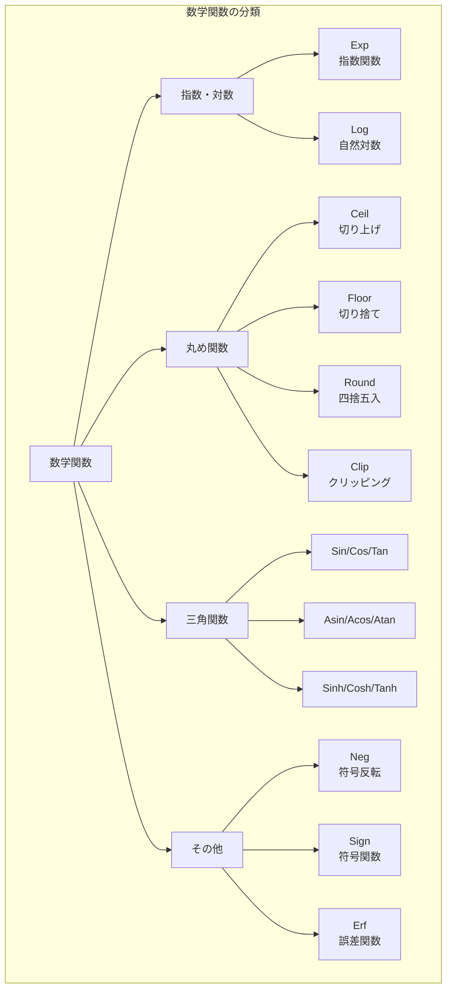

---

## Exp（指数関数）

### 説明
各要素の指数関数（eのx乗）を計算します。Softmax、確率計算、正規分布などで広く使用されます。

### 動作原理

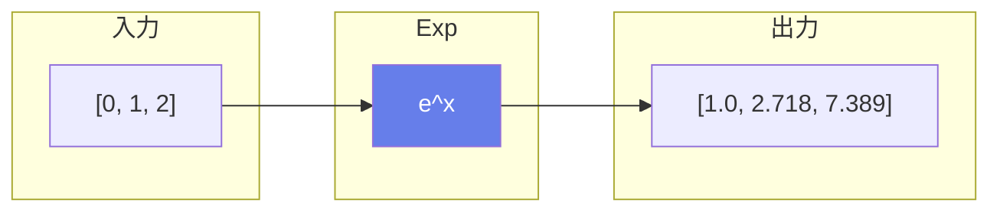

### 数式
$$Y = e^X$$

### 注意点

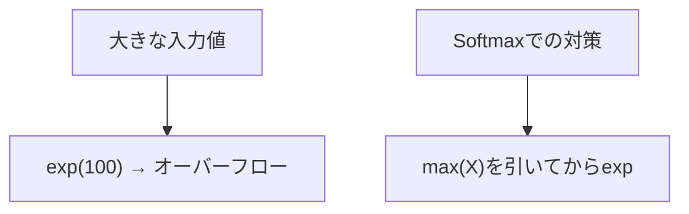

### 主な用途
- **Softmax計算**
- **確率分布**
- **指数関数的成長/減衰**

---

## Log（自然対数）

### 説明
各要素の自然対数（底がeの対数）を計算します。損失関数、エントロピー計算などで使用されます。

### 動作原理

```mermaid
graph LR
    subgraph "入力"
        X["[1, 2.718, 7.389]"]
    end

    subgraph "Log"
        L[ln(x)]
    end

    subgraph "出力"
        Y["[0, 1.0, 2.0]"]
    end

    X --> L --> Y

    style L fill:#667eea,color:#fff
```

### 数式
$$Y = \ln(X)$$

### 注意点
- 入力は**正の値**である必要があります
- 0以下の値でNaNまたは-Infが発生

### 主な用途
- **CrossEntropy損失**
- **情報エントロピー**
- **対数スケール変換**

---

## 丸め関数

### Ceil（切り上げ）

値以上の最小の整数を返します。

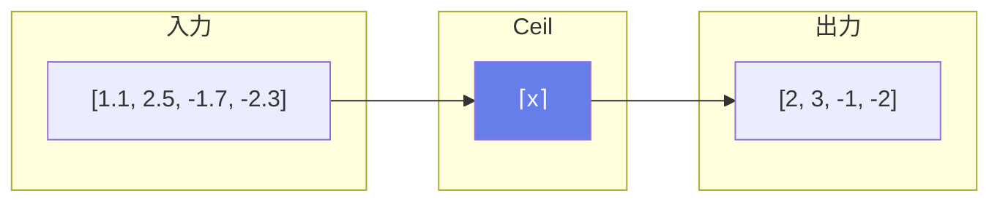

### Floor（切り捨て）

値以下の最大の整数を返します。

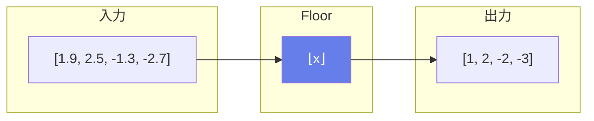

### Round（四捨五入）

最も近い整数に丸めます。0.5の場合は偶数方向に丸めます（銀行家の丸め）。

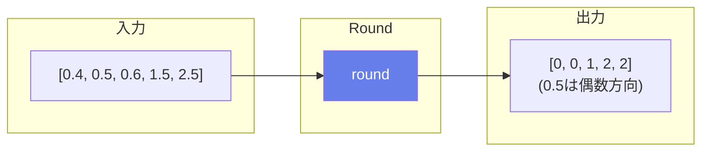

### 丸め関数の比較

| 入力 | Ceil | Floor | Round |
|------|------|-------|-------|
| 1.5 | 2 | 1 | 2 |
| 2.5 | 3 | 2 | 2 |
| -1.5 | -1 | -2 | -2 |
| -2.5 | -2 | -3 | -2 |

---

## Clip（クリッピング）

### 説明
値を指定した最小値と最大値の範囲内に制限します。

### 動作原理

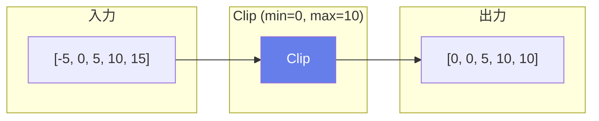

### 数式
$$Y = \min(\max(X, min\_val), max\_val)$$

### ReLU6の実装


### 主な用途
- **勾配クリッピング**
- **値の正規化**
- **ReLU6の実装**

---

## Neg / Sign（符号演算）

### Neg（符号反転）

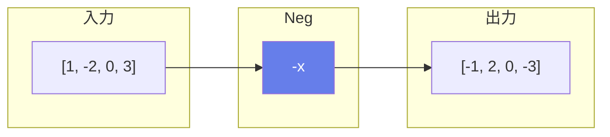

### Sign（符号関数）

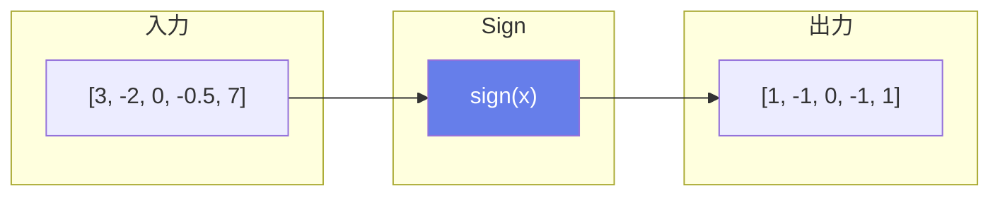

### Sign の定義

$$\text{sign}(x) = \begin{cases} 1 & \text{if } x > 0 \\ 0 & \text{if } x = 0 \\ -1 & \text{if } x < 0 \end{cases}$$

---

## Erf（誤差関数）

### 説明
ガウス誤差関数を計算します。GELU活性化関数の計算や統計処理で使用されます。

### 数式
$$\text{erf}(x) = \frac{2}{\sqrt{\pi}} \int_0^x e^{-t^2} dt$$

### グラフの特性

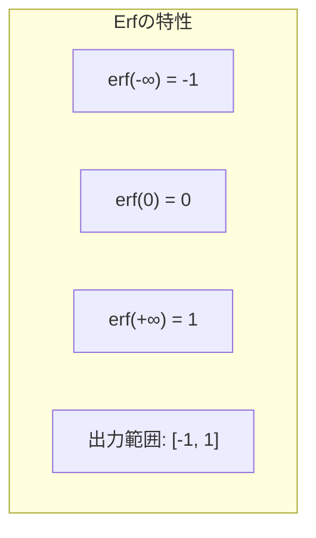

### GELUでの使用

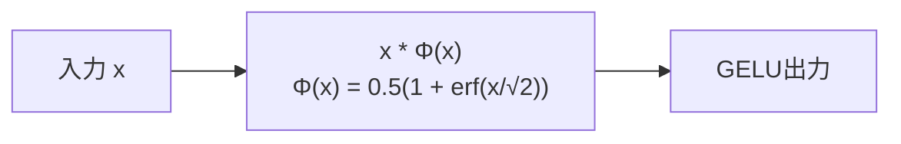

### 主な用途
- **GELU活性化関数**
- **正規分布の累積分布**
- **統計的信頼区間**

---

## 三角関数・双曲線関数

### 基本三角関数

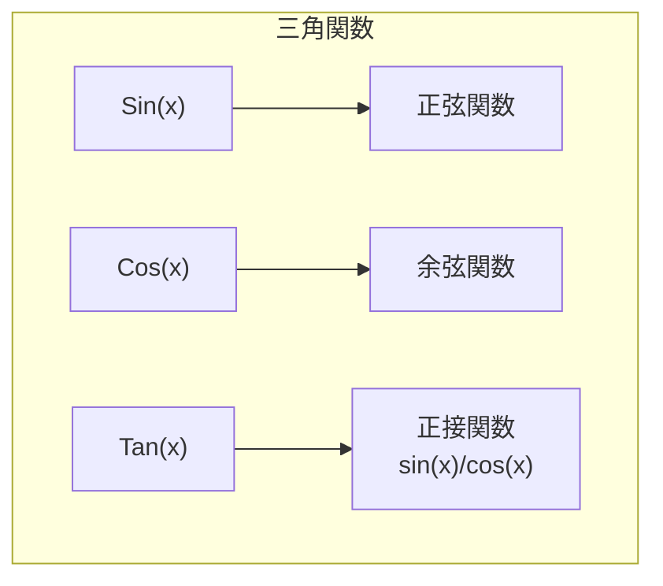

### 逆三角関数

| 関数 | 数式 | 出力範囲 |
|------|------|----------|
| Asin | arcsin(x) | [-π/2, π/2] |
| Acos | arccos(x) | [0, π] |
| Atan | arctan(x) | [-π/2, π/2] |

### 双曲線関数

$$\cosh(x) = \frac{e^x + e^{-x}}{2}$$
$$\sinh(x) = \frac{e^x - e^{-x}}{2}$$
$$\tanh(x) = \frac{\sinh(x)}{\cosh(x)} = \frac{e^x - e^{-x}}{e^x + e^{-x}}$$

### 主な用途
- **位置エンコーディング**（Transformer）
- **角度計算**
- **座標変換**
- **信号処理**

---

## Einsum（アインシュタイン縮約）

### 説明
アインシュタイン縮約記法を使用して、柔軟なテンソル演算を行います。行列乗算、転置、縮約、外積などを統一的に表現できます。

### 記法の例

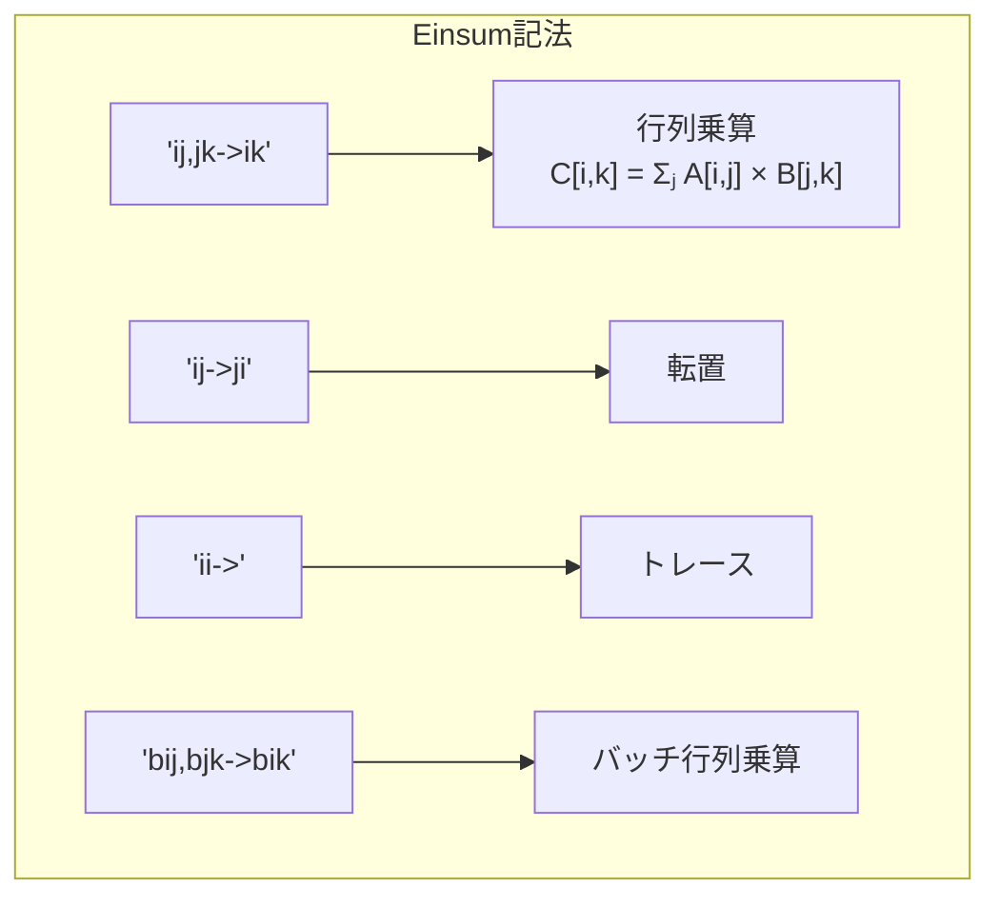

### 使用例

```python
# 行列乗算
equation = "ij,jk->ik"
A: [2, 3]
B: [3, 4]
C: [2, 4]

# Attention: scores = Q @ K^T
equation = "bhqd,bhkd->bhqk"
Q: [batch, heads, q_len, dim]
K: [batch, heads, k_len, dim]
scores: [batch, heads, q_len, k_len]
```

### 主な用途
- **複雑なテンソル演算**
- **Attention機構**
- **テンソルネットワーク**

---

## 数学関数の一覧

| 関数 | 数式 | 説明 |
|------|------|------|
| Exp | e^x | 指数関数 |
| Log | ln(x) | 自然対数 |
| Ceil | ⌈x⌉ | 切り上げ |
| Floor | ⌊x⌋ | 切り捨て |
| Round | round(x) | 四捨五入 |
| Clip | clip(x, min, max) | クリッピング |
| Neg | -x | 符号反転 |
| Sign | sign(x) | 符号関数 |
| Erf | erf(x) | 誤差関数 |
| Sin/Cos/Tan | 三角関数 | 周期関数 |
| Sinh/Cosh/Tanh | 双曲線関数 | 指数ベース |
