# ONNX演算子 - 行列演算 (Matrix Operations)

行列演算はニューラルネットワークの全結合層やAttention機構の基盤となる演算です。線形変換と行列計算を提供します。

## 概要図

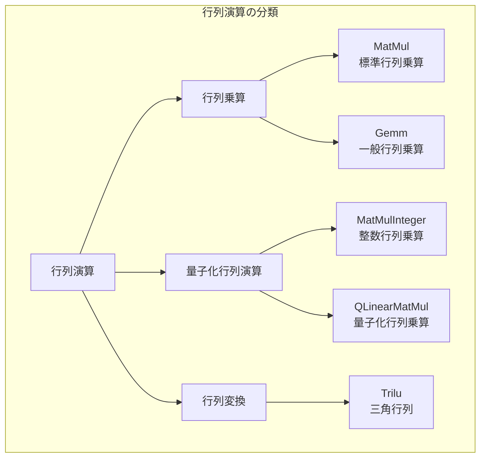

---

## MatMul（行列乗算）

### 説明
2つのテンソルの行列乗算を行います。ニューラルネットワークの全結合層やAttention機構の基本演算です。高次元テンソルではバッチ行列乗算として動作します。

### 動作原理

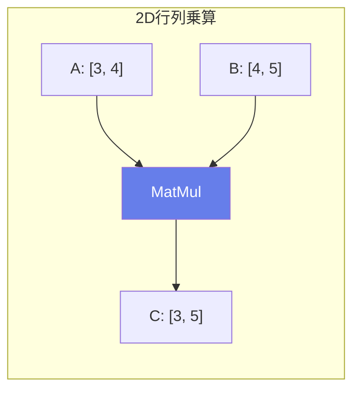

### 数式
$$C_{ij} = \sum_{k} A_{ik} \times B_{kj}$$

### サイズ制約

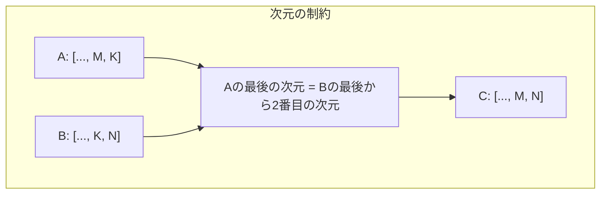

### バッチ行列乗算

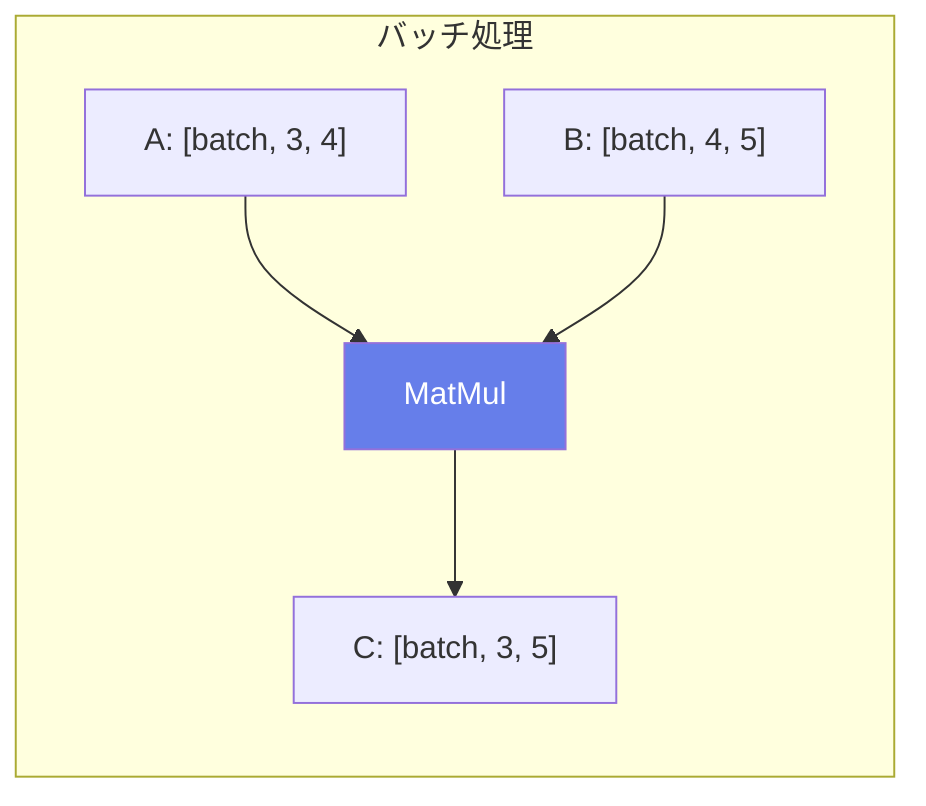

### Attention での使用

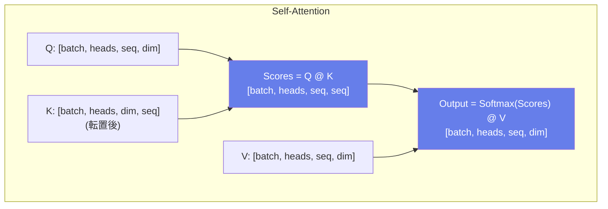

### 入出力仕様

| 項目 | 名前 | 形状 | 説明 |
|------|------|------|------|
| 入力 | A | [..., M, K] | 第1テンソル |
| 入力 | B | [..., K, N] | 第2テンソル |
| 出力 | Y | [..., M, N] | 結果テンソル |

### 主な用途
- **全結合層**
- **Attention (Q @ K^T, scores @ V)**
- **座標変換**
- **特徴変換**

---

## Gemm（一般行列乗算）

### 説明
General Matrix Multiplication。行列乗算にスケーリングとバイアス加算を組み合わせた演算です。全結合層を効率的に1つの演算子で表現できます。

### 数式
$$Y = \alpha \cdot A' \times B' + \beta \cdot C$$

$$A' = \begin{cases} A^T & \text{if transA} \\ A & \text{otherwise} \end{cases}$$

$$B' = \begin{cases} B^T & \text{if transB} \\ B & \text{otherwise} \end{cases}$$

### 全結合層としての使用

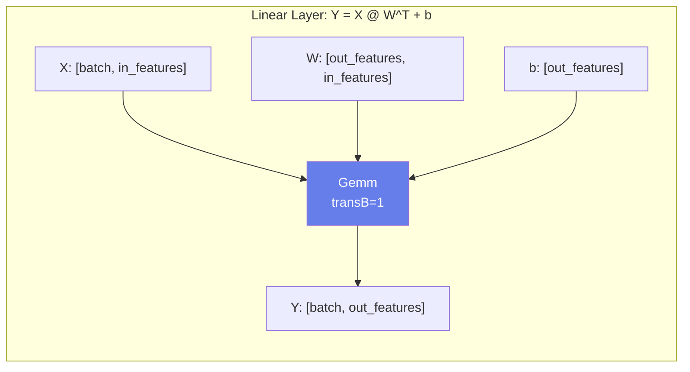

### 入出力仕様

| 項目 | 名前 | 形状 | 説明 |
|------|------|------|------|
| 入力 | A | [M, K] or [K, M] | 入力テンソル |
| 入力 | B | [K, N] or [N, K] | 重みテンソル |
| 入力 | C | [M, N] or [N] | バイアス（オプション） |
| 出力 | Y | [M, N] | 結果テンソル |

### 属性

| 属性名 | 型 | デフォルト | 説明 |
|--------|-----|----------|------|
| alpha | float | 1.0 | A×Bの係数 |
| beta | float | 1.0 | Cの係数 |
| transA | int | 0 | Aを転置するか |
| transB | int | 0 | Bを転置するか |

### MatMul vs Gemm

| 特性 | MatMul | Gemm |
|------|--------|------|
| バイアス | 別途Add必要 | 組み込み |
| スケーリング | なし | alpha, beta |
| 転置 | 別途Transpose必要 | 組み込み |
| 次元 | 任意次元 | 2次元のみ |

---

## MatMulInteger（整数行列乗算）

### 説明
整数型での行列乗算を行います。量子化されたモデルで使用され、int8やuint8の入力をサポートします。

### 数式
$$Y = (A - a\_zero\_point) \times (B - b\_zero\_point)$$

### 動作フロー

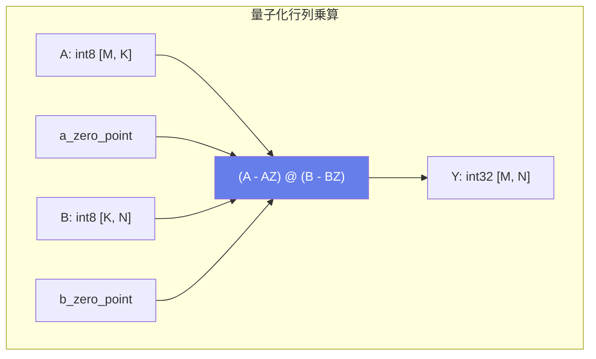

### 入出力仕様

| 項目 | 名前 | 型 | 説明 |
|------|------|-----|------|
| 入力 | A | int8/uint8 | 第1テンソル |
| 入力 | B | int8/uint8 | 第2テンソル |
| 入力 | a_zero_point | int8/uint8 | Aのゼロポイント（オプション） |
| 入力 | b_zero_point | int8/uint8 | Bのゼロポイント（オプション） |
| 出力 | Y | int32 | 結果（累積用にint32） |

### 主な用途
- **量子化推論**
- **エッジデバイス向け最適化**
- **高速推論**

---

## QLinearMatMul（量子化線形行列乗算）

### 説明
完全な量子化パイプラインでの行列乗算。入力、重み、出力それぞれにスケールとゼロポイントを持ちます。

### 数式
$$y = \frac{(a\_scale \times (a - a\_zp)) \times (b\_scale \times (b - b\_zp))}{y\_scale} + y\_zp$$

### 量子化パイプライン

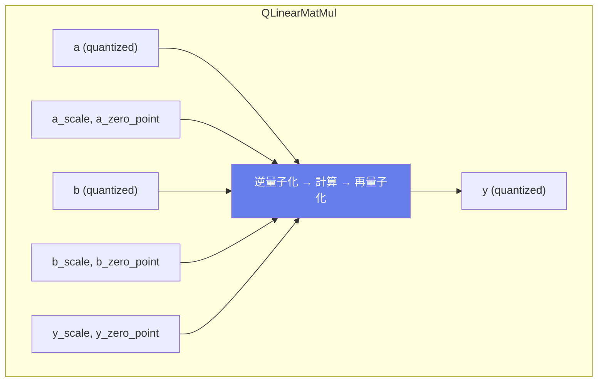

### 主な用途
- **量子化推論パイプライン**
- **INT8推論**
- **モデル軽量化**

---

## Trilu（三角行列）

### 説明
上三角行列または下三角行列を抽出します。Attentionマスクの生成などに使用されます。

### 動作原理

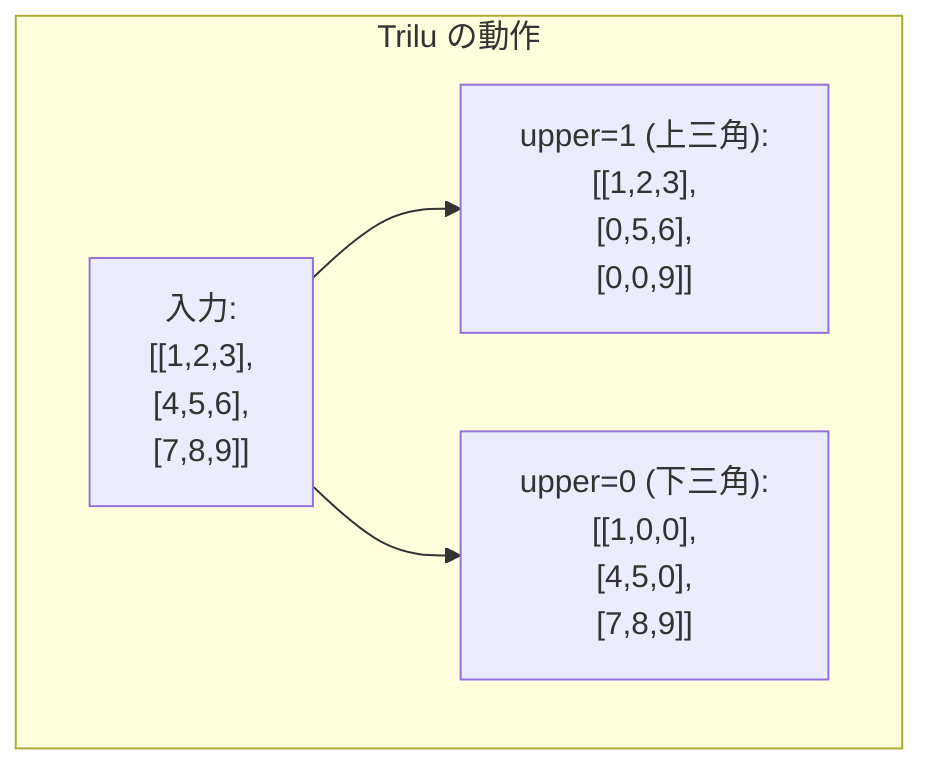

### 対角オフセット

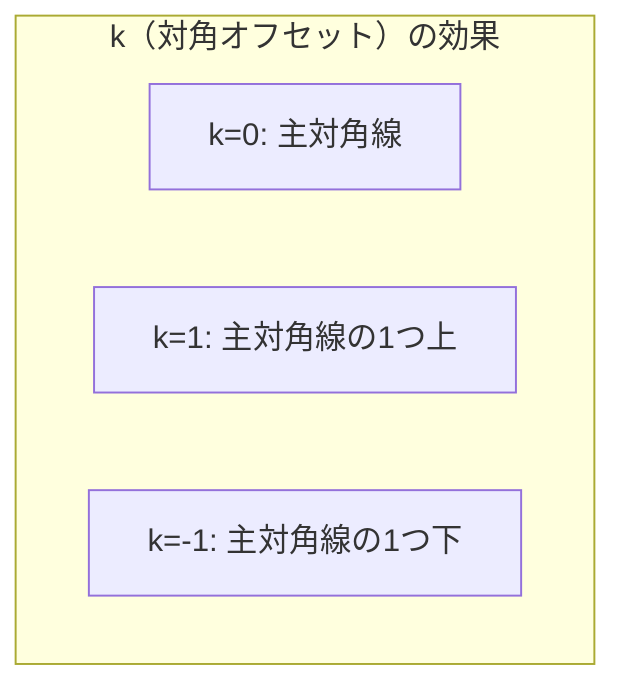

### 属性

| 属性名 | 型 | デフォルト | 説明 |
|--------|-----|----------|------|
| upper | int | 1 | 上三角(1)か下三角(0)か |

### 入力

| 名前 | 説明 |
|------|------|
| input | 入力テンソル [..., M, N] |
| k | 対角オフセット（オプション、デフォルト: 0） |

### Causal Attention マスク

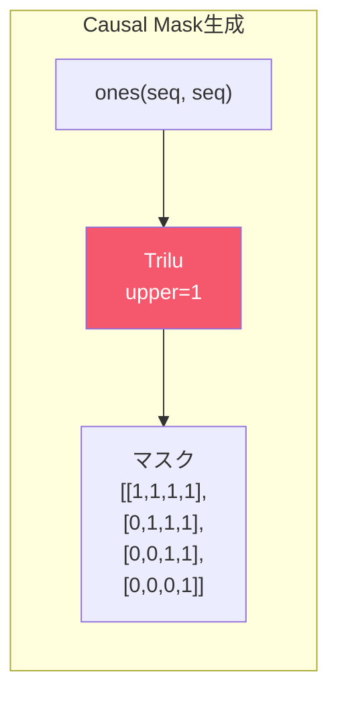

### 主な用途
- **Causal Attention マスク**
- **三角分解**
- **時系列マスキング**

---

## 行列演算の選択ガイド

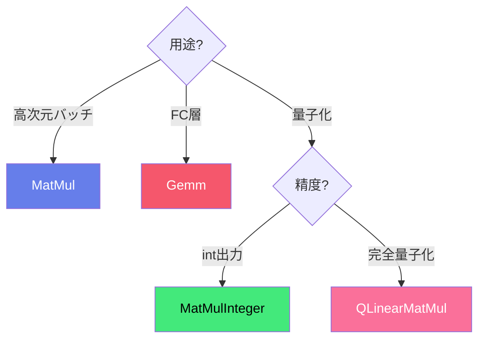

### 比較表

| 演算子 | 次元 | バイアス | 量子化 | 用途 |
|--------|------|---------|--------|------|
| MatMul | 任意 | なし | なし | Attention |
| Gemm | 2D | あり | なし | FC層 |
| MatMulInteger | 2D | なし | int8/uint8 | 量子化推論 |
| QLinearMatMul | 2D | なし | 完全 | INT8パイプライン |
