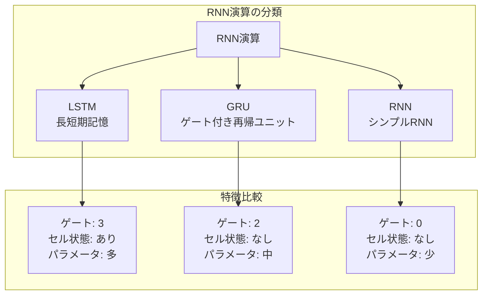
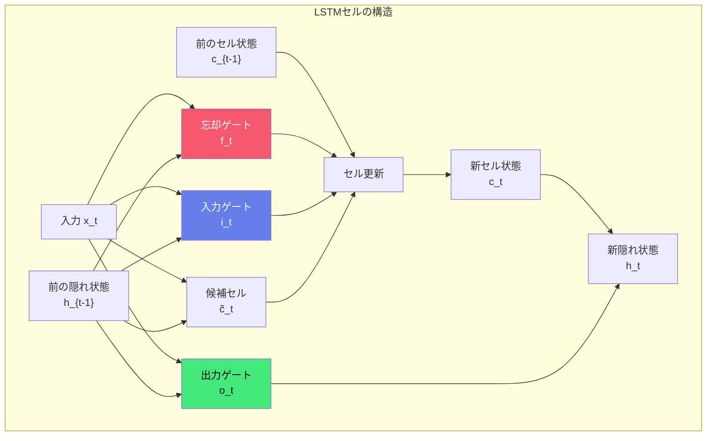
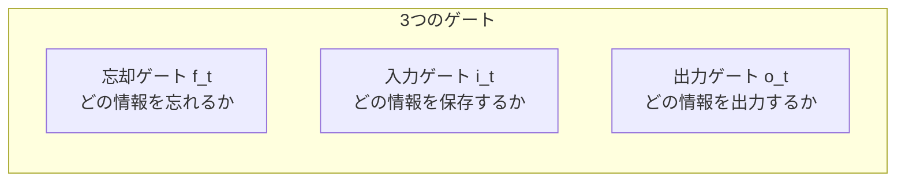
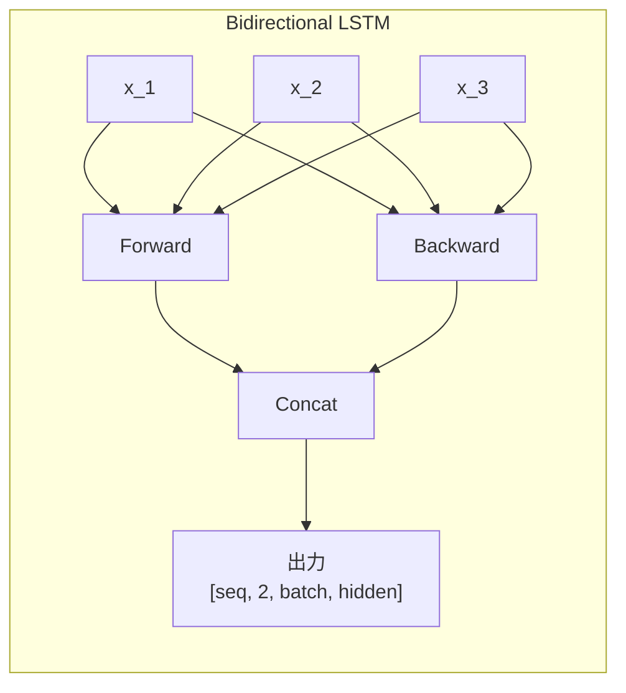
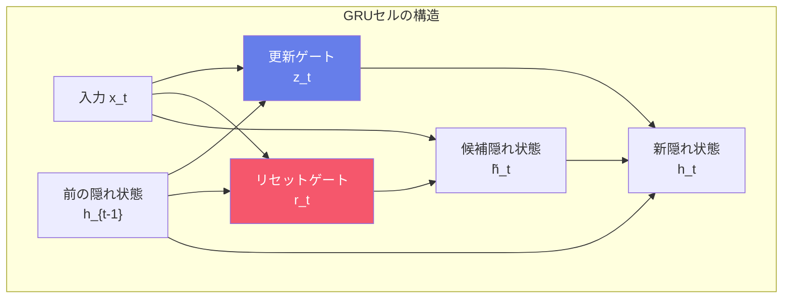
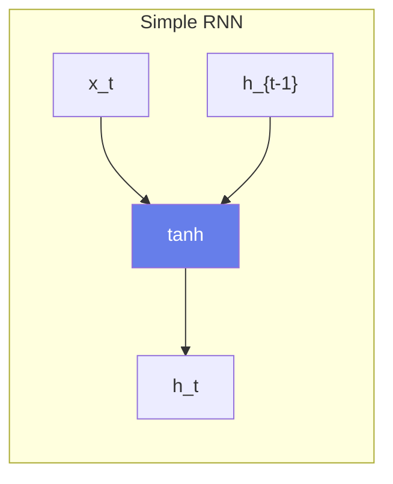
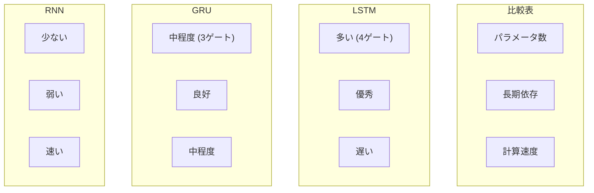
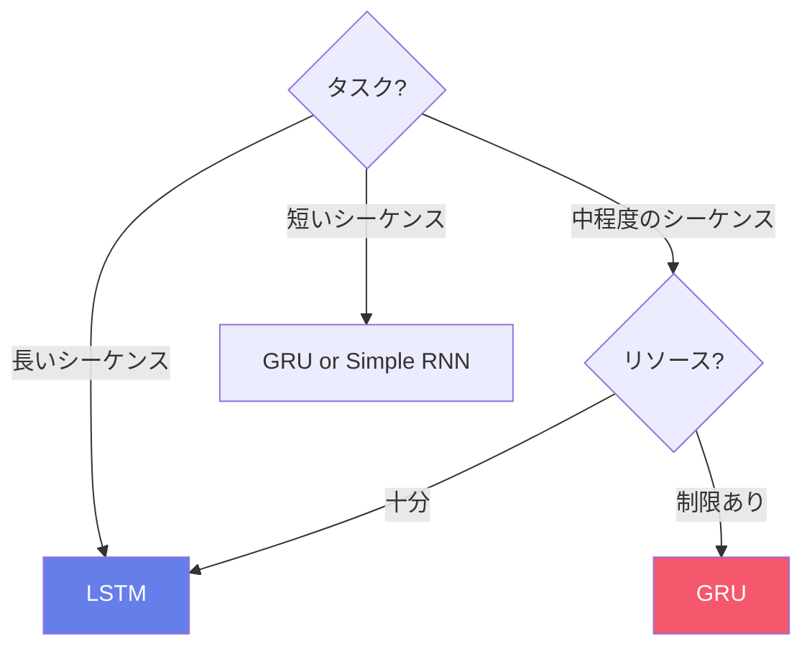
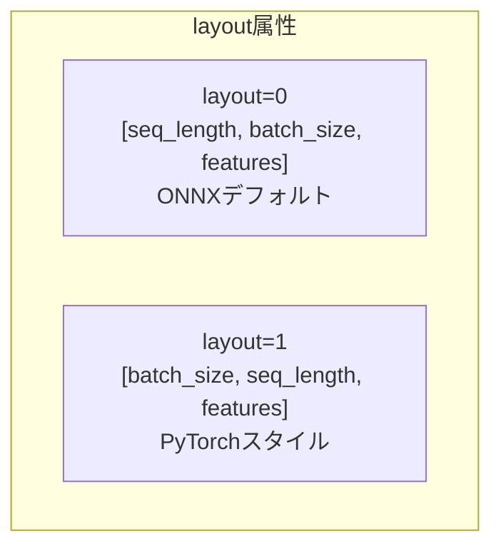

# ONNX演算子 - RNN演算 (Recurrent Neural Network Operations)

RNN演算は時系列データやシーケンスデータを処理するための再帰的なニューラルネットワーク層を提供します。自然言語処理や音声認識で広く使用されています。

## 概要図

---

## LSTM（Long Short-Term Memory）

### 説明
長短期記憶ネットワーク。ゲート機構により長期依存関係を学習できるRNNユニットです。1997年にHochreiterとSchmidhuberが提案し、勾配消失問題を軽減することで長いシーケンスを効果的に処理できます。

### 構造

### ゲートの役割

### 数式

$$f_t = \sigma(W_f \cdot [h_{t-1}, x_t] + b_f)$$
$$i_t = \sigma(W_i \cdot [h_{t-1}, x_t] + b_i)$$
$$\tilde{c}_t = \tanh(W_c \cdot [h_{t-1}, x_t] + b_c)$$
$$c_t = f_t \odot c_{t-1} + i_t \odot \tilde{c}_t$$
$$o_t = \sigma(W_o \cdot [h_{t-1}, x_t] + b_o)$$
$$h_t = o_t \odot \tanh(c_t)$$

### 入出力仕様

| 項目 | 名前 | 形状 | 説明 |
|------|------|------|------|
| 入力 | X | [seq, batch, input] | 入力シーケンス |
| 入力 | W | [dir, 4*hidden, input] | 入力重み |
| 入力 | R | [dir, 4*hidden, hidden] | 再帰重み |
| 入力 | B | [dir, 8*hidden] | バイアス（オプション） |
| 入力 | initial_h | [dir, batch, hidden] | 初期隠れ状態（オプション） |
| 入力 | initial_c | [dir, batch, hidden] | 初期セル状態（オプション） |
| 出力 | Y | [seq, dir, batch, hidden] | 全タイムステップの出力 |
| 出力 | Y_h | [dir, batch, hidden] | 最終隠れ状態 |
| 出力 | Y_c | [dir, batch, hidden] | 最終セル状態 |

### 属性

| 属性名 | 型 | 説明 |
|--------|-----|------|
| direction | string | 'forward', 'reverse', 'bidirectional' |
| hidden_size | int | 隠れ層のサイズ |
| layout | int | 0: [seq,batch,feat], 1: [batch,seq,feat] |

### 双方向LSTM

### 主な用途
- **自然言語処理**: 感情分析、品詞タグ付け
- **音声認識**
- **時系列予測**
- **機械翻訳**（エンコーダ/デコーダ）

---

## GRU（Gated Recurrent Unit）

### 説明
ゲート付き再帰ユニット。LSTMの簡略化版で、2つのゲート（リセットと更新）のみを使用します。2014年にChoらが提案。パラメータ数が少なく計算効率が良いですが、多くのタスクでLSTMと同等の性能を発揮します。

### 構造

### 数式

$$z_t = \sigma(W_z \cdot [h_{t-1}, x_t] + b_z)$$
$$r_t = \sigma(W_r \cdot [h_{t-1}, x_t] + b_r)$$
$$\tilde{h}_t = \tanh(W_h \cdot [r_t \odot h_{t-1}, x_t] + b_h)$$
$$h_t = (1 - z_t) \odot h_{t-1} + z_t \odot \tilde{h}_t$$

### 入出力仕様

| 項目 | 名前 | 形状 | 説明 |
|------|------|------|------|
| 入力 | X | [seq, batch, input] | 入力シーケンス |
| 入力 | W | [dir, 3*hidden, input] | 入力重み |
| 入力 | R | [dir, 3*hidden, hidden] | 再帰重み |
| 入力 | B | [dir, 6*hidden] | バイアス（オプション） |
| 出力 | Y | [seq, dir, batch, hidden] | 全タイムステップの出力 |
| 出力 | Y_h | [dir, batch, hidden] | 最終隠れ状態 |

### 主な用途
- **自然言語処理**
- **音声処理**
- **LSTMの軽量代替**
- **リアルタイム処理**

---

## RNN（Simple RNN）

### 説明
シンプルな再帰ニューラルネットワーク。現在の入力と前の隠れ状態を組み合わせて新しい隠れ状態を計算します。構造が単純ですが、長いシーケンスでは勾配消失問題が発生しやすいです。

### 構造

### 数式

$$h_t = \tanh(W \cdot x_t + R \cdot h_{t-1} + b)$$

### 制限事項
- **長期依存関係の学習が困難**
- **勾配消失/爆発問題**
- **実用ではLSTM/GRUを推奨**

---

## LSTM vs GRU vs RNN 比較

### 詳細比較

| 項目 | LSTM | GRU | Simple RNN |
|------|------|-----|------------|
| ゲート数 | 3 (忘却, 入力, 出力) | 2 (更新, リセット) | 0 |
| セル状態 | あり | なし | なし |
| パラメータ | 100% | ~75% | ~25% |
| 長期依存 | 優秀 | 良好 | 弱い |
| 勾配消失 | 軽減 | 軽減 | 発生しやすい |
| 計算速度 | 遅い | 中程度 | 速い |

---

## 選択ガイド

---

## データレイアウト

