# ONNX演算子 - 量子化演算 (Quantization Operations)

量子化演算は浮動小数点数を整数に変換し、モデルの軽量化と高速化を実現します。エッジデバイスへのデプロイやメモリ効率の向上に不可欠です。

## 概要図

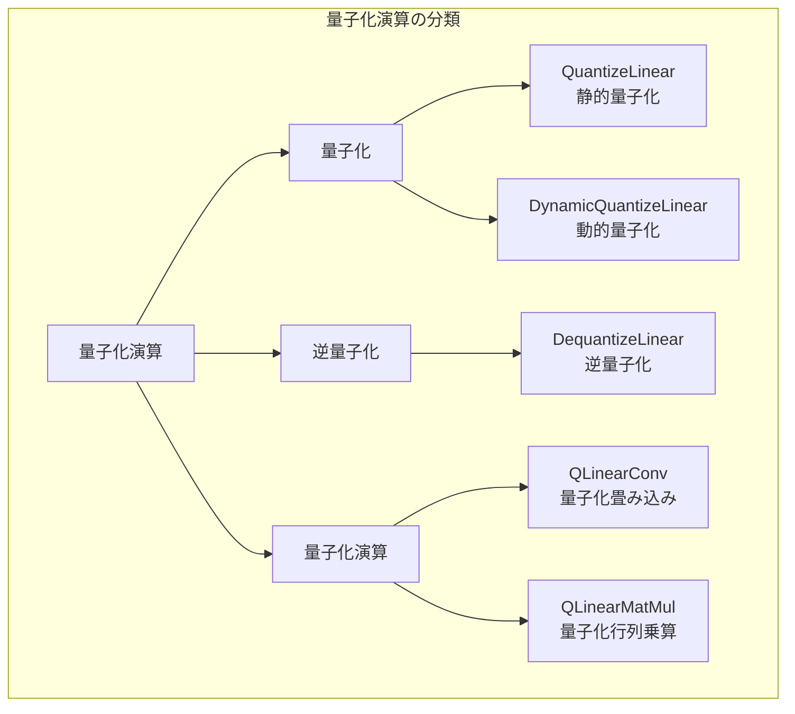

---

## 量子化の基本概念

### スケールとゼロポイント

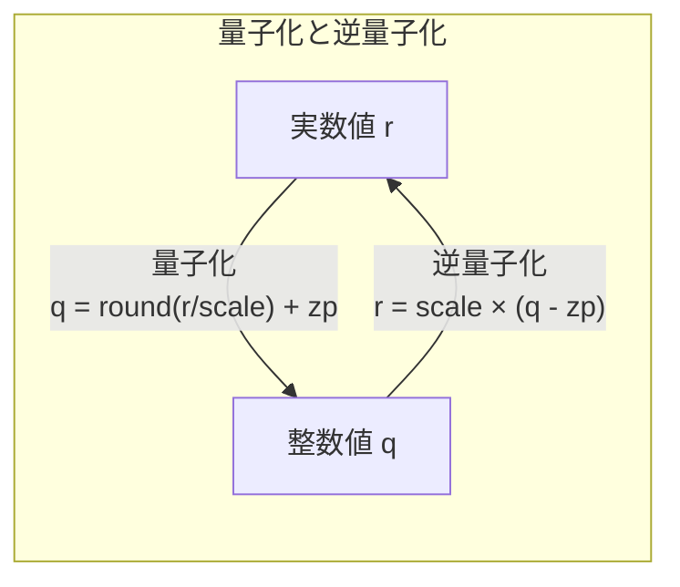

### 量子化の種類

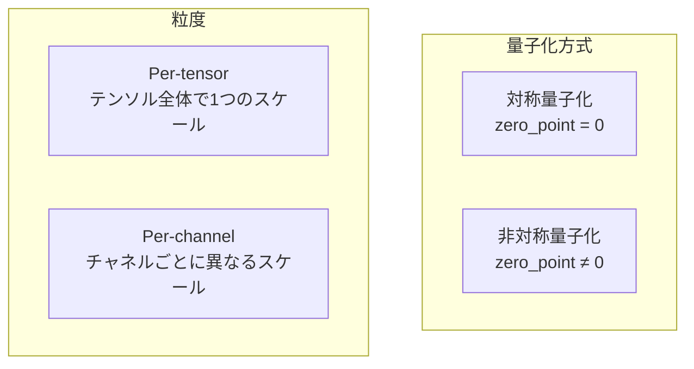

### 量子化による圧縮

| 元の型 | 量子化後 | 圧縮率 |
|--------|---------|--------|
| FP32 | INT8 | 4x |
| FP32 | INT4 | 8x |
| FP16 | INT8 | 2x |

---

## QuantizeLinear（線形量子化）

### 説明
浮動小数点数を整数に量子化します。モデルの軽量化と高速化のために使用されます。

### 動作原理

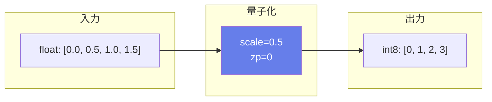

### 数式
$$y = \text{saturate}(\text{round}(x / \text{scale}) + \text{zero\_point})$$

saturateは出力型の範囲にクリップ:
- int8: [-128, 127]
- uint8: [0, 255]

### 入出力仕様

| 項目 | 名前 | 型 | 説明 |
|------|------|-----|------|
| 入力 | x | float | 浮動小数点テンソル |
| 入力 | y_scale | float | スケール係数 |
| 入力 | y_zero_point | int8/uint8 | ゼロポイント（オプション） |
| 出力 | y | int8/uint8 | 量子化テンソル |

### 属性

| 属性名 | 型 | 説明 |
|--------|-----|------|
| axis | int | per-channel量子化の軸 |
| saturate | int | 飽和するか（デフォルト: 1） |

### 主な用途
- **モデル圧縮**: FP32 → INT8で約4倍削減
- **推論高速化**
- **エッジデバイスへのデプロイ**

---

## DequantizeLinear（線形逆量子化）

### 説明
量子化された整数を浮動小数点数に戻します。

### 動作原理

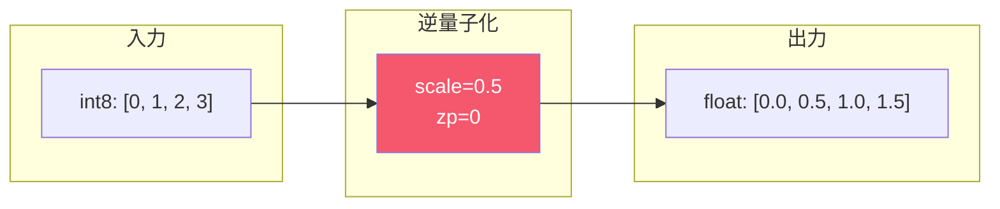

### 数式
$$y = (x - \text{zero\_point}) \times \text{scale}$$

### 主な用途
- **量子化演算の出力変換**
- **混合精度推論**
- **精度の確認**

---

## DynamicQuantizeLinear（動的線形量子化）

### 説明
入力の最小/最大値からスケールとゼロポイントを動的に計算し、量子化を行います。事前のキャリブレーションが不要です。

### 動作フロー

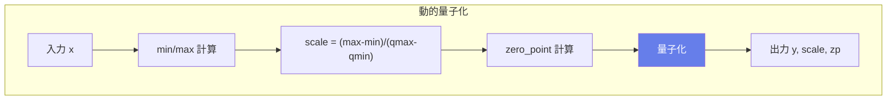

### 出力

| 名前 | 型 | 説明 |
|------|-----|------|
| y | uint8 | 量子化テンソル |
| y_scale | float | 計算されたスケール |
| y_zero_point | uint8 | 計算されたゼロポイント |

### 主な用途
- **キャリブレーション不要の量子化**
- **動的な入力範囲への対応**
- **プロトタイピング**

---

## QLinearConv（量子化線形畳み込み）

### 説明
量子化された入力と重みを使用して畳み込みを行います。INT8での効率的な畳み込み演算を実現します。

### 動作フロー

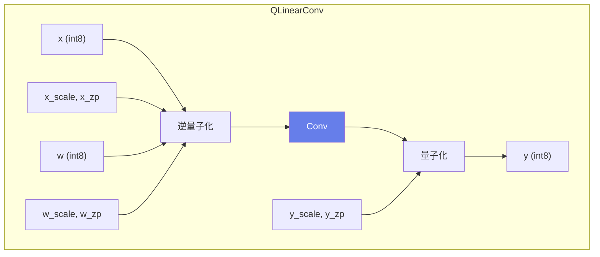

### 入出力仕様

| 項目 | 名前 | 説明 |
|------|------|------|
| 入力 | x | 量子化入力 |
| 入力 | x_scale, x_zero_point | 入力の量子化パラメータ |
| 入力 | w | 量子化重み |
| 入力 | w_scale, w_zero_point | 重みの量子化パラメータ |
| 入力 | y_scale, y_zero_point | 出力の量子化パラメータ |
| 入力 | B | バイアス（int32、オプション） |
| 出力 | y | 量子化出力 |

### 主な用途
- **量子化されたCNN**
- **INT8畳み込み**
- **モバイル/エッジ推論**

---

## 量子化パイプライン

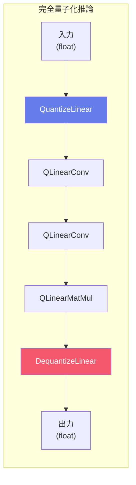

---

## キャリブレーション方法

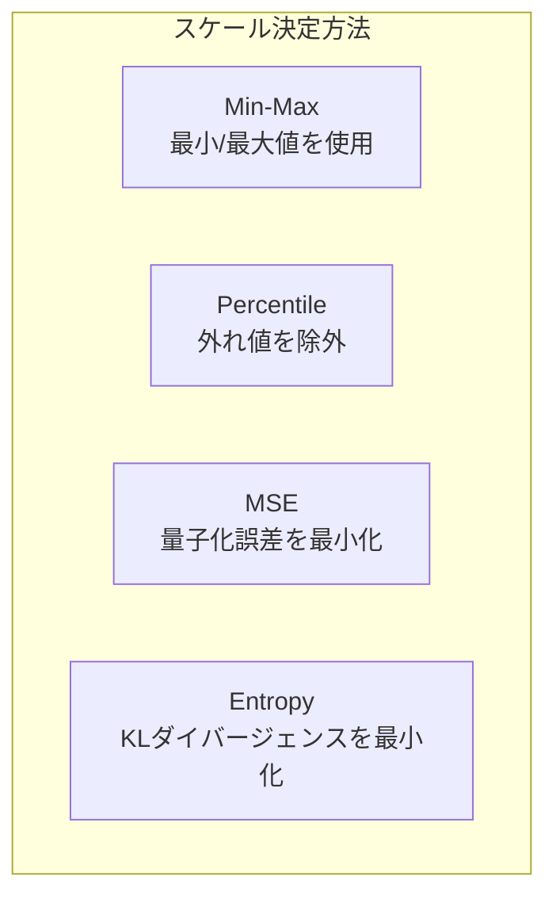

### 各方法の特徴

| 方法 | 特徴 | 用途 |
|------|------|------|
| Min-Max | シンプル、外れ値に敏感 | 基本的な量子化 |
| Percentile | 外れ値に頑健 | 一般的な推論 |
| MSE | 精度重視 | 精度が重要な場合 |
| Entropy | TensorRTで使用 | 高精度量子化 |

---

## 量子化対応レイヤー

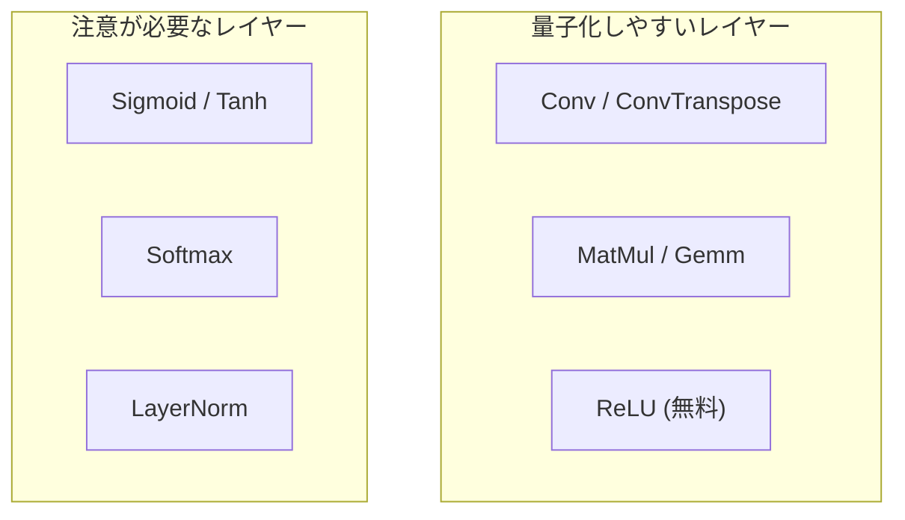

---

## 精度への影響

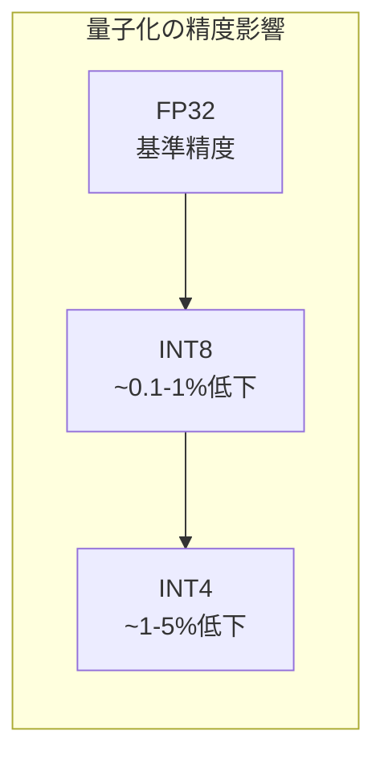

### 精度低下を抑える方法
1. **Per-channel量子化**: より細かいスケール制御
2. **混合精度**: 敏感なレイヤーはFP16/FP32で維持
3. **Quantization-Aware Training (QAT)**: 訓練時に量子化をシミュレート
4. **適切なキャリブレーション**: 代表的なデータで統計を取得
