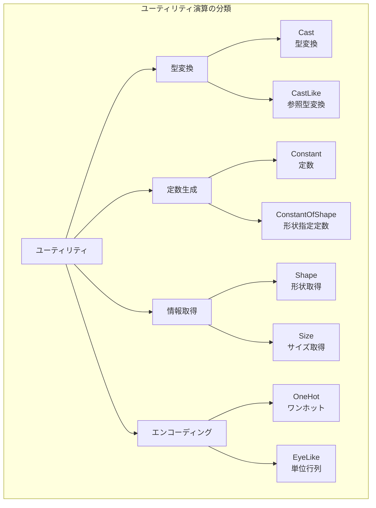
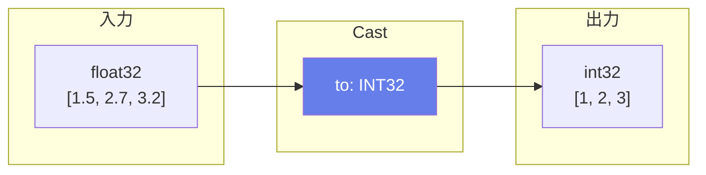
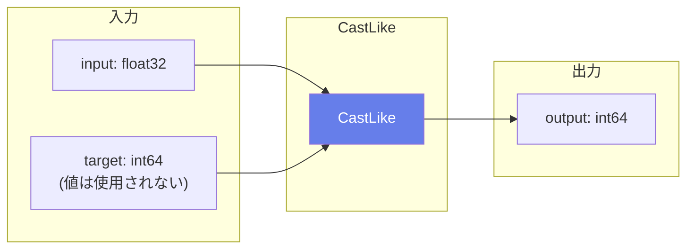
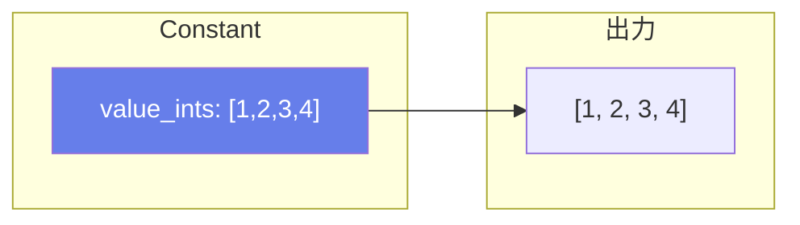
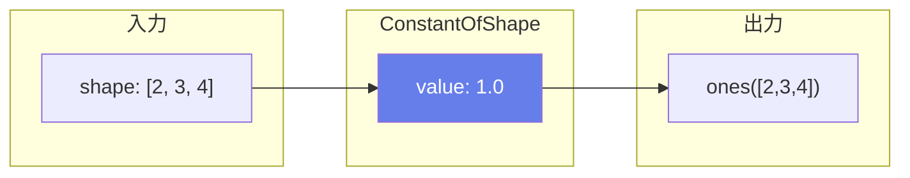
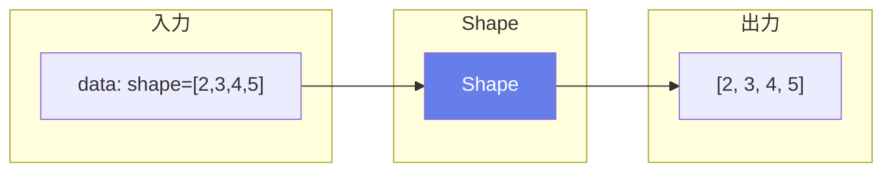
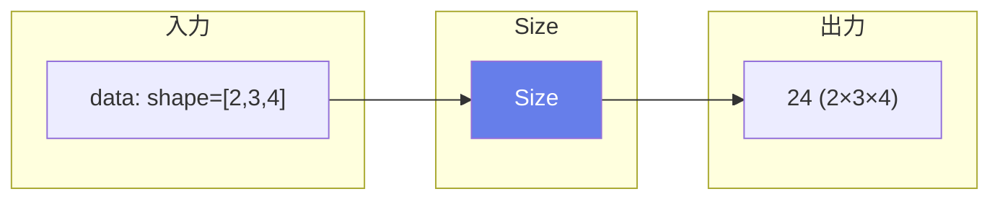
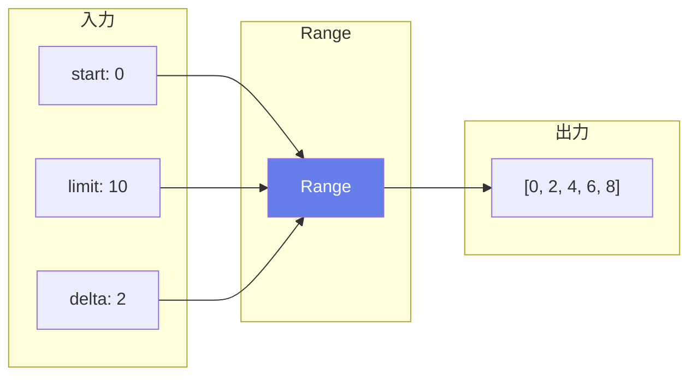
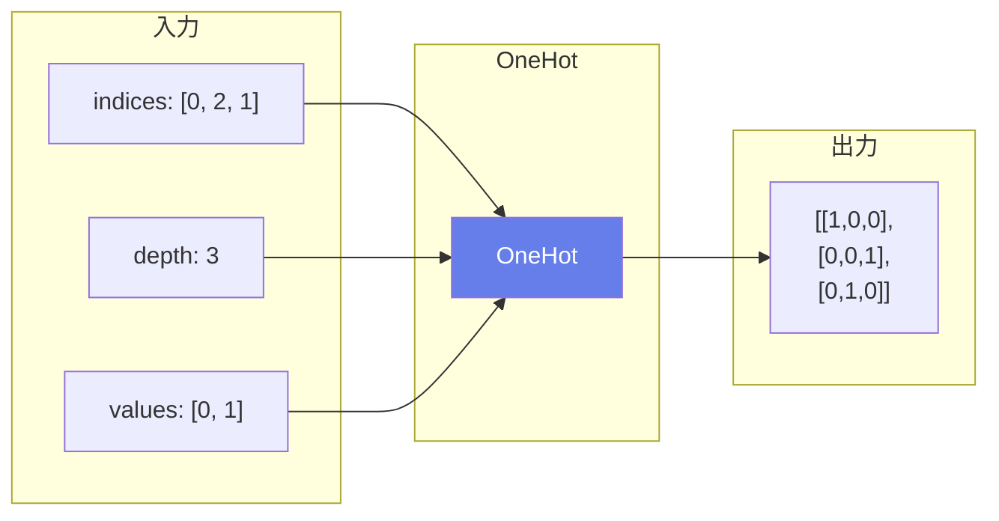
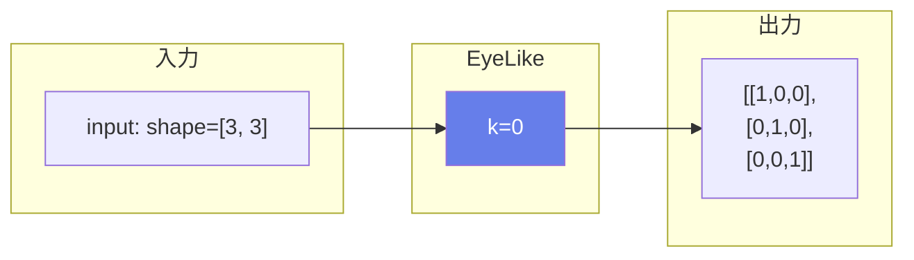

# ONNX演算子 - ユーティリティ (Utility Operations)

ユーティリティ演算は型変換、定数生成、形状取得など、モデルの構築と実行をサポートする補助的な演算です。

## 概要図



---

## Cast（型変換）

### 説明
テンソルのデータ型を別の型に変換します。精度の変更やメモリ最適化、演算子の型要件を満たすために使用されます。

### 動作原理



### データ型コード

| コード | 型名 | 説明 |
|--------|------|------|
| 1 | FLOAT | float32 |
| 2 | UINT8 | 符号なし8ビット整数 |
| 3 | INT8 | 符号付き8ビット整数 |
| 6 | INT32 | 符号付き32ビット整数 |
| 7 | INT64 | 符号付き64ビット整数 |
| 9 | BOOL | ブール値 |
| 10 | FLOAT16 | 半精度浮動小数点 |
| 11 | DOUBLE | float64 |
| 16 | BFLOAT16 | Brain浮動小数点 |

### 属性

| 属性名 | 型 | 説明 |
|--------|-----|------|
| to | int | 変換先のデータ型 |

### 主な用途
- **精度変換**: FP32 ↔ FP16
- **整数インデックスの生成**
- **演算子の型要件対応**
- **メモリ最適化**

---

## CastLike（参照型変換）

### 説明
入力テンソルを別のテンソルと同じデータ型に変換します。動的に型を決定する場合に便利です。

### 動作原理



### 主な用途
- **動的な型一致**
- **汎用的なモデル設計**

---

## Identity（恒等写像）

### 説明
入力をそのまま出力します。グラフ構築時のプレースホルダーや、条件分岐の出力統一などに使用されます。

### 数式
$$Y = X$$

### 主な用途
- **グラフ構造の調整**
- **条件分岐の出力**
- **デバッグ**
- **no-op（何もしない操作）**

---

## Constant（定数）

### 説明
定数テンソルを生成します。モデルに埋め込まれた固定値を表現するために使用されます。

### 動作原理



### 属性

| 属性名 | 型 | 説明 |
|--------|-----|------|
| value | TensorProto | 定数値 |
| value_float | float | スカラーfloat値 |
| value_floats | float[] | float配列 |
| value_int | int | スカラーint値 |
| value_ints | int[] | int配列 |

### 主な用途
- **固定パラメータ**
- **形状定義**
- **定数の埋め込み**

---

## ConstantOfShape（形状指定定数）

### 説明
指定した形状で、全ての要素が同じ値を持つテンソルを生成します。

### 動作原理



### 入出力仕様

| 項目 | 名前 | 説明 |
|------|------|------|
| 入力 | input | 形状を指定するテンソル（1次元int64） |
| 属性 | value | 埋める値（デフォルト: 0.0f） |
| 出力 | output | 指定形状の定数テンソル |

### 主な用途
- **ゼロテンソル作成**
- **初期化**
- **マスクの基底**

---

## Shape（形状取得）

### 説明
入力テンソルの形状を1次元int64テンソルとして返します。

### 動作原理



### 属性

| 属性名 | 型 | デフォルト | 説明 |
|--------|-----|----------|------|
| start | int | 0 | 開始インデックス |
| end | int | None | 終了インデックス |

### 使用例

```python
# 部分的な形状取得
data: shape=[2, 3, 4, 5]
start=1, end=3
output: [3, 4]
```

### 主な用途
- **動的形状の取得**
- **Reshapeの入力生成**
- **形状に依存した処理**

---

## Size（サイズ取得）

### 説明
入力テンソルの総要素数を返します。

### 動作原理



### 数式
$$\text{size} = \prod_i \text{shape}[i]$$

### 主な用途
- **メモリサイズ計算**
- **正規化係数の計算**
- **動的処理**

---

## Range（範囲生成）

### 説明
開始値から終了値まで、指定したステップで等差数列を生成します。

### 動作原理



### 入出力仕様

| 項目 | 名前 | 説明 |
|------|------|------|
| 入力 | start | 開始値（スカラー） |
| 入力 | limit | 終了値（含まない） |
| 入力 | delta | ステップ |
| 出力 | output | 1次元テンソル |

### 主な用途
- **インデックス生成**
- **位置エンコーディング**
- **ループのイテレータ**

---

## OneHot（ワンホットエンコーディング）

### 説明
インデックステンソルをワンホットエンコーディングに変換します。

### 動作原理



### 入出力仕様

| 項目 | 名前 | 説明 |
|------|------|------|
| 入力 | indices | インデックステンソル（整数） |
| 入力 | depth | クラス数 |
| 入力 | values | [off_value, on_value] |
| 属性 | axis | ワンホット次元の挿入位置 |
| 出力 | output | ワンホットエンコード |

### 主な用途
- **カテゴリカル変数のエンコーディング**
- **分類ラベルの表現**
- **CrossEntropy計算の準備**

---

## EyeLike（単位行列生成）

### 説明
入力テンソルと同じ形状（2次元）の単位行列を生成します。

### 動作原理



### 属性

| 属性名 | 型 | デフォルト | 説明 |
|--------|-----|----------|------|
| dtype | int | None | 出力のデータ型 |
| k | int | 0 | 対角オフセット |

### 使用例

```python
# 上対角
k=1
output: [[0,1,0], [0,0,1], [0,0,0]]
```

### 主な用途
- **初期化**
- **正則化**
- **恒等変換**
