# ONNX演算子 - その他の演算 (Other Operations)

その他の演算はTopK選択、条件分岐、物体検出のNMS、Transformerのアテンション、ビット演算など、特殊な用途に使用される演算子を含みます。

## 概要図

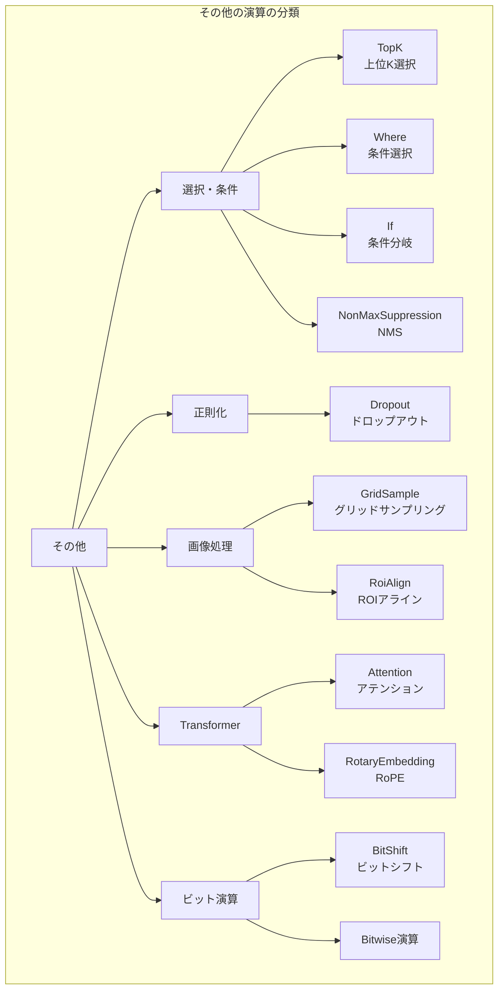

---

## TopK（上位K選択）

### 説明
指定した軸に沿って上位K個（または下位K個）の値とそのインデックスを返します。

### 動作原理

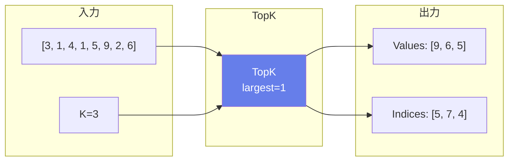

### 属性

| 属性名 | 型 | デフォルト | 説明 |
|--------|-----|----------|------|
| axis | int | -1 | 検索する軸 |
| largest | int | 1 | 最大値を選ぶか |
| sorted | int | 1 | 結果をソートするか |

### 主な用途
- **分類のTop-K予測**
- **ビームサーチ**
- **k-NN検索**
- **物体検出のNMS前処理**

---

## Where（条件選択）

### 説明
条件テンソルに基づいて、2つのテンソルから要素を選択します。三項演算子のテンソル版です。

### 動作原理

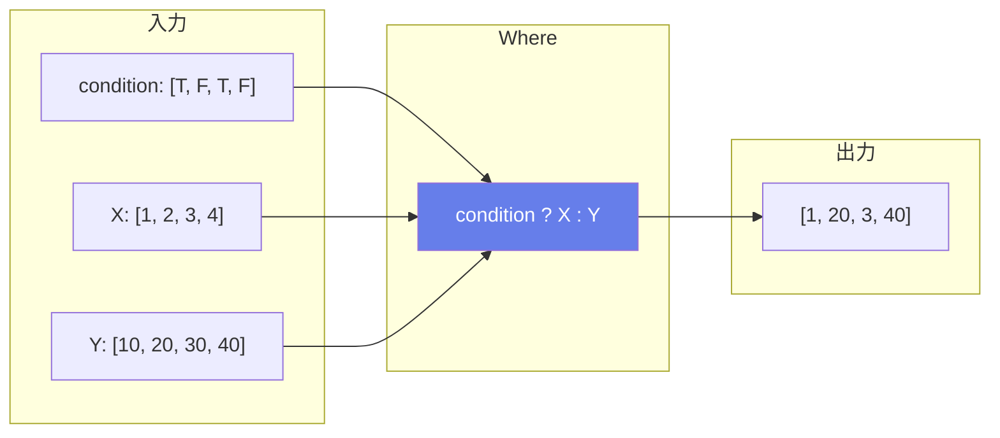

### 数式
$$\text{output}[i] = X[i] \text{ if condition}[i] \text{ else } Y[i]$$

### 主な用途
- **条件付き値の選択**
- **マスク適用**
- **クリッピング**
- **NaN/Infの置換**

---

## If（条件分岐）

### 説明
条件に基づいて異なるサブグラフを実行します。動的なモデル構造を可能にします。

### 動作フロー

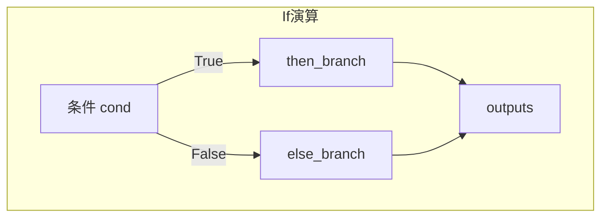

### 属性

| 属性名 | 型 | 説明 |
|--------|-----|------|
| then_branch | GraphProto | 条件がTrueの場合のサブグラフ |
| else_branch | GraphProto | 条件がFalseの場合のサブグラフ |

### 主な用途
- **条件付き処理**
- **早期終了**
- **動的アーキテクチャ**

---

## NonMaxSuppression（非最大抑制）

### 説明
物体検出で重複するバウンディングボックスを除去します。IoU（Intersection over Union）に基づいて、重複の少ない代表的な検出結果のみを保持します。

### 動作原理

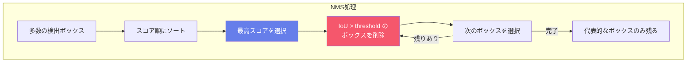

### 入出力仕様

| 項目 | 名前 | 形状 | 説明 |
|------|------|------|------|
| 入力 | boxes | [batch, num_boxes, 4] | バウンディングボックス |
| 入力 | scores | [batch, num_classes, num_boxes] | スコア |
| 入力 | max_output_boxes_per_class | スカラー | クラスあたり最大出力数 |
| 入力 | iou_threshold | スカラー | IoU閾値 |
| 入力 | score_threshold | スカラー | スコア閾値 |
| 出力 | selected_indices | [num_selected, 3] | 選択されたインデックス |

### 主な用途
- **物体検出**: YOLO, SSD, Faster R-CNN
- **インスタンスセグメンテーション**
- **キーポイント検出**

---

## Dropout（ドロップアウト）

### 説明
訓練時にランダムに要素を0にすることで過学習を防ぎます。推論時は全ての要素を使用します。

### 動作原理

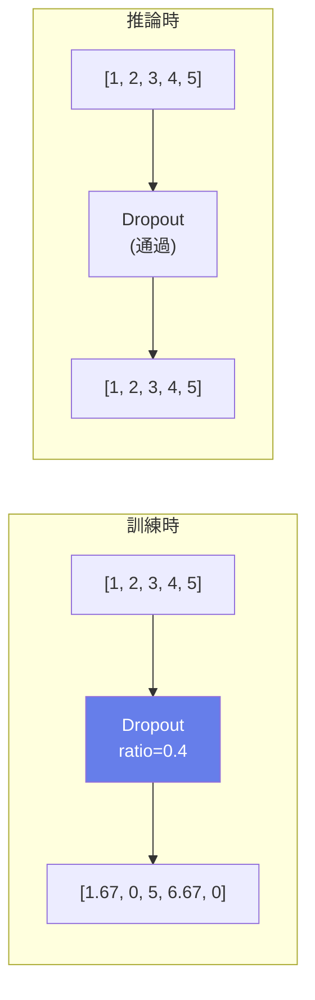

### 数式
$$Y = X \times \text{mask} / (1 - \text{ratio})$$

### 主な用途
- **過学習防止**
- **アンサンブル効果**
- **正則化**

---

## GridSample（グリッドサンプリング）

### 説明
グリッド座標に基づいて入力テンソルからサンプリングします。Spatial Transformer Networksの核となる演算です。

### 動作原理

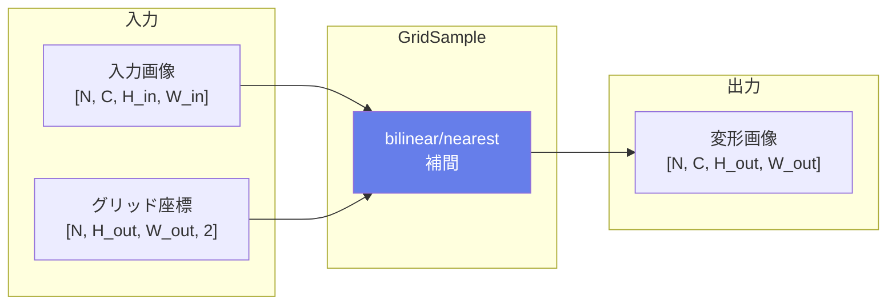

### 属性

| 属性名 | 型 | 説明 |
|--------|-----|------|
| mode | string | 補間モード ('bilinear', 'nearest', 'bicubic') |
| padding_mode | string | 範囲外処理 ('zeros', 'border', 'reflection') |
| align_corners | int | コーナーアラインメント |

### 主な用途
- **Spatial Transformer Networks**
- **画像変形・歪み補正**
- **オプティカルフロー適用**

---

## RoiAlign（ROIアライン）

### 説明
Region of Interest (ROI) から固定サイズの特徴を抽出します。バイリニア補間により量子化誤差を軽減します。

### 動作原理

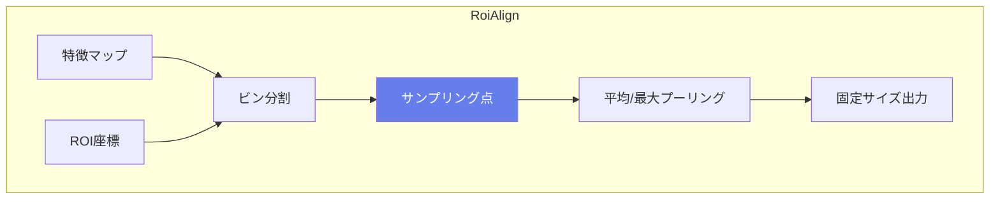

### 主な用途
- **Mask R-CNN**
- **物体検出**
- **インスタンスセグメンテーション**

---

## Attention（アテンション）

### 説明
マルチヘッドアテンション機構を実装します。Transformerの核となる演算です。

### 動作原理

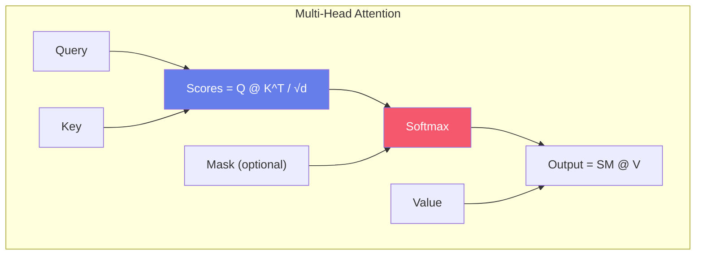

### 数式
$$\text{Attention}(Q, K, V) = \text{softmax}\left(\frac{QK^T}{\sqrt{d_k}}\right)V$$

### 主な用途
- **Transformer**: BERT, GPT等
- **自己注意機構**
- **クロスアテンション**

---

## RotaryEmbedding（RoPE）

### 説明
回転位置埋め込みを適用します。LLaMA、GPT-NeoXなどの大規模言語モデルで使用されます。

### 動作原理

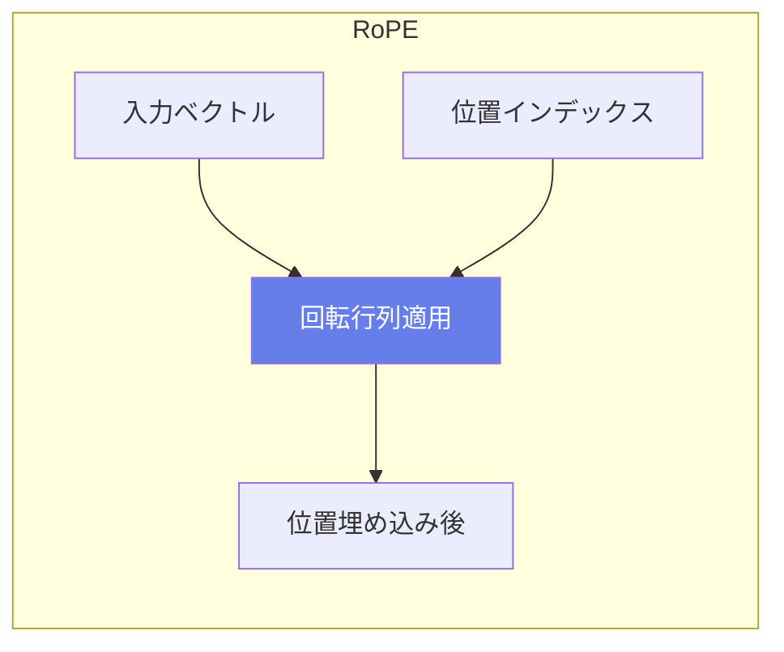

### 数式
$$\text{RoPE}(x, pos) = \begin{bmatrix} x_0 \cos(\theta_0) - x_1 \sin(\theta_0) \\ x_0 \sin(\theta_0) + x_1 \cos(\theta_0) \\ \vdots \end{bmatrix}$$

### 特徴
- **相対位置を内積で表現**
- **長いコンテキストへの外挿が可能**
- **計算効率が高い**

### 主な用途
- **LLaMA, GPT-NeoX, PaLM**
- **長文処理**
- **言語モデル**

---

## ビット演算

### BitShift（ビットシフト）

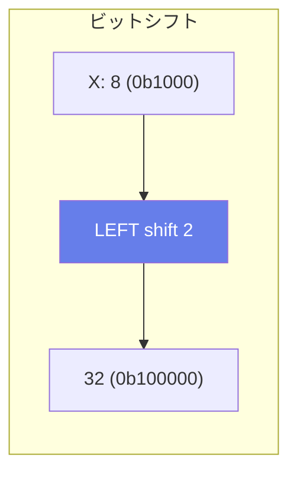

### Bitwise演算

| 演算子 | 数式 | 説明 |
|--------|------|------|
| BitwiseAnd | X & Y | 論理AND |
| BitwiseOr | X \| Y | 論理OR |
| BitwiseXor | X ^ Y | 排他的OR |
| BitwiseNot | ~X | 論理NOT |

### 主な用途
- **フラグ操作**
- **マスク処理**
- **ハッシュ計算**

---

## 特殊演算

### ReverseSequence（シーケンス反転）

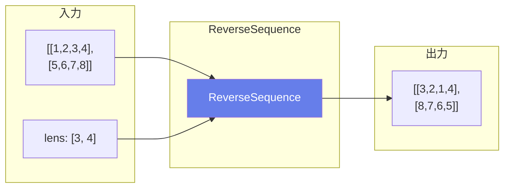

### Unique（一意要素）

テンソル内の一意な要素を返します。

### 出力
- **Y**: 一意な要素
- **indices**: 元のインデックス（オプション）
- **inverse_indices**: 逆インデックス（オプション）
- **counts**: 各要素のカウント（オプション）
